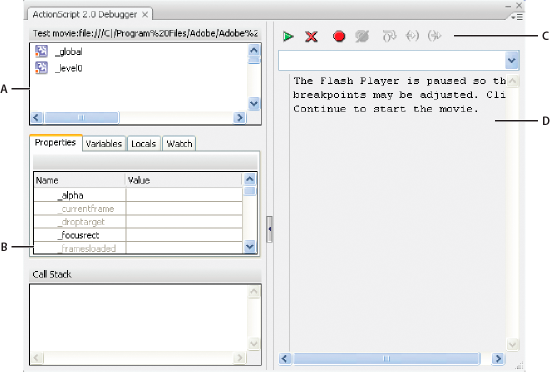
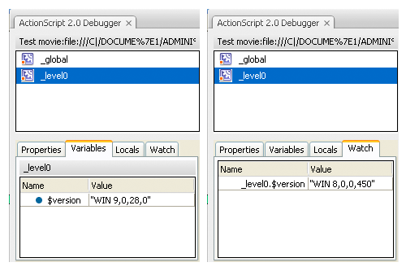
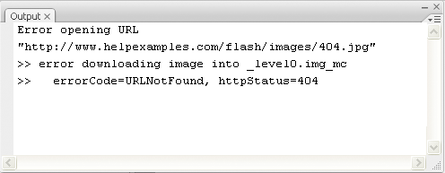

# Debugging ActionScript 1.0 and 2.0

## Debugging your ActionScript 1.0 and 2.0 scripts

The ActionScript 2.0 debugger helps you find ActionScript 1.0 and 2.0 errors
while your SWF file runs in Flash Player. When using Flash to debug ActionScript
1.0 and 2.0, you view your SWF files in the debugger version of Flash Player,
which is installed automatically with Flash. To install a stand-alone debugger
version of Flash Player, run the installer in the /_Flash installed
directory_/Players/Debug/ directory.

The ActionScript 2.0 Debugger shows a hierarchical display list of movie clips
currently loaded in Flash Player. Using the ActionScript 2.0 Debugger, you can
display and modify variable and property values as the SWF file plays, and you
can use breakpoints to stop the SWF file and step through ActionScript code line
by line. You can then go back to your scripts and edit them so that they produce
the correct results.

A.  
Display list

B.  
Properties list

C.  
Tool bar

D.  
Code view You can resize the regions of the Debugger panel. When your pointer
changes between each region, drag to resize the Display list, Watch list, and
code view. You can also click the vertical bar to expand either side of the
Debugger to full size.

After it's activated, the Debugger status bar displays the URL or local path of
the file, tells whether the file is running in the test environment or from a
remote location, and shows a live view of the movie clip display list. When
movie clips are added to or removed from the file, the display list reflects the
changes immediately.

> **Note:** The ActionScript 2.0 and 3.0 debuggers have significant differences.
> For more information about the ActionScript 3.0 debugger, see
> [Debugging ActionScript 3.0](./debugging-actionscript-3.0.md).

#### The Test Movie command and keyboard controls

When you use the Control \> Test Movie \> Test command to test SWF files that
implement keyboard controls (tabbing, keyboard shortcuts created using
`Key.addListener()`, and so on), select Control \> Disable Keyboard Shortcuts in
the Test Movie window. Selecting this option prevents the authoring environment
from "grabbing" keystrokes, and lets them pass through to the player. For
example, in the authoring environment, Control+U opens the Preferences dialog
box. If your script assigns Control+U to an action that underlines text
onscreen, when you use Test Movie, pressing Control+U opens the Preferences
dialog box instead of running the action that underlines text. To let the
Control+U command pass through to the player, you must select Control \> Disable
Keyboard Shortcuts in the Test Movie window. Important: When you use a
non-English application on an English system, the Test Movie command fails if
any part of the SWF file path has characters that cannot be represented with the
MBCS encoding scheme. For example, Japanese paths on an English system do not
work.

#### Other debugging tools

Flash also provides the following debugging tools:

- The Compiler Errors panel, which shows errors encountered when Flash compiles
  your scripts

- The Output panel, which shows runtime error messages, and lists of variables
  and objects

- The `trace()` statement, which sends programming notes and values of
  expressions to the Output panel

- The `throw` and `try..catch..finally` statements, which let you test and
  respond to runtime errors from within your script

## Debug a local SWF file

1.  Open the FLA document.
2.  Select Debug \> Debug Movie \> Debug. This command exports the SWF file with
    debugging information (the SWD file). It opens the Debugger and opens the
    SWF file in the test environment. The SWD file is used to debug
    ActionScript, and contains information that lets you use breakpoints and
    step through code.

## Debug a remote ActionScript 2.0 SWF file

You can debug a remote SWF file by using the stand-alone, ActiveX, or plug‑in
version of the Debug Flash Player, which you can find in the _Flash install
directory_/Players/Debug/ directory.

To permit remote debugging of the file, enable debugging in the Publish
settings. You can also publish your file with a debugging password to ensure
that only trusted users can debug it.

As in JavaScript or HTML, users can view client-side variables in ActionScript.
To store variables securely, send them to a server-side application instead of
storing them in your file. However, as a developer, you may have other trade
secrets, such as movie clip structures, that you do not want to reveal. You can
use a debugging password to protect your work.

### Enable remote debugging of a SWF file and set a debugging password

1.  Open the FLA file.

2.  Select File \> Publish Settings.

3.  In the Publish Settings dialog box, click the Flash tab (CS5) or Flash
    category (CS5.5), and then select Permit Debugging.

4.  To set a password, enter a password in the Password box.

    After you set this password, no one can download information to the Debugger
    without the password.

5.  Close the Publish Settings dialog box, and select one of the following
    commands:

    - Debug \> Debug Movie \> Debug

    - File \> Export \> Export Movie

    - File \> Publish

      Flash creates a debugging file, with the extension .swd, and saves it in
      the same directory as the SWF file. The SWD file is used to debug
      ActionScript, and contains information that lets you use breakpoints and
      step through code.

6.  Upload the SWF file and the SWD file to the same directory on your web
    server, or leave it on the local machine to perform a remote debug session
    on the localhost.

    If the SWD file is not in the same directory as the SWF file, you can still
    debug remotely; however, the Debugger has no breakpoint information, so you
    can't step through code.

7.  In Flash, select Debug \> Begin Remote Debug Session \> ActionScript 2.0.

    Flash opens the ActionScript 2.0 Debugger panel and waits for a debug Flash
    Player to connect. You have 2 minutes to start the debug Flash Player. If
    more than 2 minutes elapse, repeat this step.

8.  Open the SWF file in the debug version of the Flash Player plugin, ActiveX
    control, or stand-alone player. The debug stand-alone player is located in
    the _Flash install directory_/Players/Debug/ directory.

    The debug session begins when the debug player connects to the Flash
    ActionScript 2.0 Debugger panel.

### Activate the Debugger from a remote location

1.  Open the Flash authoring application if it is not already open.

2.  Select Debug \> Begin Remote Debug Session \> ActionScript 2.0.

3.  In a browser or in the debugger version of the stand-alone player, open the
    published SWF file from the remote location. Be sure the SWD file is in the
    same folder as the SWF file.

    If the Remote Debug dialog box does not appear, right-click (Windows) or
    Control-click (Macintosh) in the SWF file to display the context menu, and
    select Debugger.

4.  In the Remote Debug dialog box, select Localhost or Other Machine:

    - Select Localhost if the debugger version of Flash Player and the Flash
      authoring application are on the same computer.

    - Select Other Machine if the debugger version of Flash Player and the Flash
      authoring application are not on the same computer. Enter the IP address
      of the computer running the Flash authoring application.

    - Select Don't show this dialog at launch to prevent the Remote Debug dialog
      box from prompting the user for a debugger location if one cannot be
      found. This option is selected by default.

5.  Enter your debugging password if you set one.

    The display list of the SWF file appears in the Debugger. If the SWF file
    doesn't play, the Debugger might be paused, so click Continue to start it.

## Display and modify the values of variables in the Debugger

The Variables tab in the Debugger shows the names and values of any global and
timeline variables that are selected in the SWF file's display list. If you
change the value of a variable on the Variables tab, the change is reflected in
the SWF file while it runs. For example, to test collision detection in a game,
you can enter the variable value to position a ball in the correct location next
to a wall.

The Locals tab in the Debugger shows the names and values of any local variables
that are available in the line of ActionScript where the SWF file is currently
stopped, at a breakpoint or anywhere else within a user-defined function.

### Display a variable and its value

1.  In the Debugger's display list, select the movie clip containing the
    variable. (To display global variables, select the `_global` clip in the
    display list.)
2.  Click the Variables tab. The display list updates automatically as the SWF
    file plays.
    > **Note:** If a movie clip is removed from the SWF file at a specific
    > frame, that movie clip, along with its variable and variable name, is also
    > removed from the display list in the Debugger. However, if its variable is
    > marked for the Watch list, you can still view it in the Watch tab.

### Modify a variable value

 On the Debugger panel Variables tab, double-click the
value, and enter a new value.

Enter a string (any value surrounded by quotation marks), a number, or a Boolean
value (`true` or `false`). You cannot enter an expression (for example,
`eval("name:" +i)` or `x + 2`).

> **Note:** To write the value of an expression to the Output panel in the test
> environment, use the `trace()` statement.

## Use the Watch list

To monitor a set of critical variables, you can mark them for the Watch list.
The Watch list shows the absolute path to the variable and the value. You can
also enter a new variable value in the Watch list. The Watch list shows only
variables that you access by using an absolute target path, such as `_global` or
`_root`.

If you add a local variable to the Watch list, its value appears only when Flash
Player stops at a line of ActionScript that is within the variable's scope. All
other variables appear while the SWF file is playing. If the Debugger can't find
the value of the variable, the value is listed as undefined.

Variables marked for the Watch list and variables in the Watch list

### Add variables to the Watch list

- On the Variables or Locals tab, right-click (Windows) or Control-click
  (Macintosh) a selected variable; then select Watch from the context menu. A
  blue dot appears next to the variable.
- On the Watch tab, right-click (Windows) or Control-click (Macintosh) and
  select Add from the context menu. Double-click in the name column, and enter
  the target path to the variable name.

### Remove variables from the Watch list

 On the Watch tab or the Variables tab, right-click
(Windows) or Control-click (Macintosh) and select Remove from the context menu.

## Display movie clip properties and change editable properties

The Debugger's Properties tab shows all the property values of any movie clip on
the Stage. If you change a value, you can see its effect in the SWF file while
it runs. (Some movie clip properties are read-only and cannot be changed.)

### Display a movie clip's properties in the Debugger

1.  Select a movie clip from the display list.
2.  Click the Properties tab in the Debugger.

### Modify a property value

 In the Debugger's Properties tab, double-click the
value, and enter a new value.

Enter a string (any value surrounded by quotation marks), a number, or a Boolean
value (`true` or `false`). You cannot enter an expression (for example,
`x + 50`), or object or array values (for example, `{id: "rogue"}` or
`[1, 2, 3]`).

> **Note:** To write the value of an expression to the Output panel in the test
> environment, use the `trace()` statement.

## List a SWF file's objects and variables

To list a SWF file's objects, use the List Objects command, which is useful for
finding the correct target path and instance names. To list a SWF file's
variables, use the List Variables command, with which you can find a variable's
name and target path.

Selecting the List Objects or List Variables command clears the contents of the
Output panel. If you do not want to lose this information, select Save to File
from the Output Panel menu before selecting the command.

### List a SWF file's objects

In the test environment, the List Objects command shows the level, frame, object
type (shape, movie clip, or button), target paths, and instance names of movie
clips, buttons, and text fields in a hierarchical list in the Output panel. (It
does not show all ActionScript data objects.)

1.  If your SWF file is not running in the test environment, select Control \>
    Test Movie \> Test.

2.  Select Debug \> List Objects.

    A list of all the objects currently on the Stage appears in the Output
    panel. The list does not update automatically as the SWF file plays; you
    must select the List Objects command each time you want to send the
    information to the Output panel.

### List a SWF file's variables in the Output panel

In the test environment, the List Variables command shows a list of all the
variables in the SWF file. Global variables (those declared with the `_global`
identifier) appear at the top of the List Variables output in a Global Variables
section, and each variable has a `_global`prefix.

In addition, the List Variables command shows getter/setter
properties—properties that are created with the `Object.addProperty()` method
and start `get` or `set` methods. In the Output panel, the value of a
getter/setter property is prefixed with `[getter/setter]`. The software
determines the value that appears for a getter/setter property by evaluating the
`get` function.

The list does not update automatically as the SWF file plays; you must select
the List Variables command each time you want to send the information to the
Output panel.

1.  Create a new FLA document. For example, you might call it
    `listvariables.fla`.

2.  Add the following ActionScript 2.0 in the Actions panel:

        _global.myName = "Buster";
        var myCatSays:String = "meow";
        var myNum:Number = 313;
        var myArray:Array = ["one", "two", "three"];

3.  Select Control \> Test Movie \> Test.

4.  Select Debug \> List Variables in the test environment.

    A list of all the variables currently in the SWF file appears in the Output
    panel. The following example shows the variables that would be output from
    the code listed above in step 2:

        Global Variables:
        Variable _global.myName = "Buster"
        Level #0:
        Variable _level0.$version = "WIN 9,0,29,3"
        Variable _level0.myCatSays = "meow"
        Variable _level0.myNum = 313
        Variable _level0.myArray = [object #1, class 'Array'] [            0:"one",
                1:"two",
                2:"three"
            ]

## Set and remove breakpoints

A breakpoint lets you stop an application at a specific line of ActionScript.
You can use breakpoints to test possible trouble spots in your code. For
example, if you've written a set of `if..else if` statements and can't determine
which one is executing, you can add a breakpoint before the statements and
examine them one by one (step through them) in the Debugger.

You can set breakpoints in the Actions panel, Script window, or Debugger.
Breakpoints set in the Actions panel are saved with the FLA file. Breakpoints
set in the Debugger and Script window are not saved in the FLA file and are
valid only for the current debugging session. Important: If you set breakpoints
in the Actions panel or Script window and click Auto Format, check your
breakpoints. If the Auto Format command removed empty lines, your ActionScript
might be moved to a different line. It's a good idea to autoformat your scripts
before you set breakpoints. You can view breakpoints in both the Debugger and
the Script window by setting them in either one of those windows. For this to
work, the path to the AS file must be the same in both windows.

Do not set breakpoints on comments or empty lines; these breakpoints are
ignored.

### Set or remove a breakpoint in the Actions panel or Script window

During a debugging session, do one of the following:

- Click in the left margin of the Script pane. A red dot indicates a breakpoint.

- Click Debug Options  button.

- Right-click (Windows) or Control-click (Macintosh) to display the context
  menu, and select Set Breakpoint, Remove Breakpoint, or Remove Breakpoints In
  This File. (In the Script window, you can also select Remove Breakpoints In
  All AS Files.)

- Press Control+Shift+B (Windows) or Command+Shift+B (Macintosh).

  > **Note:** In some previous versions of Flash, clicking in the left margin of
  > the Script pane selected the line of code; now it adds or removes a
  > breakpoint. To select a line of code, use Control-click (Windows) or
  > Command-click (Macintosh).

### Set and remove breakpoints in the Debugger

- Click in the left margin of the code pane. A red dot indicates a breakpoint.
- Click Toggle Breakpoint or Remove All Breakpoints above the code view.
- Right-click (Windows) or Control-click (Macintosh) to display the context
  menu, and select Set Breakpoint, Remove Breakpoint, or Remove All Breakpoints
  in the File.
- Press Control+Shift+B (Windows) or Command+Shift+B (Macintosh).

### The breakpoints XML file

When you work with breakpoints in the Script window, the AsBreakpoints.xml file
lets you store breakpoint information. This file is written to the Local
Settings directory, in the following locations:

Windows  
_Hard Disk_\Documents and Settings\\_User_\Local Settings\Application
Data\Adobe\Flash CS3\\_language_\Configuration\Debugger\\

Macintosh  
_Macintosh HD_/Users/_User_/Library/Application Support/Adobe Flash
CS3/Configuration/Debugger/

Here is an example of an AsBreakpoints.xml file:

    <?xml version="1.0"?>
    <flash_breakpoints version="1.0">
        <file name="c:\tmp\myscript.as">
            <breakpoint line="10"></breakpoint>
            <breakpoint line="8"></breakpoint>
            <breakpoint line="6"></breakpoint>
        </file>
        <file name="c:\tmp\myotherscript.as">
            <breakpoint line="11"></breakpoint>
            <breakpoint line="7"></breakpoint>
            <breakpoint line="4"></breakpoint>
        </file>
    </flash_breakpoints>

The XML file consists of the following tags:

flash_breakpoints  
This node has a `version` attribute, which specifies the version of the XML
file. Flash 8 is version 1.0.

file  
A child node of `flash_breakpoints`. This node has a `name` attribute, which
specifies the name of the file that contains breakpoints.

breakpoint  
A child node of `file`. This node has a `line` attribute, which specifies the
line number that contains the breakpoint.

The AsBreakpoints.xml file is read when you start Flash, and regenerated when
you quit. AsBreakpoints.xml is used to keep track of the breakpoints between
development sessions.

## Stepping through lines of code

After you set breakpoints in a script and click Continue in the Debugger, you
can step through lines of code—that is, control how the Debugger moves through
statements and functions.

For example, in the following ActionScript 2.0 code, suppose a breakpoint is set
inside a button on the `myFunction()`line:

    on(press){
        myFunction();
    }

When you click the button, Flash Player reaches the breakpoint and pauses. You
can now bring the Debugger to the first line of `myFunction()` wherever it is
defined in the document. You can also continue through or exit out of the
function.

As you step through lines of code, the values of variables and properties change
in the Variables, Locals, Properties, and Watch tabs. A yellow arrow on the left
side of the Debugger's code view indicates the line at which the Debugger
stopped. Use the following buttons along the top of the code view:

Step In   
Advances the Debugger into a function. (If a line does not contain a
user-defined function, Step In advances to the next line.)

In the following example, if you place a breakpoint at line 7 and click Step In,
the Debugger advances to line 2, and another click of Step In advances you to
line 3.

    1 function myFunction() {
    2 x = 0;
    3 y = 0;
    4 }
    5
    6 mover = 1;
    7 myFunction();
    8 mover = 0;

> **Note:** The numbers in this code snippet denote line numbers. They are not
> part of the code. Step Out   
> Advances the Debugger out of a function. This button works only if you are
> currently stopped in a user-defined function; it moves the yellow arrow to the
> line that follows the function call. In the previous example, if you place a
> breakpoint at line 3 and click Step Out, the Debugger moves to line 8.
> Clicking Step Out at a line that is not within a user-defined function is the
> same as clicking Continue. For example, if you stop at line 6 and click Step
> Out, the player continues to execute the script until it encounters a
> breakpoint.

Step Over   
Advances the Debugger over a line of code. This button moves the yellow arrow to
the next line in the script. In the previous example, if you are stopped at line
7 and click Step Over, you advance directly to line 8 without stepping through
`myFunction()`, although the `myFunction()` code still executes.

Continue   
Leaves the line at which the player is stopped and continues playing until a
breakpoint is reached.

End Debug Session   
Makes the Debugger inactive but continues to play the SWF file in Flash Player.

## Control compiler warnings

You can control the types of compiler warnings that the ActionScript compiler
generates in the Compiler Errors panel. When the compiler reports an error, you
can double click on the error to navigate to the line of code that caused the
error.

1.  Select File \> Publish Settings.
2.  Click the Flash tab.
3.  Click the ActionScript Settings button.
4.  Select among the Errors options:

    - Strict Mode causes warnings to be reported as errors, which means that
      compilation will not succeed if those errors exist.

    - Warnings Mode causes extra warnings to be reported that are useful for
      discovering incompatibilities when updating ActionScript 2.0 code to
      ActionScript 3.0.

## Output panel overview

When you test a SWF file, the Output panel can show information to help you
troubleshoot your SWF file. To show this information, add `trace()` statements
to your code or use the List Objects and List Variables commands.

If you use the `trace()` statement in your scripts, you can send specific
information to the Output panel as the SWF file runs. This could include notes
about the SWF file's status or the value of an expression. For more information,
see the `trace()` function in the
[_ActionScript 2.0 Language Reference_](https://web.archive.org/web/20111228214543mp_/http://www.adobe.com/go/learn_cs5_as2lr_en).

### Display or hide the Output panel

 Select Window \> Output or press F2.

### Work with the contents of the Output panel

 In the Output Panel menu ,
select a command. Here is a partial list:

Copy  
Copies all the contents of the Output panel to the computer's Clipboard. To copy
a selected portion of the output, select the area you want to copy and then
select Copy.

Save To File  
Saves the Output panel contents to a text file.

Filter Level  
Select None to prevent any information from appearing in the Output panel;
select Verbose to send all information to the Output panel.

## Use the trace statement

A `trace()` statement sends specific information to the Output panel. For
example, while testing a SWF file, you can send results to the Output panel when
a button is pressed or a frame plays. The `trace()` statement is similar to the
JavaScript `alert` statement.

When you use the `trace()` statement in a script, you can use expressions as
parameters. The value of an expression appears in the Output panel in the test
environment.

1.  Select a frame in the Timeline and add a `trace()` statement. For example,
    you might select Frame 1 and add the following ActionScript 2.0 code:

        this.createEmptyMovieClip("img_mc", 10);
        var mclListener:Object = new Object();
        mclListener.onLoadInit = function(target_mc:MovieClip) {
            trace(target_mc+" loaded in "+getTimer()+" ms");
        };
        mclListener.onLoadError = function(target_mc:MovieClip, errorCode:String, httpStatus:Number) {
            trace(">> error downloading image into "+target_mc);
            trace(">>\t errorCode="+errorCode+", httpStatus="+httpStatus);
        };
        var img_mcl:MovieClipLoader = new MovieClipLoader();
        img_mcl.addListener(mclListener);
        img_mcl.loadClip("http://www.helpexamples.com/flash/images/404.jpg", img_mc);

2.  Select Control \> Test Movie \> Test to test the SWF file.

    The Output panel displays the results of the `trace()` statement. For
    example, the panel might display the following message:

    

    <caption>Output panel</caption>

## Navigate to errors in code

When Flash encounters an error in ActionScript code, either during compiling or
execution, it reports the error in the Compiler Errors panel. From the Compiler
Errors panel, you can navigate to the line of code that caused the error.

 Double click the error in the Compiler Errors panel.

## Debugging text field objects

To obtain debugging information about TextField objects, you can use the
Debug \> List Variables command or the Debug \> List Objects command in the test
environment. When you use Debug \> List Variables, the Output panel uses the
following conventions to show TextField properties:

- No more than four properties appear on a line.

- A property with a string value appears on a separate line.

- Color properties appear as hexadecimal numbers (0x00FF00).

- The properties appear in the following order: `variable`, `text`, `htmlText`,
  `html`, `textWidth`, `textHeight`, `maxChars`, `borderColor`,
  `backgroundColor`, `textColor`, `border`, `background`, `wordWrap`,
  `password`, `multiline`, `selectable`, `scroll`, `hscroll`, `maxscroll`,
  `maxhscroll`, `bottomScroll`, `type`, `embedFonts`, `restrict`, `length`,
  `tabIndex`, `autoSize`.

  The Debug \> List Objects command lists TextField objects. If an instance name
  is specified for a text field, the Output panel shows the full target path
  including the instance name in the following form:

      Target = "target path"
