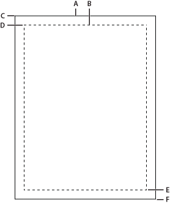

# Printing at runtime

## Printing at runtime using ActionScript 3.0

For information about printing at runtime with ActionScript 3.0, see these
resources:

- [Printing](https://web.archive.org/web/20120103062731mp_/http://help.adobe.com/en_US/as3/dev/WS5b3ccc516d4fbf351e63e3d118a9b8fa63-8000.html)
  in the _ActionScript 3.0 Developer's Guide_ (Adobe.com)

## Printing at runtime using ActionScript 2.0

You can add printing functionality to Flash documents that lets users print from
Flash Player. You can use the ActionScript® PrintJob class, or you can use the
print() or printAsBitmap() ActionScript functions. Users can also access the
Flash Player context menu and select the Print command there. Additionally,
users can print from a browser, rather than from Flash Player, by selecting a
command such as File \> Print from the browser window. However, printing from
Flash Player directly, rather than from a browser window Print menu, offers
several advantages, including the following:

- Users can print all frames or certain frames that you've labeled as printable
  from Flash Player. Additionally, you can set the print area of a frame.

- You can specify that content print as vector graphics (to take advantage of
  higher resolution) or as bitmaps (to preserve transparency and color effects).

- The ActionScript PrintJob object improves upon the print() and printAsBitmap()
  functions by adding the ability to print dynamically rendered pages as a
  single print job. The PrintJob object also provides the user's printer
  settings, which can be used to format reports specifically for the user.

- Flash Player versions earlier than 4.0.25 (Windows) or 4.0.20 (Macintosh) do
  not support printing frames directly. Flash Player 7 and later supports the
  PrintJob class.

  > **Note:** For information on printing from SWF files at runtime using
  > ActionScript 3.0, see
  > [Printing](https://web.archive.org/web/20120103062731mp_/http://help.adobe.com/en_US/as3/dev/WS5b3ccc516d4fbf351e63e3d118a9b8fa63-8000.html)
  > in the ActionScript 3.0 Developer's Guide.

### Controlling runtime printing

To control what users can print, remember the following items as you set up
documents and movie clips for printing:

- Adjust the page layout in any frames that you designate as printable to match
  the desired printed output. Using Flash Player, you can print all shapes,
  symbols, bitmaps, text blocks, and text fields. Levels in a SWF file are not
  composited on print output.

- The printer driver uses the HTML settings for dimension, scale, and alignment
  in the Publish Settings dialog box. Use these settings to control the print
  layout.

- The selected frames print as they appear in the movie clip symbol. Let users
  print a movie clip that is not visible in a browser by using the Actions panel
  to set the movie clip's `_visible` property to `false`. Changing the property
  of a movie clip with the `setProperty` action, tweening, or any transformation
  tool does not affect how a movie clip prints.

- For a movie clip to be printable, it must be on the Stage or pasteboard and it
  must be given an instance name.

- All elements must be fully loaded to print. Use the movie clip` _framesloaded`
  property to check whether the printable content is loaded. For more
  information, see \_framesloaded (MovieClip.\_framesloaded property) in the
  [_ActionScript 2.0 Language Reference_](https://open-flash.github.io/mirrors/as2-language-reference/index.html).

### Using the ActionScript 2.0 PrintJob class

The ActionScript PrintJob class, in addition to improving print functionality
available with the `print()` method, lets you render dynamic content at runtime,
prompt users with a single print dialog box, and print an unscaled document with
proportions that map to the proportions of the content. This capability is
useful for rendering and printing external dynamic content, such as database
content and dynamic text.

Additionally, with properties populated by the `PrintJob.start()`method, your
document can access your user's printer settings, such as page height, width,
and orientation, and you can configure your document to dynamically format Flash
Pro content that is appropriate for the printer settings.

> **Note:** When you use the PrintJob class, users must have Flash Player 7 or
> later.

> **Note:** For information on printing from SWF files at runtime using
> ActionScript 2.0, see
> [Learning ActionScript 2.0 in Adobe Flash](http://help.adobe.com/en_US/FlashPlatform/reference/actionscript/2/help.html?content=Part1_Learning_AS2_1.html).

### Build a print job

Because you are spooling a print job to the user's operating system between your
calls to the `PrintJob.start()` and` PrintJob.send()`methods, and because the
PrintJob functions might temporarily affect the Flash Player internal view of
onscreen Flash Pro content, implement print-specific activities only between
your calls to `PrintJob.start()` and `PrintJob.send()`. For example, the Flash
Pro content should not interact with the user between `PrintJob.start()` and
`PrintJob.send()`. Instead, complete formatting of your print job, add pages to
the print job, and send the print job to the printer.

1.  Create an instance of the print job object: `new PrintJob()`.

2.  Start the print job and display the print dialog box for the operating
    system: `PrintJob.start()`.

3.  Add pages to the print job (call once per page to add to the print job):
    `PrintJob.addPage()`.

4.  Send the print job to the printer: `PrintJob.send()`.

5.  Delete the print job: `delete PrintJob`.

    The following example shows ActionScript code that creates a print job for a
    button:

        myButton.onRelease = function()
        {
            var my_pj = new PrintJob();
            var myResult = my_pj.start();
            if(myResult)
            {
                myResult = my_pj.addPage (0, {xMin : 0, xMax: 400, yMin: 0,
                    yMax: 400});
                myResult = my_pj.addPage ("myMovieClip", {xMin : 0, xMax: 400,
                    yMin: 400, yMax: 800},{printAsBitmap:true}, 1);
                myResult = my_pj.addPage (1, null,{printAsBitmap:false}, 2);
                myResult = my_pj.addPage (0);
                my_pj.send();
            }
            delete my_pj;
        }

    Only one print job can run at any given time. A second print job cannot be
    created until one of the following events occurs with the previous print
    job:
    - The print job is entirely successful and the `PrintJob.send()` method is
      called.

    - The` PrintJob.start()` method returns a value of `false`.

    - The` PrintJob.addPage()` method returns a value of `false`.

    - The` delete PrintJob` method is called.

### Starting a print job

Calling the ActionScript 2.0 `PrintJob.start()` method spools the print job to
the user's operating system and prompts the user's operating system print dialog
box to appear.

If the user selects an option to begin printing, the` PrintJob.start(`) method
returns a value of `true`. (The value is `false` if the user cancels the print
job, in which case the script should call only `delete`). If successful, the
`PrintJob.start()` method sets values for the `paperHeight`, `paperWidth`,
`pageHeight`, `pageWidth`, and `orientation` properties.

Depending on the user's operating system, an additional dialog box might appear
until spooling is complete and the `PrintJob.send` function is called: Make
calls to `PrintJob.addPage()` and `PrintJob.send()` expeditiously. If ten
seconds elapse between the `PrintJob.start()` function call and the
`PrintJob.send()`function call, which sends the print job to the printer, Flash
Player effectively calls` PrintJob.send()`, causing any pages that are added by
using `PrintJob.addPage()` to be printed and spooling to stop.

When a new print job is constructed, the `PrintJob()` properties are initialized
to 0. When `PrintJob.start()` is called, after the user selects the print option
in the operating system print dialog box, Flash Player retrieves the print
settings from the operating system. The `PrintJob.start()` function populates
the following properties: | Property | Type | Unit | Notes | |
---------------------- | ------ | ------ |

---

| | `PrintJob.paperHeight` | number | points | Overall paper height | |
`PrintJob.paperWidth` | number | points | Overall paper width | |
`PrintJob.pageHeight` | number | points | Height of actual printable area on the
page; does not include any user-set margins | | `PrintJob.pageWidth` | number |
points | Width of actual printable area on the page; does not include any
user-set margins | | `PrintJob.orientation` | string | n/a | Portrait or
landscape orientation |

### Adding pages to a print job

You add pages to your print job with the ActionScript 2.0 `PrintJob.addPage()`
method. Although the method can include as many as four parameters, the only
required parameter is `target/level`. The three optional parameters are
`printArea`, `options`, and `frameNum`.

If you are not using a particular optional parameter but are using other
optional parameters, use `NULL` in place of the excluded optional parameter.

With all four parameters, the function uses the following syntax:

    MyPrintJob.addPage(target[,printArea:Object, options:Object, frameNum:Number]):boolean;

If you provide an invalid parameter, the print job uses default parameter
values.

Each call to add a new page is unique, which lets you modify parameters without
affecting previously set parameters. For example, you can specify that one page
print as a bitmap image and another page print as a vector graphic. You can add
as many new pages to your print job as the print job requires. One call to add a
page equals one printed page.

> **Note:** Any ActionScript code that needs to be called to change a resulting
> printout must run before the `PrintJob.addPage()` method is called. The
> ActionScript can, however, run before or after a new `PrintJob()method`. If a
> frame has a call to `PrintJob.addPage()`, the call itself does not guarantee
> that the ActionScript script on that frame will run when that frame is
> printed.

### Specifying a target

The ActionScript 2.0 `target` parameter can be either a number that represents a
level (such as 0 for the \_root document), or a string that represents the
instance name of a movie clip (`"myMovieClip"`).

#### Specifying a print area

The optional `printArea` parameter includes the following values:

    {xMin:Number, xMax:Number, yMin:Number, yMax:Number}

The `xMin`, `xMax`, `yMin`, and `yMax` values represent screen pixels relative
to the target level or movie clip registration point. The print area orientation
is from the upper-left corner of the printable area on the page. If the print
area is larger than the printable area on the page, the print data that exceeds
the right and bottom edge of the page is clipped.

A.  
Paper rectangle

B.  
Page rectangle

C.  
(594,774)

D.  
(576,756)

E.  
(0,0)

F.  
(-18,-18) If you don't specify a print area, or if you specify an invalid print
area, the print area defaults to the Stage area of the root document.

#### Scaling, points, and pixels

A print job using the PrintJob class prints Flash Pro content, by default,
without scaling it. For example, an object that is 144 pixels wide on screen
prints as 144 points, or 2 inches wide.

One point equals one pixel. In the authoring tool, 72 pixels equals one inch; on
paper, 72 points equals one inch.

To understand how Flash Pro screen content maps to the printed page, it helps to
understand screen and print units of measure. Pixels are a screen measurement
and points are a print measurement. Both pixels and points equal 1/72 of an
inch. A _twip_ is 1/20 of a point and pixel.

The following list further illustrates the relationship between units of
measure.

- 1 pixel = 20 twips

- 1 point = 20 twips

- 72 pixels = 1 inch

- 72 points = 1 inch

- 567 twips = 1 cm

- 1440 twips = 1 inch

  To scale a movie clip before printing, set its `MovieClip.xscale` and
  `MovieClip.yscale` properties before calling this method, and set them back to
  their original values afterward. If you scale a movie clip and also pass a
  value for the `printArea` property, the pixel values passed to
  `printArea`reflect the original size of the movie clip. That is, if you set a
  movie clip's scale to 50% and specify a print area of 500 x 500 pixels, the
  content that prints is identical to the content that would print if you didn't
  scale the movie clip; however, it prints at half the size. For more
  information, see the addPage (PrintJob.addPage method)method of the `printjob`
  class in the
  [_ActionScript 2.0 Language Reference_](https://open-flash.github.io/mirrors/as2-language-reference/index.html).

#### Specifying printing as a vector image or bitmap graphic

The `options` parameter lets you specify whether to print as a vector graphic or
bitmap image. When using this optional parameter, use the following syntax:

    {printAsBitmap:boolean}

The default value is `false`, which represents a request for vector printing.
Remember the following suggestions when determining which value to use:

- If the content that you're printing includes a bitmap image, specify that the
  print job print as a bitmap to include any transparency and color effects.

- Conversely, if the content does not include bitmap images, specify that the
  print job print as vector graphics to take advantage of the higher image
  quality.

#### Specifying a frame to print

The `frameNum` parameter lets you specify a frame to print. If you do not
specify a frame number parameter, by default the current frame of the target or
level that you specify as the first parameter when you add a page prints.

### Print or delete a print job

1.  To send a print job to the printer after using the ActionScript 2.0
    `addPage()` calls, use the `PrintJob.send()` method, which causes Flash
    Player to stop spooling the print job so that the printer starts printing.
2.  To delete the print job after you send the print job to a printer, use the
    `delete PrintJob()` ActionScript function to delete the PrintJob object,
    which frees memory.

### Printing frames independent of the PrintJob class

The ActionScript 2.0 PrintJob class, available for Flash Player 7 and later,
offers many advantages over the `print()` and `printAsBitmap()` methods for
printing. However, to print targeting Flash Player 6 and earlier versions, back
to Flash Player 4.0.25 (Windows) and 4.0.20 (Macintosh), use `print(``)` and
`printAsBitmap()` functions and frame labels.

To set up printing from Flash Player independent of the PrintJob class, specify
frames to print and set their print area.

### Specifying a print area when not using the PrintJob object

By default, when frames are printed, the document file's Stage determines the
print area. Any object that extends off the Stage is clipped and does not print.
Loaded movies use their own Stage size for the print area, not the main SWF
file's Stage size.

As an alternative to using a document's Stage size, set the following print
areas:

- For either the Flash Player context menu or the ActionScript 2.0 `print()`
  function, designate the bounding box for SWF content as the print area for all
  frames by selecting an object in one frame as the bounding box. This option is
  useful, for example, to print a full-page data sheet from a web banner.

- The `print()` function lets you use the composite bounding box of all
  printable frames in a Timeline as the print area—for example, to print
  multiple frames that share a registration point. To use the composite bounding
  box, use the `bMax` parameter, as shown in the following example:

      print ("myMovie", "bmax")

- The `print()` function lets you change the print area for each frame, scaling
  objects to fit the print area—for example, to have objects of different sizes
  in each frame fill the printed page. To change the bounding box per frame, use
  the Frame parameter in the Print action parameters, as shown in the following
  example:

      print ("myMovie", "bframe")

- The `print()` function lets you designate the bounding box of a specific frame
  in a document as the print area for all printable frames in the document, as
  shown in the following example:

        print ("myMovie", "bmovie")

  You use the frame label \#b to designate a frame to be used to designate the
  print area. The label \#b must be on the same layer as a frame labeled \#p.

  For more information about `print()` function parameters, see "print function"
  in the
  [_ActionScript 2.0 Language Reference_](https://open-flash.github.io/mirrors/as2-language-reference/index.html).

### Using the print() function when not using the PrintJob object

The basic syntax for the ActionScript 2.0 `print()` function, which you can
associate with a button or other trigger in your document to activate printing,
is as follows:

    print (target, "Bounding box");

The target parameter specifies the location of the frames that print, and the
bounding box parameter specifies the print area.

Assign a `print()` function to a button, frame, or movie clip in your document
to let users print Flash Pro content. If you assign a `print()` function to a
frame, the action executes when the playhead reaches the designated frame.

The `print()` function lets you print frames in other movie clips in addition to
the main Timeline. Each `print()` function sets only one Timeline for printing,
but the action lets you specify any number of frames in the Timeline to print.
If you attach more than one `print()` function to a single button or frame, the
Print dialog box appears for each action executed.

See also "print function" in the
[_ActionScript 2.0 Language Reference_](https://open-flash.github.io/mirrors/as2-language-reference/index.html).
