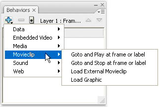
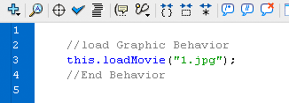

# Script Assist mode and behaviors

## About Script Assist mode

If you are new to ActionScript, or if you want to add simple interactivity
without having to learn the ActionScript language and its syntax, you can use
Script Assist in the Actions panel to help you add ActionScript to your FLA
files.

Script Assist lets you build scripts by selecting items from the Actions
toolbox. When you click an item once, its description appears at the upper right
of the panel. When you double-click an item, it adds the item to the Actions
panel Script pane.

In Script Assist mode, you can add, delete, or change the order of statements in
the Script pane; enter parameters for actions in boxes above the Script pane;
find and replace text; and view script line numbers. You can also _pin_ a
script—that is, keep a script in the Script pane when you click away from the
object or frame.

Script Assist helps you avoid the syntax and logic errors a novice user might
make. However, to use Script Assist you must become familiar with ActionScript,
and know what methods, functions, and variables to use when creating your
scripts. To learn about ActionScript, see _Learning ActionScript 2.0 in Adobe
Flash_ or _Programming ActionScript 3.0_.

## Use Script Assist to write ActionScript

To add an ActionScript 3.0 action to a Flash document, you must attach it to a
frame. To add an ActionScript 2.0 (or earlier) action to a Flash document,
attach it to a button or movie clip, or to a frame in the timeline.

### Start Script Assist mode

1.  Select Window \> Actions.

2.  In the Actions panel, click Script Assist .

    In Script Assist mode, the Actions panel changes in the following ways:
    - Add (+) functions differently in Script Assist mode. When you select an
      item from the Actions toolbox or the Add
      menu , the item is added after the currently
      selected text block.

    - Delete (-) lets you remove the current selection in the Script pane.

    - The up and down arrows let you move the current selection in the Script
      pane upward or downward within the code.

    - The Check Syntax , Auto
      Format , Show Code
      Hint , and Debug
      Options  buttons and menu items normally
      visible in the Actions panel are disabled, as they do not apply to Script
      Assist mode.

    - The Insert Target button  is disabled unless
      you are typing in a box. Clicking Insert Target places the resulting code
      in the current box.

> **Note:** If the Actions panel contains ActionScript code when you click
> Script Assist, Flash compiles the code. If there are errors in the code, you
> cannot use Script Assist until you fix the current code selection. The errors
> are described in detail in the Compiler Errors panel.

### View a description of an action

- Click a category in the Actions toolbox to display the actions in that
  category, and click an action.

- Select a line of code in the Script pane.

  The description appears at the top of the Actions panel.

### Add an action to the Script pane

- Click a category in the Actions toolbox to display the actions in that
  category, and then either double-click an action or drag it to the Script
  pane.
- Click Add (+) and select an action from the pop‑up menu.
- Press Escape and a shortcut key. (To view a list of shortcut keys, select Esc
  Shortcut Keys in the Actions panel pop‑up menu; select this option again to
  hide the list.)

### Delete an action

1.  Select a statement in the Script pane.
2.  Click Delete (-) or press the Delete key.

### Move a statement up or down in the Script pane

1.  Select a statement in the Script pane.
2.  Click the up or down arrow.

### Work with parameters

1.  Add an action to, or select a statement in, the Script pane.

    Relevant parameter options appear above the Script pane.

2.  Enter values in the boxes above the Script pane.

### Search for text in a script

- To go to a specific line in a script, choose Go To Line from the Actions panel
  pop‑up menu or press Control+G (Windows) or Command+G (Macintosh); then enter
  the line number.

- To find text, click Find , select Find from the Actions
  panel pop‑up menu, or press Control+F (Windows) or Command+F (Macintosh).

- To find text again, press F3 or select Find Again from the Actions panel
  pop‑up menu.

- To replace text, click Find, or press Control+H (Windows) or Command+H
  (Macintosh).

  In Script Assist mode, Replace searches and replaces text only in the
  parameter box of each action, not in the entire script. For example, in Script
  Assist mode you cannot replace all `gotoAndPlay` actions with `gotoAndStop`.

## About behaviors

Behaviors are predefined scripts that you can attach to objects in your FLA
file. Behaviors provide functionality such as frame navigation, loading external
SWF and JPEG files, controlling the stacking order of movie clips, and movie
clip dragging.

Behaviors provide a convenient way to avoid writing ActionScript and can help
you learn how ActionScript works.

Behaviors are available only for ActionScript 2.0 and earlier, and only when you
work in the Actions panel, not in an external script file. Typically, you select
a triggering object in your document (such as a movie clip or a button), select
Add in the Behaviors panel, and then select behavior, as the following example
shows:  Selecting a behavior from the Behaviors
panel

The behavior is added to the object and is displayed in the Actions panel.
 The ActionScript of a behavior

For a sample about behaviors, see the Flash Samples page at
[www.adobe.com/go/learn_fl_samples](https://web.archive.org/web/20120111023659mp_/http://www.adobe.com/go/learn_fl_samples).
Download and decompress the Samples zip file and navigate to the
Behaviors\BehaviorsScrapbook folder to access the sample.

More Help topics

[Controlling instances with behaviors](../symbols-instances-and-library-assets/symbols-and-actionscript.md#controlling-instances-with-behaviors)

[Add and configure a behavior](../symbols-instances-and-library-assets/symbols-and-actionscript.md#add-and-configure-a-behavior)

[Create custom behaviors](../symbols-instances-and-library-assets/symbols-and-actionscript.md#create-custom-behaviors)
