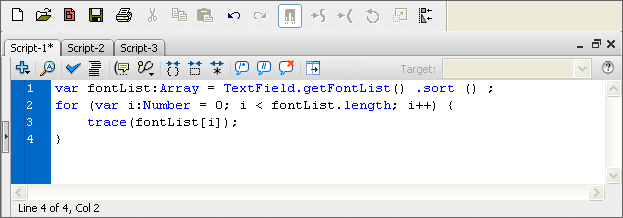

# Script window overview

The Script window lets you create external script files that you import into
your application. These scripts can be ActionScript, Flash Communication, or
Flash JavaScript files. The Add (+) menu lists the language elements available
for the type of script you create.

Script window

If you have more than one external file open, filenames are displayed on tabs
across the top of the Script window.

In the Script window, you can use the following features: the Add (+) menu
(which is like the Actions toolbox), find and replace, syntax checking, syntax
coloring, auto format, code hinting, code commenting, code collapse, debug
options (ActionScript files only), and word wrap. The Script window also lets
you display line numbers and hidden characters.

The Script window does not include code-assistance features such as the Script
navigator, Script Assist mode, and behaviors. These features are useful only in
the context of creating a FLA file, not an external script file.

## Create an external file in the Script window

1.  Select File \> New.
2.  Select the type of external file you want to create (ActionScript file,
    ActionScript Communication file, or Flash JavaScript file).

## Edit an existing file in the Script window

- To open an existing script, select File \> Open, and then open an existing AS
  file.

- To edit a script that is already open, click the document tab that shows the
  script's name.

More Help topics

[Writing and managing scripts](../writing-and-managing-scripts.md)
