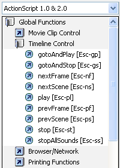
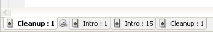
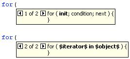
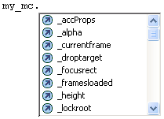

# Writing and managing scripts

## Format code

Your code can be formatted and indented automatically or manually. If you use
dynamic font mapping, you ensure that the correct fonts are used for
multilingual text.

### Set Auto Format options

1.  Do one of the following:
    - From the panel menu  (at the upper-right
      corner of the Actions panel), select Preferences.

    - In the Script window, select Edit \> Preferences (Windows) or Flash \>
      Preferences (Macintosh).

2.  In the Preferences dialog box, select Auto Format.

3.  Select any of the Auto Format options.

    After you set Auto Format options, your settings are applied automatically
    to the code you write, but not to existing code; you must apply your
    settings to existing code manually.

### Format code according to Auto Format settings

- Click Auto Format  in the Actions panel or Script
  window toolbar.
- From the panel menu (at the upper-right corner of the Actions panel), select
  Auto Format.
- Press Control+Shift+F (Windows) or Command+Shift+F (Macintosh).
- In the Script window, select Tools \> Auto Format.

### Use dynamic font mapping

 To turn dynamic font mapping on or off, select or
deselect Use Dynamic Font Mapping in the Preferences dialog box.

Dynamic font mapping is turned off by default because it increases performance
time when you are scripting. If you are working with multilingual text, turn on
dynamic font mapping because it helps to ensure that the correct fonts are used.

### Use automatic indentation

 To turn automatic indentation on or off, select or
deselect Automatic Indentation in the Preferences dialog box.

When automatic indentation is turned on, the text you type after an opening
parenthesis "(" or opening curly brace "{" is automatically indented according
to the Tab Size setting in ActionScript preferences.

In your scripts, you can indent a line by selecting it and pressing Tab. To
remove the indent, select the line and press Shift+Tab.

## Comment sections of code

Code comments are parts of code that the ActionScript compiler ignores. A
comment lines explains what your code is doing, or temporarily deactivates code
that you don't want to delete. Comment a line of code by beginning it with a
double slash (//). The compiler ignores all text on that line after the double
slash. You can also comment larger blocks of code by placing a slash and
asterisk (/\*) at the beginning of the block and an asterisk and slash (\*/) at
the end of the block.

You can type these comment markers manually, or you can use buttons at the top
of the Actions panel or Script window to add them.

### Comment a line of code

1.  Place the insertion point at the beginning of the line or at the character
    where you want the comment to begin.
2.  Click Apply Line Comment  at the top of the
    Actions panel or Script window. A double slash (//) is placed at the
    insertion point.

### Comment multiple lines of code

1.  Select the lines to comment. (The first and last lines of the selection can
    be partial lines.)
2.  Click Apply Block Comment  at the top of the
    Actions panel or Script window. Block comment characters are placed at the
    beginning (/\*) and end (\*/) of the selection.

### Remove a comment

1.  Place the insertion point in the line that contains the comment, or select
    the block of code that is commented.
2.  Click Remove Comment .

## Use syntax coloring

In ActionScript, as in any language, _syntax_ is the way elements are put
together to create meaning. If you use incorrect ActionScript syntax, your
scripts cannot work.

To highlight syntax errors, set a color-code for parts of your scripts. For
example, suppose you set the syntax coloring preference to make keywords appear
in blue. When you type `var`, the word `var` appears in blue. However, if you
mistakenly type `vae`, the word `vae` remains black, which shows that you made a
typing error.

Do one of the following:

- Select Edit \> Preferences (Windows) or Flash \> Preferences (Macintosh),
  click ActionScript in the Category list, and specify Syntax Coloring settings.

- From the panel menu  (at the upper-right corner of
  the Actions panel), select Preferences and specify Syntax Coloring settings.

- With the insertion point in the Script pane, press Control-U (Windows) or
  Command-U (Macintosh).
  > **Note:** When you write scripts in the Actions panel, commands that are not
  > supported by the version of the player you are targeting appear in yellow in
  > the Actions toolbox. For example, if the Flash Player SWF file version is
  > set to Flash 7, ActionScript that only Flash Player 8 supports appears in
  > yellow in the Actions toolbox.

## Use line numbers and word wrap

When you edit or modify code, line numbers make code easier to scroll and parse.
Word wrap helps you avoid horizontally scrolling long lines of code (especially
when you work in the authoring environment, or at low screen resolutions).

### Enable or disable line numbers

- From the panel menu  (at the upper-right corner of
  the Actions panel), select Line Numbers.
- In the Script window, select View \> Line Numbers.
- Press Control+Shift+L (Windows) or Command+Shift+L (Macintosh).

### Highlight a specific line

- From the panel menu  (at the upper-right corner of
  the Actions panel), select Go To Line.
- In the Script window, select Edit \> Go To Line.

### Enable or disable line word wrap

- From the panel menu  (at the upper-right corner of
  the Actions panel), select Word Wrap.
- In the Script window, select View \> Word Wrap.
- Press Control+Shift+W (Windows) or Command+Shift+W (Macintosh).

## Collapse sections of code

To make your code more readable and easier to navigate during programming and
debugging, collapse sections of code into a single line. By collapsing sections
that you don't need to look at, you can focus on the code you are writing or
debugging.

### Collapse selected code

1.  Select the code to collapse.
2.  Click Collapse Selection .

### Collapse code between braces or parentheses

1.  Place the insertion point inside the braces or parentheses.
2.  Click Collapse Between Braces .

### Expand collapsed code

 Click the plus sign (+) that appears to the left of the
collapsed code. (To recollapse the code block, click the minus sign (-) that
appears.)

### Expand all collapsed code in the current script

 Click Expand All .

## Adding ActionScript with shortcut keys

To add elements to a script, use Escape shortcut keys (pressing the Escape key,
and then two other keys). For example, if you are working in the Script pane and
press Escape+d+o, the following code is placed in your script:

    do {
    } while ();

The insertion point is placed after the word `while`, so you can begin typing
your condition. Similarly, if you press Escape+c+h, the following code is placed
in your script, and the insertion point is placed between the parentheses (), so
you can begin typing your condition:

    catch () {
    }

To learn which commands have Escape shortcut keys, display them in the Actions
toolbox by selecting Escape Shortcut Keys from the Actions Panel menu.

Escape shortcut keys

## Display hidden characters

Characters such as spaces, tabs, and line breaks are hidden in ActionScript
code. You may need to display these characters; for example, you must find and
remove double-byte spaces that are not part of a string value, because they
cause compiler errors.

- From the panel menu  (at the upper-right corner of
  the Actions panel), Select Hidden Characters.

- Press Control+Shift+8 (Windows) or Command+Shift+8 (Macintosh).

The following symbols are used to display hidden characters.

| Hidden character  | Symbol                    |
| ----------------- | ------------------------- |
| Single-byte space | .                         |
| Double-byte space | l                         |
| Tab               | >>                        |
| line break        |  |

## Find text in a script

The Find tool lets you find and replace text strings in your scripts.

> **Note:** To search through text in every script in a Flash document, use the
> Movie Explorer.

### Find text

1.  In the Actions panel or Script window, click Find  or
    press Control+F (Windows) or Command+F (Macintosh).
2.  Enter the search string.
3.  Click Find Next.

### Find and replace text in a script

1.  In the Actions panel or Script window, click Find  or
    press Control+F (Windows) or Command+F (Macintosh).
2.  Enter the search string.
3.  In the Replace box, enter the new string.
4.  Click Find Next.
5.  To replace the string, click Replace; to replace all occurrences of the
    string, click Replace All.

### Repeat a search in the Actions panel

  From the panel menu  (at
the upper-right corner of the Actions panel), select Find Again.

### Repeat a search in the Script window

 Select Edit \> Find Again.

## Check syntax and punctuation

You can do a quick check of your ActionScript code without publishing the FLA
file.

When you check syntax, the current script is checked. If the current script
calls ActionScript classes, those classes are also checked. Other scripts that
might be in the FLA file are not checked.

For ActionScript 2.0 files, Check Syntax runs the code through the compiler,
generating syntax and compiler errors.

For ActionScript 3.0 files, Check Syntax generates only syntax errors. To
generate compiler errors, such as type mismatches, improper return values, and
variable or method name misspellings, you must use the Control \> Test Movie \>
Test command.

### Check syntax

To check syntax, do one of the following:

- In the Actions panel or Script window, click Check
  Syntax .
- From the panel menu  (at the upper-right corner of
  the Actions panel), select Check Syntax.
- Click in the Script pane, and then press Control+T (Windows) or Command+T
  (Macintosh). Clicking or typing in the Script pane gives it the focus. If an
  object on the Stage has the focus, the Transform panel opens instead. Syntax
  errors are listed in the Compiler Errors panel.
  > **Note:** In an external ActionScript class file in the Script window, the
  > global classpath (AS2) or source path (AS3) affects the syntax check. Even
  > if the global classpath or source path is set correctly, you might generate
  > errors, because the compiler is not aware that this class is being compiled.

### Check for punctuation balance

1.  Click between braces {}, brackets \[\], or parentheses () in your script.
2.  In Windows, press Control+' (single quote); on the Macintosh, press
    Command+' (single quote). The text between braces, brackets, or parentheses
    is highlighted, and you can check that opening punctuation has corresponding
    closing punctuation.

## Import and export scripts

You can import a script into the Actions panel or Script window. You can also
export your scripts from the Actions panel to external ActionScript files. (When
you use the Script window, exporting is unnecessary because you can instead save
the AS file.)

If text in your scripts doesn't look as expected when you open or import a file,
change the import encoding preference.

### Import an external AS file

1.  In the Script pane, place the insertion point where you want to locate the
    first line of the external script.
2.  Do one of the following:
    - In the Actions panel, select Import Script from the panel menu, or press
      Control+Shift+I (Windows) or Command+Shift+I (Macintosh).

    - In the Script window, select File \> Import Script or press
      Control+Shift+I (Windows) or Command+Shift+I (Macintosh).

### Export a script from the Actions panel

1.  Select the script to export. Then select Export Script from the Actions
    Panel menu, or press Control+Shift+X (Windows) or Command+Shift+X
    (Macintosh).
2.  Save the ActionScript (AS) file.

### Set text encoding options

1.  Select Edit \> Preferences (Windows) or Flash \> Preferences (Macintosh),
    and select ActionScript in the Category list.
2.  Set any of these options: Open/Import  
    Select UTF-8 Encoding to open or import using Unicode encoding, or select
    Default Encoding to open or import using the encoding form of the language
    currently used by your system.

    Save/Export Select UTF-8 Encoding to save or export using Unicode encoding,
    or select Default Encoding to save or export using the encoding form of the
    language currently used by your system.

### Turn the export encoding warning off or on

1.  Select Edit \> Preferences (Windows) or Flash \> Preferences (Macintosh),
    and select Warnings in the Category list.
2.  Select or deselect Warn On Encoding Conflicts When Exporting ActionScript
    Files.

## Encoding for imported and exported scripts

You can set ActionScript preferences to specify the type of encoding to use in
imported or exported ActionScript files. UTF‑8 Encoding is 8‑bit Unicode format,
which lets you include text in multiple languages in your file; Default Encoding
is the encoding supported by the language your system is currently using, also
called the _traditional code page_. Important: When you use a non-English
application on an English system, the Test Movie command fails if any part of
the SWF file path has characters that cannot be represented by using the
Multibyte Character Sets (MBCS) encoding scheme. For example, Japanese paths,
which work on a Japanese system, won't work on an English system. Be sure to use
English-only path names on English systems. All areas of the application that
use the Test Movie player are subject to this limitation.

## Pin scripts in the Actions panel

If you don't organize the code within your FLA file into one central location,
or if you're using behaviors, you can pin individual scripts in the Actions
panel to move among them more easily. To _pin_ a script means that you can keep
the location of the code open in the Actions panel, and easily click between
open scripts. This can be especially useful when debugging.

In the following figure, the script associated with the current location on the
timeline is on Frame 1 of the layer named Cleanup. (The tab at the far left
always follows your location along the timeline.) That script is also pinned (it
is shown as the rightmost tab). Two other scripts are pinned: one on Frame 1 and
the other on Frame 15 of the layer named Intro. You can move among the pinned
scripts by clicking the tabs or by using keyboard shortcuts. Moving among pinned
scripts does not change your current position on the timeline.

A pinned script

 If the content in the Script pane doesn't change to
reflect the location you select on the timeline, the Script pane is probably
showing a pinned script. Click the tab at the lower left of the Script pane to
show the script associated with your location along the timeline.

### Pin a script

1.  Click the Timeline so the script appears in a tab at the lower left of the
    Script pane in the Actions panel.
2.  Do one of the following:
    - Click the Pushpin icon to the right of the tab.

    - Right-click (Windows) or Control-click (Macintosh) the tab, and select Pin
      Script.

    - From the panel menu  (at the upper-right
      corner of the Actions panel), select Pin Script.

### Unpin a script

- If a pinned script appears in a tab at the lower left of the Script pane in
  the Actions panel, click the Pushpin icon on the right of the tab.
- Right-click (Windows) or Control-click (Macintosh) a tab, and select Close
  Script or Close All Scripts.
- From the panel menu  (at the upper-right corner of
  the Actions panel), select Close Script or Close All Scripts.

### Keyboard shortcuts for pinned scripts

When the insertion point is in the Script pane, use the following keyboard
shortcuts to work with pinned scripts. | Action | Windows shortcut key |
Macintosh shortcut key | | ------------------------------ |
---------------------------- | ---------------------- | | Pin script | Control+=
(equal sign) | Command+= | | Unpin script | Control+- (minus sign) | Command+- |
| Move focus to tab on the right | Control+Shift+. (period) | Command+Shift+. |
| Move focus to tab on the left | Control+Shift+, (comma) | Command+Shift+, | |
Unpin all scripts | Control+Shift+- (minus sign) | Command+Shift+- |

## Insert target paths

Many script actions are meant to affect movie clips, buttons, and other symbol
instances. In your code, you can reference symbol instances on a timeline by
inserting a _target path_—the address of the instance you want to target. You
can set either an absolute or relative target path. An absolute path contains
the entire address of the instance. A relative path contains only the part of
the address that is different from the address of the script itself in the FLA
file, and will no longer work if the script is moved to another location.

1.  In the Actions panel, click an action in your script.
2.  Click Target Path .
3.  Enter the path to the target instance, or select the target from the list.
4.  Select either the Absolute or Relative path option.

## Use code hints

When you work in the Actions panel or Script window, the software can detect
what action you are entering and display a _code hint._ There are two types of
code hint: a tooltip that contains the complete syntax for that action, and a
pop-up menu that lists possible ActionScript elements, such as method or
property names (sometimes referred to as a form of _code completion_).

Code hints are enabled by default. By setting preferences, you can disable code
hints or determine how quickly they appear. When code hints are disabled in
preferences, you can still manually display a code hint for a specific command.

> **Note:** If you cannot display code hints for a variable or object you
> created in ActionScript 2.0, but code hints are enabled in ActionScript
> preferences, make sure you named your variable or object with the proper
> suffix or that you used strict typing for your variable or object.

### Enabling code hinting

You can trigger code hints in various ways.

#### Strict typing for objects

When you use ActionScript 2.0 and use strict typing for a variable that is based
on a built‑in class (such as Button, Array, and so on), the Script pane displays
code hints for the variable. For example, suppose you enter the following two
lines of code:

    var foo:Array = new Array();
    foo.

As soon as you enter the period (`.`), Flash displays a list of methods and
properties available for Array objects in a pop-up menu, because you typed the
variable as an array.

#### Suffixes and code hints

If you use ActionScript 1.0 or you want to display code hints for objects
without strictly typing them, add a suffix to the name of each object when you
create it. For example, the suffix that triggers code hinting for the Camera
class is `_cam`. Suppose you type the following code:

    var my_array = new Array();
    var my_cam = Camera.get();

If you then enter `my_cam` followed by a period, code hints for the Camera
object appear.

For objects that appear on the Stage, use the suffix in the Instance Name box in
the Property inspector. For example, to display code hints for MovieClip
objects, use the Property inspector to assign instance names with the `_mc`
suffix to all MovieClip objects. Then, whenever you type the instance name
followed by a period, code hints appear.  Although
suffixes are not required for triggering code hints when you use strict typing
for an object, using suffixes consistently helps make your code understandable.
The following table lists the suffixes that trigger code hints in ActionScript
2.0: | Object type | Variable suffix | | --------------- | --------------- | |
Array | \_array | | Button | \_btn | | Camera | \_cam | | Color | \_color | |
ContextMenu | \_cm | | ContextMenuItem | \_cmi | | Date | \_date | | Error |
\_err | | LoadVars | \_lv | | LocalConnection | \_lc | | Microphone | \_mic | |
MovieClip | \_mc | | MovieClipLoader | \_mcl | | PrintJob | \_pj | |
NetConnection | \_nc | | NetStream | \_ns | | SharedObject | \_so | | Sound |
\_sound | | String | \_str | | TextField | \_txt | | TextFormat | \_fmt | |
Video | \_video | | XML | \_xml | | XMLNode | \_xmlnode | | XMLSocket |
\_xmlsocket |

#### Comments and code hints

You can also use ActionScript comments to specify an object's class for code
hints. In the following example, a comment tells ActionScript that the class of
the `theObject` instance is Object, and so on.

    // Object theObject;// Array theArray;// MovieClip theMC;

If you subsequently enter `theMC` followed by a period, code hints that display
the list of MovieClip methods and properties appear. If you enter `theArray`
followed by a period, code hints that display the list of Array methods and
properties appear, and so on.

Instead of this technique, however, Adobe recommends that you use strict data
typing or suffixes, because these techniques enable code hints automatically and
make your code more understandable.

### Specify preference settings for automatic code hints

- In the Actions panel or Script window, select Edit \> Preferences (Windows) or
  Flash \> Preferences (Macintosh), click ActionScript in the Category list, and
  then enable or disable Code Hints.
- Select Preferences from the panel menu  (at the
  upper right of the Actions panel), and enable or disable Code Hints in the
  ActionScript preferences.

### Specify a delay for code hints

1.  In the Actions panel or Script window, select Edit \> Preferences (Windows)
    or Flash \> Preferences (Macintosh).
2.  Click ActionScript in the Category list.
3.  Use the slider to select an amount of delay, in seconds.

### Use tooltip-style code hints

1.  Display the code hint by typing an opening parenthesis "(" after an element
    that requires parentheses (for example, after a method name, a command such
    as `if` or `do..while`, and so on).

    

    <caption>Opening parentheses invoke the code hints</caption>

2.  Enter a value for the parameter.

    For multiple parameters, separate the values with commas. For functions or
    statements, such as the `for` loop, separate the parameters with semicolons.

    Overloaded commands (functions or methods that can be invoked with different
    sets of parameters) such as `gotoAndPlay()` or `for` display an indicator
    that lets you select the parameter you want to set. To select the parameter,
    click the small arrows or press Control+Left Arrow and Control+Right Arrow.

    

    <caption>A code hint with multiple sets of parameters</caption>

3.  To dismiss the code hint, do one of the following:
    - Type a closing parenthesis ")".

    - Click outside the statement.

    - Press Escape.

### Use menu-style code hints:

1.  Display the code hint by typing a period after a variable or object name.

    

    <caption>Menu-style code hints</caption>

2.  To navigate through the code hints, use the Up and Down Arrow keys.
3.  To select an item in the menu, press Enter or Tab, or double-click the item.
4.  To dismiss the code hint, do one of the following:
    - Select one of the menu items.

    - Click above or below the menu window.

    - Type a closing parenthesis ")" if you've already typed an opening
      parenthesis "(".

    - Press Escape.

### Manually display a code hint

1.  Click in a code location where code hints can appear, such as in the
    following locations:
    - After the dot (.) following a statement or command, where a property or
      method must be entered

    - Between parentheses \[()\] in a method name

2.  Do one of the following:
    - Click Show Code Hint  in the Actions panel or
      Script window toolbar.

    - Press Control+Spacebar (Windows) or Command+Spacebar (Macintosh).

    - From the panel menu  (at the upper-right
      corner of the Actions panel), select Show Code Hint.

### Reload code hints without restarting the software

 From the panel menu  (at the
upper-right corner of the Actions panel), select Reload Code Hints.

You might need to do this if you customize Script Assist mode by writing custom
methods.

### Code hinting for custom classes

When you create custom ActionScript 3.0 classes, Flash parses the classes and
determines the objects, properties, and methods included in them. Flash can then
provide code hinting when you write code that refers to the custom classes.
Custom class code completion is automatic for any class that you link to any
other code with the `import` command.

Code hinting allows developers to work faster because they don't have to
remember all of the objects, methods, and properties used by the class.
Designers can work with classes they did not write themselves because they don't
have to have first hand knowledge of how to work with the class.

Code hinting includes the following:

- Code hinting for nested class references

  When you write nested references, the continued assistance of code hints is
  helpful.

- Code hinting for "this"

  When you type "this" in a class file, you get code hints for that same class.

- Code hinting for "new+\<space\>"

  When you type "new+\<space\>", Flash displays a list of available classes and
  packages.

- Code hinting for "import"

  When you type "import + \<space\>", Flash displays a list of all the built-in
  packages and custom packages.

- Code hinting for SWC libraries

  When you add a SWC library to the library path or the external library path,
  Flash enables code hinting for all the classes included in the SWC file.

More Help topics

[Set ActionScript preferences](./working-with-actionscript/set-actionscript-preferences.md)

[Use the Movie Explorer](../workspace/using-flash-authoring-panels.md#use-the-movie-explorer)

[Debugging ActionScript 3.0](./debugging-actionscript-3.0.md)

[Debugging ActionScript 1.0 and 2.0](./debugging-actionscript-1.0-and-2.0.md)

[Objects and classes](https://web.archive.org/web/20111231232956mp_/http://help.adobe.com/en_US/as3/learn/WS5b3ccc516d4fbf351e63e3d118a9b90204-7f9f.html)

[Compiling and exporting classes (ActionScript 2.0)](https://web.archive.org/web/20120111162413mp_/http://www.adobe.com/go/learn_cs5_learningas2_en)

[Data types](https://web.archive.org/web/20120111162413mp_/http://help.adobe.com/en_US/as3/learn/WS5b3ccc516d4fbf351e63e3d118a9b90204-7fc6.html)

[Data type descriptions](https://web.archive.org/web/20120111162413mp_/http://help.adobe.com/en_US/as3/learn/WS5b3ccc516d4fbf351e63e3d118a9b90204-7f88.html)
