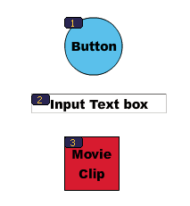

# Using Flash to enter accessibility information for screen readers

## Flash for screen readers and accessibility

Screen readers read aloud a description of the content, read text, and assist
users as they navigate through the user interfaces of traditional applications
such as menus, toolbars, dialog boxes, and input text fields.

By default, the following objects are defined as accessible in all Flash Pro
documents and are included in the information that Flash Player provides to
screen reader software:

- Dynamic text

- Input text fields

- Buttons

- Movie clips

- Entire Flash Pro applications

  Flash Player automatically provides names for static and dynamic text objects,
  which are the contents of the text. For each of these accessible objects, you
  can set descriptive properties for screen readers to read aloud. You can also
  control how Flash Player decides which objects to expose to screen readers—for
  example, you can specify that certain accessible objects are not exposed to
  screen readers at all.

## The Flash Accessibility panel

The Flash Accessibility panel (Window \> Other Panels \> Accessibility) lets you
provide accessibility information to screen readers and set accessibility
options for individual Flash Pro objects or entire Flash Pro applications.

> **Note:** Alternatively, use ActionScript code to enter accessibility
> information. If you select an object on the Stage, you can make that object
> accessible and specify options and tab order for the object. For movie clips,
> you can specify whether child object information is passed to the screen
> reader (the default when you make an object accessible).

With no objects selected on the Stage, use the Accessibility panel to assign
accessibility options for an entire Flash Pro application. You can make the
entire application accessible, make child objects accessible, have Flash Pro
label objects automatically, and give specific names and descriptions to
objects.

All objects in Flash Pro documents must have instance names for you to apply
accessibility options to them. Create instance names for objects in the Property
inspector. The instance name is used to refer to the object in ActionScript.

The following options are available in the Accessibility panel:

Make Object Accessible  
(Default) Instructs Flash Player to pass the accessibility information for an
object to a screen reader. When the option is disabled, accessibility
information for the object is not passed to screen readers. Disabling this
option as you test content for accessibility can be useful because some objects
might be extraneous or decorative and making them accessible could produce
confusing results in the Screen Reader. You can then apply a name manually to
the labeled object, and hide the labeling text by deselecting Make Object
Accessible. When Make Object Accessible is disabled, all other controls on the
Accessibility panel are disabled.

Make Child Objects Accessible  
(Movie clips only; Default) Instructs Flash Player to pass child object
information to the screen reader. Disabling this option for a movie clip causes
that movie clip to appear as a simple clip in the accessible object tree, even
if the clip contains text, buttons, and other objects. All objects in the movie
clip are then hidden from the object tree. This option is useful mainly for
hiding extraneous objects from screen readers.

> **Note:** If a movie clip is used as a button—it has a button event handler
> assigned to it, such as `onPress` or `onRelease`—the Make Child Objects
> Accessible option is ignored because buttons are always treated as simple
> clips, and their children are never examined, except in the case of labels.

Auto Label  
Instructs Flash Pro to automatically label objects on the Stage with the text
associated with them.

Name  
Specifies the object name. Screen readers identify objects by reading these
names aloud. When accessible objects don't have specified names, a screen reader
might read a generic word, such as _Button_, which can be confusing. Important:
Do not confuse object names specified in the Accessibility panel with instance
names specified in the Property inspector. Giving an object a name in the
Accessibility panel does not give it an instance name.

Description  
Lets you enter a description of the object to the screen reader. The screen
reader reads this description.

Shortcut  
Describes keyboard shortcuts to the user. The screen reader reads the text in
this text field. Entering keyboard shortcut text here does not create a keyboard
shortcut for the selected object. You must provide ActionScript keyboard
handlers to create shortcut keys.

Tab Index (Adobe® Flash® Professional CS5 only)  
Creates a tab order in which objects are accessed when the user presses the tab
key. The tab index feature works for keyboard navigation through a page, but not
for screen reader reading order.

For more information, see the
[Flash Pro Accessibility web page](https://web.archive.org/web/20101005081148/http://www.adobe.com/accessibility/products/flash/).

For a sample of accessible rich media content, see the
[Flash Samples page](https://web.archive.org/web/20120102164641/http://www.adobe.com/devnet/flash/samples.html).
Download and decompress the Samples zip file and navigate to the
Accessibility\AccessibleApplications folder to access the sample.

## Selecting names for buttons, text fields, and entire SWF applications

Use the Accessibility panel in the following ways to assign names to buttons and
input text fields so that the screen reader identifies them appropriately:

- Use the auto label feature to assign text adjacent or in the object as a
  label.

- Enter a specific label in the Accessibility panel name field.

  Flash Pro automatically applies the name that you place on top of, in, or near
  a button or text field as a text label. Labels for buttons must appear within
  the bounding shape of the button. For the button in the following example,
  most screen readers would first read the word _button_, then read the text
  label _Home_. The user can press Return or Enter to activate the button.

  

  A form might include an input text field where users enter their names. A
  static text field, with the text _Name_ appears next to the input text field.
  When Flash Player discovers such an arrangement, it assumes that the static
  text object serves as a label for the input text field.

  For example, when the following part of a form is encountered, a screen reader
  reads "Enter your name here."

  

  A.  
   Static text

  B.  
   Input text field

  In the Accessibility panel, turn off automatic labeling if it is not
  appropriate for your document. You can also turn off automatic labeling for
  specific objects in your document.

## Provide a name for an object

You can turn off automatic labeling for part of an application and provide names
for the objects in the Accessibility panel. If you have automatic labeling
turned on, you can select specific objects and provide names for the objects in
the Name text field in the Accessibility panel so that the name is used instead
of the object text label.

When a button or input text field doesn't have a text label, or when the label
is in a location that Flash Player can't detect, you can specify a name for the
button or text field. You can also specify a name if the text label is near a
button or text field, but you don't want that text to be used as that object's
name.

In the following example, the text that describes the button appears outside and
to the right of the button. In this location, Flash Player does not detect the
text, and the screen reader does not read it.

To correct this situation, open the Accessibility panel, select the button, and
enter the name and description. To prevent repetition, make the text object
inaccessible.

> **Note:** An object's accessibility name is unrelated to the ActionScript
> instance name or ActionScript variable name associated with the object. (This
> information generally applies to all objects.) For information on how
> ActionScript handles instance names and variable names in text fields, see
> About text field instance and variable names in
> [_Learning ActionScript 2.0 in Adobe Flash_](https://web.archive.org/web/20120116125748/http://help.adobe.com/en_US/FlashPlatform/reference/actionscript/2/help.html?content=Part1_Learning_AS2_1.html).

### Specify a name and description for a button, text field, or entire SWF application

1.  Do one of the following:
    - To provide a name for a button or text field, select the object on the
      Stage.

    - To provide a name for an entire Flash Pro application, deselect all
      objects on the Stage.

2.  Select Window \> Other Panels \> Accessibility.
3.  Select either Make Object Accessible (for buttons or text fields) or the
    default, Make Movie Accessible (for entire Flash Pro applications).
4.  Enter a name and description for the button, text field, or Flash Pro
    application.

### Define accessibility for a selected object in a SWF application

1.  Select Window \> Other Panels \> Accessibility.
2.  Do one of the following:
    - Select Make Object Accessible (the default setting) to expose the object
      to screen readers and to enable other options in the panel.

    - Deselect Make Object Accessible to hide the object from screen readers and
      disable the other options in the panel.

3.  Enter a name and a description for the selected object as needed:

    **Dynamic text**  
    To provide a description for static text, you must convert it to dynamic
    text.

    **Input text fields or buttons**  
    Enter a keyboard shortcut.

    **Movie clips**  
    Select Make Child Objects Accessible to expose the objects inside the movie
    clip to screen readers.

    > **Note:** If you can describe your application in a simple phrase that a
    > screen reader can easily convey, turn off Make Children Accessible, and
    > type a suitable description.

## Make an entire SWF application accessible

After a Flash Pro document is complete and ready to be published or exported,
make the entire Flash Pro application accessible.

1.  Deselect all elements in the document.
2.  Select Window \> Other Panels \> Accessibility.
3.  Select Make Movie Accessible (the default setting) to expose the document to
    screen readers.
4.  Select or deselect Make Children Accessible to expose or omit any accessible
    objects in the document to screen readers.
5.  If you selected Make Movie Accessible in step 2, enter a name and
    description for the document as needed.
6.  Select Auto Label (the default setting) to use text objects as automatic
    labels for accessible buttons or input text fields contained in the
    document. Deselect this option to turn off automatic labeling and expose
    text objects to screen readers as text objects.

## Viewing and creating tab order and reading order

The two aspects to tab indexing order are the _tab order_ in which a user
navigates through the web content and the order in which things are read by the
screen reader, called the _reading order_.

Flash Player uses a tab index order from left to right and top to bottom.
Customize both the tab and reading order by using the `tabIndex` property in
ActionScript (in ActionScript, the `tabIndex` property is synonymous with the
reading order).

> **Note:** Flash Player no longer requires that you add all of the objects in a
> FLA file to a list of tab index values. Even if you do not specify a tab index
> for all objects, a screen reader reads each object correctly.

Tab order  
The order in which objects receive input focus when users press the Tab key. Use
ActionScript to create the tab order, or if you have
Adobe® Flash® Professional CS5, use the Accessibility panel. The tab index that
you assign in the Accessibility panel does not necessarily control the reading
order.

Reading order  
The order in which a screen reader reads information about the object. To create
a reading order, use ActionScript to assign a tab index to every instance.
Create a tab-order index for every accessible object, not just the focusable
objects. For example, dynamic text must have tab indexes, even though a user
cannot tab to dynamic text. If you do not create a tab index for every
accessible object in a given frame, Flash Player ignores all tab indexes for
that frame whenever a screen reader is present, and uses the default tab
ordering instead.

## Create a tab-order index for keyboard navigation in the Accessibility panel

You can create a custom tab-order index in the Accessibility panel for keyboard
navigation for the following objects:

- Dynamic text

- Input text

- Buttons

- Movie clips, including compiled movie clips

- Components

- Screens

  > **Note:** You can also use ActionScript code to create a tab-order index for
  > keyboard navigation.

  Tab focus occurs in numerical order, starting from the lowest index number.
  After tab focus reaches the highest tab index, focus returns to the lowest
  index number.

  When you move tab-indexed objects that are user-defined in your document, or
  to another document, Flash Pro retains the index attributes. Check for and
  resolve index conflicts (for example, two different objects on the Stage with
  the same tab-index number).

  > **Important:** If two or more objects have the same tab index in any given
  > frame, Flash Pro follows the order in which the objects were placed on the
  > Stage.

1.  Select the object in which to assign a tab order.
2.  Select Window \> Other Panels \> Accessibility.
3.  If you're providing an index for the selected object only, in the Tab Index
    text field, enter a positive integer (up to 65535) that reflects the order
    in which the selected object should receive focus.
4.  To view a tab order, select View \> Show Tab Order. Tab index numbers for
    individual objects appear in the upper-left corner of the object.

    

    <caption>Tab index numbers</caption>

    > **Note:** Tab indexes created with ActionScript code do not appear on the
    > Stage when the Show Tab Order option is enabled.

More Help topics

[Creating accessibility with ActionScript](./creating-accessibility-with-actionscript.md)

[Create a keyboard shortcut to an object for screen readers](./specifying-advanced-accessibility-options-for-screen-readers.md#create-a-keyboard-shortcut-to-an-object-for-screen-readers)

[Turn off automatic labeling and specify an object name for screen readers](./specifying-advanced-accessibility-options-for-screen-readers.md#turn-off-automatic-labeling-and-specify-an-object-name-for-screen-readers)

[Use ActionScript to create a tab order for accessible objects](./creating-accessibility-with-actionscript.md#use-actionscript-to-create-a-tab-order-for-accessible-objects)
