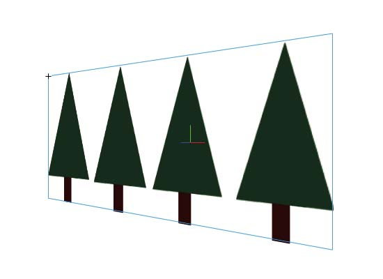
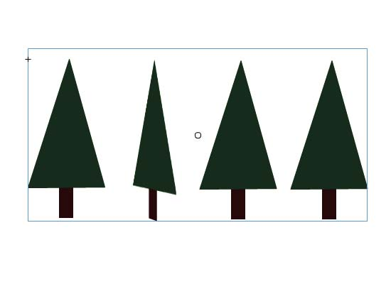
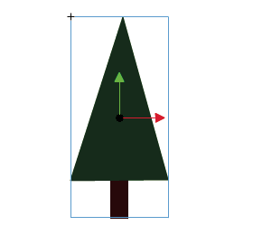
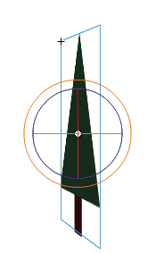
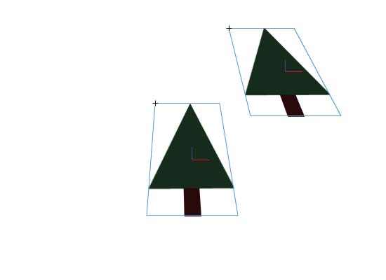

# 3D graphics

## About 3D graphics in Flash

Flash Pro allows you to create 3D effects by moving and rotating movie clips in
3D space on the Stage. Flash Pro represents 3D space by including a z axis in
the properties of each movie clip instance. You add 3D perspective effects to
movie clip instances by moving them along their x axis or rotating them around
their x or y axis using the 3D Translation and 3D Rotation tools. In 3D
terminology, moving an object in 3D space is called a _translation_ and rotating
an object in 3D space is called a _transformation_. Once you have applied either
of these effects to a movie clip, Flash Pro considers it a 3D movie clip and a
colored axes indicator appears overlaid onto the movie clip whenever it is
selected.

To make an object appear nearer or further away from the viewer, move it along
its z axis with the 3D Translation tool or the Property inspector. To give the
impression of an object that is at an angle to the viewer, rotate the movie clip
around its z axis with the 3D Rotation tool. By using these tools in
combination, you can create realistic perspective effects.

Both the 3D Translation and the 3D Rotation tools allow you to manipulate
objects in global or local 3D space. Global 3D space is the Stage space. Global
transforms and translations are relative to the Stage. Local 3D space is the
movie clip space. Local transforms and translations are relative to the movie
clip space. For example, if you have a movie clip containing several nested
movie clips, local 3D transforms of the nested movie clips are relative to the
drawing area inside the container movie clip. The default mode of the 3D
Translation and Rotation tools is global. To use them in local mode, click the
Global toggle button in the Options section of the Tools panel.

<caption>The Stage with a movie clip rotated in global 3D space.</caption>

<caption>The Stage with a movie clip containing a nested movie clip rotated in local 3D
space.</caption>

By using the 3D properties of movie clip instances in your FLA file, you can
create a variety of graphic effects without duplicating movie clips in the
library. However, when you edit a movie clip from the library, 3D transforms and
translations that have been applied are not visible. When editing the contents
of a movie clip, only 3D transforms of nested movie clips are visible.

> **Note:** Once a 3D transform is added to a movie clip instance, its parent
> movie clip symbol cannot be edited in Edit in Place mode. If you have 3D
> objects on the Stage, you can add certain 3D effects to all of those objects
> as a group by adjusting the Perspective Angle and Vanishing Point properties
> of your FLA file. The Perspective Angle property has the effect of zooming the
> view of the Stage. The Vanishing Point property has the effect of panning the
> 3D objects on the Stage. These settings only affect the appearance of movie
> clips that have a 3D transform or translation applied to them.

In the Flash Pro authoring tool, you can control only one viewpoint, or
_camera_. The camera view of your FLA file is the same as the Stage view. Each
FLA file has only one perspective Angle and Vanishing Point setting.

To use the 3D capabilities of Flash Pro, the publish settings of your FLA file
must be set to Flash Player 10 and ActionScript 3.0. Only movie clip instances
can be rotated or translated along the z axis. Some 3D capabilities are
available through ActionScript that are not available directly in the Flash Pro
user interface, such as multiple Vanishing Points and separate cameras for each
movie clip. Using ActionScript 3.0, you can apply 3D properties to objects such
as text, FLV Playback components, and buttons, in addition to movie clips.

> **Note:** The 3D tools cannot be used on objects on mask layers and layers
> containing 3D objects cannot be used as mask layers. For more information
> about mask layers, see
> [Using mask layers](../timelines-and-animation/using-mask-layers.md).

### Additional resources

The following resources provide additional detailed information about working
with 3D graphics in Flash Pro.

Articles:

- Mariko Ogawa has written a detailed article titled
  [Exploring the new 3D features in Flash Professional](https://web.archive.org/web/20120101132508mp_/http://www.adobe.com/devnet/flash/articles/3d_support.html)
  in the Adobe Flash Developer Center. The article describes using the 3D tools,
  animating 3D properties, and working with 3D in ActionScript 3.0.

## Move objects in 3D space

You move movie clip instances in 3D space with the 3D Translation tool
. When you select a movie clip with the tool,
its three axes, X, Y, and Z, appear on the Stage on top of the object. The x
axis is red, the y axis is green, and the z axis is blue.

The default mode of the 3D Translation tool is global. Moving an object in
global 3D space is the same as moving it relative to the Stage. Moving an object
in local 3D space is the same as moving it relative to its parent movie clip if
it has one. To toggle the 3D Translation tool between global and local modes,
click the Global toggle button in the Options section of the Tools panel while
the 3D Translation tool is selected. You can temporarily toggle the mode from
global to local by pressing the D key while dragging with the 3D Translation
tool.

The 3D Translation and Rotation tools occupy the same space in the Tools panel.
Click and hold the active 3D tool icon in the Tools panel to select the
currently inactive 3D tool.

By default, selected objects that have 3D translation applied appear with a 3D
axis overlay on the Stage. You can turn off this overlay in the General section
of Flash Preferences.

<caption>The 3D Translation tool overlay.</caption>

> **Note:** Changing the z axis position of a 3D movie clip will cause the movie
> clip to appear to change its x and y position as well. This is because
> movement along the z axis follows the invisible perspective lines which
> radiate from the 3D vanishing point (set in the 3D symbol instance Property
> inspector) to the edges of the Stage.

### Move a single object in 3D space

1.  Select the 3D Translation tool  in the
    Tools panel (or press the G key to select it).

2.  Set the tool to Local or Global mode.

    Be sure that the tool is in the mode you want mode by checking the Global
    toggle button in the Options section of the Tools panel. Click the button or
    press the D key to toggle the mode.

3.  Select a movie clip with the 3D Translation tool
    .

4.  To move the object by dragging with the tool, move the pointer over the x-,
    y-, or z-axis controls. The pointer changes when over any of the controls.

    The x- and y-axis controls are the arrow tips on each axis. Drag one of
    these controls in the direction of its arrow to move the object along the
    selected axis. The z-axis control is the black dot at the center of the
    movie clip. Drag the z-axis control up or down to move the object on the z
    axis.

5.  To move the object using the Property inspector, enter a value for X, Y, or
    Z in the 3D Position and View section of the Property inspector.

    When you move an object on the z axis, its apparent size changes. The
    apparent size appears in the Property inspector as the Width and Height
    values in the 3D Position and View section of the Property inspector. These
    values are read-only.

### Move a multiple-object selection in 3D space

When you select multiple movie clips, you can move one of the selected objects
with the 3D Translation tool  and the others
move in the same way.

- To move each object in the group in the same way in global 3D space, set the
  3D Translation tool to global mode and then drag one of the objects with the
  axis controls. Shift-double-click one of the selected objects to move the axis
  controls to that object.

- To move each object in the group in the same way in local 3D space, set the 3D
  Translation tool to local mode and then drag one of the objects with the axis
  controls. Shift-double-click one of the selected objects to move the axis
  controls to that object.

You can also move the axis controls to the center of the multiple selection by
double-clicking the z-axis control. Shift-double-click one of the selected
objects to move the axis controls to that object.

## Rotate objects in 3D space

You rotate movie clip instances in 3D space with the 3D Rotation tool
. A 3D rotation control appears on top of
selected objects on the Stage. The X control is red, the Y control is green, and
the Z control is blue. Use the orange free rotate control to rotate around the X
and Y axes at the same time.

The default mode of the 3D Rotation tool is global. Rotating an object in global
3D space is the same as moving it relative to the Stage. Rotating an object in
local 3D space is the same as moving it relative to its parent movie clip if it
has one. To toggle the 3D Rotation tool between global and local modes, click
the Global toggle button in the Options section of the Tools panel while the 3D
Rotation tool is selected. You can temporarily toggle the mode from global to
local by pressing the D key while dragging with the 3D Rotation tool.

The 3D Rotation and Translation tools occupy the same space in the Tools panel.
Click and hold the active 3D tool icon in the Tools panel to select the
currently inactive 3D tool.

By default, selected objects that have 3D rotation applied appear with a 3D axis
overlay on the Stage. You can turn off this overlay in the General section of
Flash Preferences.

<caption>The Global 3D Rotation tool overlay.</caption>

<caption>The Local 3D Rotation tool overlay.</caption>

### Rotate a single object in 3D space

1.  Select the 3D Rotation tool  in the Tools
    panel (or press the W key).

    Verify that the tool is in the mode that you want by checking the Global
    toggle button in the Options section of the Tools panel. Click the button or
    press the D key to toggle the mode between global and local.

2.  Select a movie clip on the Stage.

    The 3D Rotation controls appear overlaid on selected object. If the controls
    appear in a different location, double-click the control center point to
    move it to the selected object.

3.  Place the pointer over one of the four rotation axis controls.

    The pointer changes when over one of the four controls.

4.  Drag one of the axis controls to rotate around that axis, or the free rotate
    control (outer orange circle) to rotate x and y simultaneously.

    Drag the X axis control left or right to rotate around the x axis. Drag the
    y-axis control up or down to rotate around the y axis. Drag the z-axis
    control in a circular motion to rotate around the z axis.

5.  To relocate the rotation control center point relative to the movie clip,
    drag the center point. To constrain the movement of the center point to 45°
    increments, press the Shift key while dragging.

    Moving the rotation control center point lets you control the effect of the
    rotation on the object and its appearance. Double-click the center point to
    move it back to the center of the selected movie clip.

    The location of the rotation control center point for the selected object
    appears in the Transform panel as the 3D Center Point property. You can
    modify the location of the center point in the Transform panel.

### Rotate a multiple-object selection in 3D space

1.  Select the 3D Rotation tool  in the Tools
    panel (or press the W key).

    Verify that the tool is in the mode that you want by checking the Global
    toggle button in the Options section of the Tools panel. Click the button or
    press the D key to toggle the mode between global and local.

2.  Select multiple movie clips on the Stage.

    The 3D Rotation controls appear overlaid on the most recently selected
    object.

3.  Place the pointer over one of the four rotation axis controls.

    The pointer changes when over one of the four controls.

4.  Drag one of the axis controls to rotate around that axis, or the free rotate
    control (outer orange circle) to rotate X and Y simultaneously.

    Drag the x-axis control left or right to rotate around the x axis. Drag the
    y-axis control up or down to rotate around the y axis. Drag the z-axis
    control in a circular motion to rotate around the z axis.

    All of the selected movie clips rotate around the 3D center point which
    appears at the center of the rotation controls.

5.  To relocate the 3D rotation control center point, do one of the following:
    - To move the center point to an arbitrary location, drag the center point.

    - To move the center point to the center of one of the selected movie clips,
      Shift-double-click the movie clip.

    - To move the center point to the center of the group of selected movie
      clips, double-click the center point.

    Changing the location of the 3D rotation center point lets you control the
    effect of the rotation on the objects.

    The location of the rotation control center point for the selected object
    appears in the Transform panel as the 3D Center Point. You can modify the
    location of the center point in the Transform panel.

### Rotate a selection with the Transform panel

1.  Open the Transform panel (Window \> Transform).
2.  Select one or more movie clips on the Stage.
3.  In the Transform panel, enter the desired values in the 3D Rotation X, Y,
    and Z fields to rotate the selection. These fields contain hot text, so you
    can drag the values to change them.

    > **Note:** The 3D rotation takes place in global or local 3D space,
    > depending on the current mode of the 3D Rotation tool in the Tools panel.

4.  To move the 3D rotation point, enter the desired values in the 3D Center
    Point X, Y, and Z fields.

## Adjusting the Perspective Angle

The Perspective Angle property of a FLA file controls the apparent angle of view
of 3D movie clips on the Stage.

Increasing or decreasing the Perspective Angle affects the apparent size of 3D
movie clips and their location relative to the edges of the Stage. By increasing
the Perspective Angle, you make 3D objects appear closer to the viewer. By
decreasing the Perspective Angle property, you make 3D objects appear further
away. The effect is like zooming in or out with a camera lens which changes the
angle of view through the lens.

<caption>The Stage with a Perspective Angle of 55.</caption>

<caption>The Stage with a Perspective Angle of 110.</caption>

The Perspective Angle property affects all movie clips with 3D translation or
rotation applied to them. The Perspective Angle does not affect other movie
clips. The default Perspective Angle is 55° of view, like a normal camera lens.
The range of values is from 1° to 180°.

To view or set the Perspective Angle in the Property inspector, a 3D movie clip
must be selected on Stage. Changes to the Perspective Angle are visible on the
Stage immediately.

The Perspective Angle changes automatically when you change the Stage size so
that the appearance of 3D objects does not change. You can turn off this
behavior in the Document Properties dialog box.

To set the Perspective Angle:

1.  On the Stage, select a movie clip instance that has 3D rotation or
    translation applied to it.
2.  In the Property inspector, enter a new value in the Perspective Angle field,
    or drag the hot text to change the value.

## Adjust the Vanishing Point

The Vanishing Point property of a FLA file controls the orientation of the z
axis of 3D movie clips on the Stage. The z axes of all 3D movie clips in a FLA
file recede toward the Vanishing Point. By relocating the Vanishing Point, you
change the direction that an object moves when translated along its z axis. By
adjusting the position of the Vanishing Point, you can precisely control the
appearance of 3D objects and animation on the Stage.

For example, if you locate the Vanishing Point at the upper-left corner of the
Stage (0, 0), then increasing the value of the Z property of a movie clip moves
the movie clip away from the viewer and toward the upper-left corner of the
Stage.

Because the Vanishing Point affects all 3D movie clips, changing it also changes
the position of all movie clips that have a z-axis translation applied.

The Vanishing Point is a document property that affects all movie clips that
have z-axis translation or rotation applied to them. The Vanishing Point does
not affect other movie clips. The default location of the Vanishing Point is the
center of the Stage.

To view or set the Vanishing Point in the Property inspector, a 3D movie clip
must be selected on Stage. Changes to the Vanishing Point are visible on the
Stage immediately.

To set the Vanishing Point:

1.  On the Stage, select a movie clip that has 3D rotation or translation
    applied to it.
2.  In the Property inspector, enter a new value in the Vanishing Point field,
    or drag the hot text to change the value. Guides indicating the location of
    the Vanishing Point appear on the Stage while dragging the hot text.
3.  To move the Vanishing Point back to the center of the Stage, click the Reset
    button in the Property inspector.

> **Note:** If you resize the Stage, the Vanishing Point does not update
> automatically. To maintain the 3D look created by a specific placement of the
> Vanishing Point, you will need to reposition the Vanishing Point relative to
> the new Stage size.

More Help topics

[Working in three dimensions (3D)](https://web.archive.org/web/20120101132508mp_/http://help.adobe.com/en_US/as3/dev/WSF24A5A75-38D6-4a44-BDC6-927A2B123E90.html)
