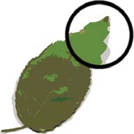
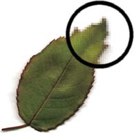
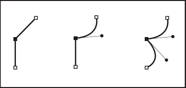
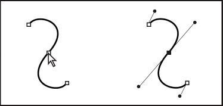

# About drawing

The drawing tools in Adobe® Flash® Professional CS5 let you create and modify
lines and shapes for the artwork in your documents. The lines and shapes you
create in Flash Pro are all lightweight vector graphics, which help keep your
FLA file size small.

Before you draw and paint in Flash Pro, it is important to understand how Flash
Pro creates artwork, and how drawing, painting, and modifying shapes can affect
other shapes on the same layer.

## Vector and bitmap graphics

Computers display graphics in either vector or bitmap format. Understanding the
difference between the two formats helps you work more efficiently. Using Flash
Pro, you can create and animate compact vector graphics. Flash Pro also imports
and manipulates vector and bitmap graphics that were created in other
applications.

#### Vector graphics

Vector graphics describe images by using lines and curves, called _vectors,_
that also include color and position properties. For example, the image of a
leaf is described by points through which lines pass, creating the leaf's
outline. The color of the leaf is determined by the color of the outline and the
color of the area enclosed by the outline.

Lines in vector art.

When you edit a vector graphic, you modify the properties of the lines and
curves that describe its shape. Move, resize, reshape, and change the color of a
vector graphic without changing the quality of its appearance. Vector graphics
are resolution independent; that is, they can be displayed on output devices of
varying resolutions without losing any quality.

#### Bitmap graphics

Bitmap graphics describe images using colored dots, called _pixels,_ arranged in
a grid. For example, the image of a leaf is described by the specific location
and color value of each pixel in the grid, creating an image in much the same
manner as a mosaic.

Pixels in bitmap art.

When you edit a bitmap graphic, you modify pixels rather than lines and curves.
Bitmap graphics are resolution dependent, because the data describing the image
is fixed to a grid of a particular size. Editing a bitmap graphic can change the
quality of its appearance. In particular, resizing a bitmap graphic can make the
edges of the image ragged as pixels are redistributed within the grid.
Displaying a bitmap graphic on an output device that has a lower resolution than
the image itself also degrades its quality.

## Paths

Whenever you draw a line or shape in Flash, you create a line called a _path_. A
path is made up of one or more straight or curved _segments_. The beginning and
end of each segment is denoted by _anchor points_, which work like pins holding
a wire in place. A path can be _closed_ (for example, a circle), or _open_, with
distinct _endpoints_ (for example, a wavy line).

You change the shape of a path by dragging its anchor points, the _direction
points_ at the end of _direction lines_ that appear at anchor points, or the
path segment itself.

<i>Image Missing: dr_06.png</i>

Components of a path

A.  
Selected (solid) endpoint

B.  
Selected anchor point

C.  
Unselected anchor point

D.  
Curved path segment

E.  
Direction point

F.  
Direction line. Paths can have two kinds of anchor points: corner points and
smooth points. At a _corner point_, a path abruptly changes direction. At a
_smooth point_, path segments are connected as a continuous curve. You can draw
a path using any combination of corner and smooth points. If you draw the wrong
type of point, you can always change it.

<i>Image Missing: dr_07.png</i>

Points on a path

A.  
Four corner points

B.  
Four smooth points

C.  
Combination of corner and smooth points. A corner point can connect any two
straight or curved segments, while a smooth point always connects two curved
segments.

<caption>A corner point can connect both straight segments and curved segments.</caption>

> **Note:** Don't confuse corner and smooth points with straight and curved
> segments.

A path outline is called a _stroke_. A color or gradient applied to an open or
closed path interior area is called a _fill_. A stroke can have weight
(thickness), color, and a dash pattern. After you create a path or shape, you
can change the characteristics of its stroke and fill.

## Direction lines and direction points

When you select an anchor point that connects curved segments (or select the
segment itself), the anchor points of the connecting segments display _direction
handles_, which consist of _direction lines_ that end in _direction points._ The
angle and length of the direction lines determine the shape and size of the
curved segments. Moving the direction points reshapes the curves. Direction
lines don't appear in the final output.  After selecting
an anchor point (left), direction lines appear on any curved segments connected
by the anchor point (right).

A smooth point always has two direction lines, which move together as a single,
straight unit. When you move a direction line on a smooth point, the curved
segments on both sides of the point are adjusted simultaneously, maintaining a
continuous curve at that anchor point.

In comparison, a corner point can have two, one, or no direction lines,
depending on whether it joins two, one, or no curved segments, respectively.
Corner point direction lines maintain the corner by using different angles. When
you move a direction line on a corner point, only the curve on the same side of
the point as that direction line is adjusted.

<i>Image Missing: dr_11.png</i>

<caption>Adjusting direction lines on a smooth point (left) and a corner point (right).</caption>

Direction lines are always tangent to (perpendicular to the radius of) the curve
at the anchor points. The angle of each direction line determines the slope of
the curve, and the length of each direction line determines the height, or
depth, of the curve.

<i>Image Missing: dr_12.png</i>

<caption>Moving and resizing direction lines changes the slope of curves.</caption>
