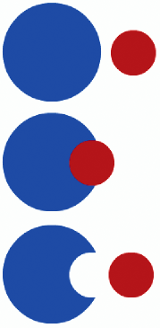
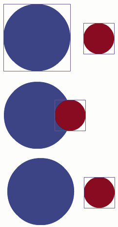
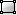
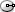
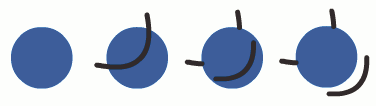
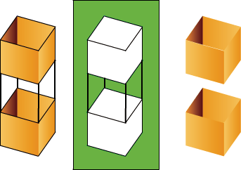

# Drawing modes and graphic objects

In Flash Pro, you can create several different kinds of graphic objects by using
different drawing modes and drawing tools. Each kind has its own advantages and
disadvantages. By understanding the capabilities of the different graphic object
types, you can make good decisions about which types of objects to use in your
work.

> **Note:** In Flash Pro, graphic objects are items on the Stage. Flash lets you
> move, copy, delete, transform, stack, align, and group graphic objects.
> "Graphic objects" in Flash are different from "ActionScript objects," which
> are part of the ActionScript® programming language. Do not confuse the two
> uses of the term _"objects_." For more information on objects in the
> programming language, see About Data Types in
> [Learning ActionScript 2.0 in Adobe Flash](https://web.archive.org/web/20111115153835mp_/http://www.adobe.com/go/learn_cs5_learningas2_en),
> or
> [Data types](https://web.archive.org/web/20111115153835mp_/http://help.adobe.com/en_US/as3/learn/WS5b3ccc516d4fbf351e63e3d118a9b90204-7f9c.html)
> in _the ActionScript 3.0 Developer's Guide_.

## Merge Drawing mode

The default drawing mode automatically merges shapes that you draw when you
overlap them. When you draw shapes that overlap each other in the same layer,
the top-most shape cuts away the part of the shape underneath it that it
overlaps. In this way, drawing shapes is a destructive drawing mode. For
example, if you draw a circle and overlay a smaller circle on top of it, and
then select the smaller circle and move it, the portion of the second circle
that overlaid the first circle is removed.

When a shape has both a stroke and a fill, they are considered separate graphic
elements that can be selected and moved independently.
 Shapes created with the Merge Drawing mode
merge together when they overlap. Selecting a shape and moving it results in the
overlaid shape being altered.

### Enter Merge Drawing mode

1.  Select the Merge Drawing option in the Tools panel.

2.  Select a drawing tool from the Tools panel and draw on the Stage > **Note:**
    By default, Flash Pro uses the Merge Drawing mode.

## Object Drawing mode

Creates shapes referred to as _drawing objects_. Drawing objects are separate
graphic objects that do not automatically merge together when overlaid. This
lets you overlap shapes without altering their appearance if you move them
apart, or rearrange their appearance. Flash Pro creates each shape as a separate
object that you can individually manipulate.

When a drawing tool is in Object Drawing mode, the shapes you create with it are
self-contained. The stroke and fill of a shape are not separate elements, and
shapes that overlap do not alter one another. When you select a shape created
using Object Drawing mode, Flash Pro surrounds the shape with a rectangular
bounding box to identify it.

> **Note:** Set preferences for contact sensitivity when selecting shapes
> created using the Object Drawing mode.

<caption>Shapes created with the Object Drawing mode remain separate objects that you can
manipulate individually.</caption>

### Enter Object Drawing mode

To draw shapes using Object Drawing mode, you must explicitly enable it.

1.  Select a drawing tool that supports Object Drawing mode (the Pencil, Line,
    Pen, Brush, Oval, Rectangle, and Polygon tools).

2.  Select the Object Drawing button  from
    the Options category of the Tools panel, or press the J key to toggle
    between the Merge and Object Drawing modes. The Object Drawing button
    toggles between the Merge and Object Drawing modes. You can set preferences
    for contact sensitivity when you select shapes created with Object Drawing
    mode.

3.  Draw on the Stage.

### Convert a Merge Drawing mode created shape to an Object Drawing mode shape

1.  Select the shape on the Stage.

2.  To convert the shape into an Object Drawing mode shape, select Modify \>
    Combine Objects \> Union. After conversion, the shape is treated like a
    vector-based drawing object that does not alter its appearance by
    interacting with other shapes. > **Note:** To join two or more shapes into a
    single, object-based shape, > use the Union command.

## Primitive objects

Primitive objects are shapes that let you adjust their characteristics in the
Property inspector. You can precisely control the size, corner radius, and other
properties of the shape at any time after you have created it without having to
draw it from scratch.

Two types of primitives are available, rectangles and ovals.

1.  Select the Rectangle Primitive Tool 
    or Oval Primitive Tool  from the Tools
    panel.

2.  Draw on the Stage.

## Overlapping shapes

When you draw a line across another line or painted shape in Merge Drawing mode,
the overlapping lines are divided into segments at the intersection points. To
select, move, and reshape each segment individually, use the Selection tool.

A fill; the fill with a line drawn through it; and the three line segments
created by segmentation.

When you paint on top of shapes and lines, the portion underneath is replaced by
whatever is on top. Paint of the same color merges together. Paint of different
colors remains distinct. To create masks, cutouts, and other negative images,
use these features. For example, the following cutout is made by moving the
ungrouped kite image onto the green shape, deselecting the kite, and then moving
the filled portions of the kite away from the green shape.

Making a cutout with the kite image.

To avoid inadvertently altering shapes and lines by overlapping them, group the
shapes or use layers to separate them.

More Help topics

[Group objects](../arranging-objects.md#group-objects)

[Create and organize layers](../../timelines-and-animation/timeline-layers.md#create-and-organize-layers)
