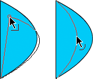
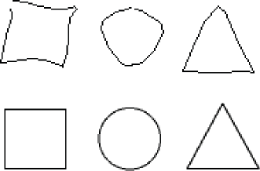

# Reshape lines and shapes

## Display and adjust points with the Subselection tool

1.  Select the Subselection tool .
2.  Click the line or shape outline.

## Reshape a line or shape

To reshape a line or shape outline, drag any point on a line using the Selection
tool. The pointer changes to indicate what type of reshaping it can perform on
the line or fill.

Flash Pro adjusts the curve of the line segment to accommodate the new position
of the moved point. If the repositioned point is an end point the line will
lengthen or shorten. If the repositioned point is a corner, the line segments
forming the corner remain straight as they become longer or shorter.
 When a corner appears next to the pointer, you can
change an end point. When a curve appears next to the pointer, you can adjust a
curve.

Some brush stroke areas are easier to reshape if you view them as outlines.

If you are having trouble reshaping a complex line, smooth it to remove some of
its details, making reshaping easier. Increasing the magnification can also make
reshaping easier and more accurate.

1.  Select the Selection tool .
2.  Do one of the following:

    - To reshape the segment, drag from any point.

    - To drag a line to create a new corner point, control-click (Windows) or
      Option-click (Macintosh).

## Straighten and smooth lines

Straightening makes small straightening adjustments to lines and curves you
already drew. It has no effect on segments that are already straight.

> **Note:** To adjust the degree of automatic smoothing and straightening,
> specify preferences for drawing settings.

To make Flash Pro recognize shapes, use the straightening technique. If you draw
any oval, rectangular, or triangular shapes with the Recognize Shapes option
turned off, use the Straightening option to make the shapes geometrically
perfect. Shapes that are touching, and thus connected to other elements, are not
recognized.  Shape recognition turns the
top shapes into the bottom shapes.

Smoothing softens curves and reduces bumps or other variations in a curve's
overall direction. It also reduces the number of segments in a curve. Smoothing
is relative, however, and has no effect on straight segments. It is particularly
useful when you are having trouble reshaping a number of very short curved line
segments. Selecting all the segments and smoothing them reduces the number of
segments, producing a gentler curve that is easier to reshape. Repeated
application of smoothing or straightening makes each segment smoother or
straighter, depending on how curved or straight each segment was originally.

- To smooth the curve of each selected stroke, select the Selection tool and
  click the Smooth modifier  in the Options section of the
  Tools panel. Each click of the Smooth modifier button makes the selected
  stroke progressively smoother.

- To enter specific parameters for a smoothing operation, choose Modify \>
  Shape \> Smooth. In the Smooth dialog box, enter values for the Smooth Angles
  Above, Smooth Angles Below, and Smoothing Strength parameters.

- To make small straightening adjustments on each selected fill outline or
  curved line, select the Selection tool  and click the
  Straighten modifier  in the Options section of the
  Tools panel.

- To enter specific parameters for a straightening operation, choose Modify \>
  Shape \> Straighten. In the Straighten dialog box, enter a value for the
  Straighten Strength parameter.

- To use shape recognition, select the Selection tool 
  and click the Straighten modifier , or select
  Modify \> Shape \> Straighten.

## Optimize curves

Optimizing smooths curves by refining curved lines and filling outlines,
reducing the number of curves used to define these elements. Optimizing curves
also reduces the size of the Flash Pro document (FLA file) and the exported
Flash Pro application (SWF file). Apply optimization to the same elements
multiple times.

1.  Select the drawn elements to optimize and select Modify \> Shape \>
    Optimize.
2.  To specify the degree of smoothing, drag the Optimization Strength slider.
    The results depend on the curves selected. Generally, optimizing produces
    fewer curves, with less resemblance to the original outline.
3.  To display a message indicating the number of segments in the selection
    before and after the optimization, select the Show Totals Message option.
    Flash Pro displays the message after the operation completes.
4.  Click OK.

## Modify shapes

1.  To convert lines to fills, select a line or multiple lines and select
    Modify \> Shape \> Convert Lines To Fills. Selected lines are converted to
    filled shapes, which allows you to fill lines with gradients or to erase a
    portion of a line. Converting lines to fills can make file sizes larger, but
    it can also speed up drawing for some animations.

2.  To expand the shape of a filled object, select a filled shape, and select
    Modify \> Shape \> Expand Fill. Enter a value in pixels for Distance and
    select Expand or Inset For Direction. Expand enlarges the shape, and Inset
    reduces it.

    This feature works best on a single, small, filled color shape with no
    stroke, that does not contain many small details.

3.  To soften the edges of an object, select a filled shape, and select
    Modify \> Shape \> Soften Fill Edges. Set the following options:

    **Distance**  
    The width, in pixels, of the soft edge.

    **Number Of Steps**  
    Controls how many curves are used for the soft edge effect. The more steps
    you use, the smoother the effect. Increasing steps also creates larger files
    and slows drawing.

    **Expand Or Inset**  
    Controls whether the shape is enlarged or reduced to soften the edges.

    This feature works best on a single filled shape that has no stroke, and can
    increase the file size of a Flash Pro document and the resulting SWF file.

## Delete everything on the Stage

 Double-click the Eraser
tool  in the toolbar. This erases all types of
content on the Stage and pasteboard.

## Remove stroke segments or filled areas

1.  Select the Eraser tool, and then click the Faucet
    modifier .
2.  Click the stroke segment or filled area to delete.

## Erase by dragging

1.  Select the Eraser tool.
2.  Click the Eraser Mode modifier and select an erasing mode:

    **Erase Normal**  
    Erases strokes and fills on the same layer.

    **Erase Fills**  
    Erases only fills; strokes are not affected.

    **Erase Lines**  
    Erases only strokes; fills are not affected.

    **Erase Selected Fills**  
    Erases only the currently selected fills and does not affect strokes,
    selected or not. (Select the fills to erase before using the Eraser tool in
    this mode.)

    **Erase Inside**  
    Erases only the fill on which you begin the Eraser stroke. If you begin
    erasing from an empty point, nothing is erased. Strokes are unaffected by
    the eraser in this mode.

3.  Click the Eraser Shape modifier and select an eraser shape and size. Make
    sure that the Faucet modifier is not selected.
4.  Drag on the Stage.

More Help topics

[Adjust anchor points on paths](./drawing-in-flash/drawing-with-the-pen-tool.md#adjust-anchor-points-on-paths)

[Drawing preferences](./drawing-in-flash/drawing-preferences.md)
