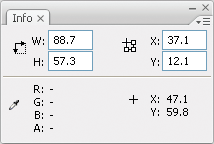
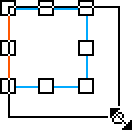
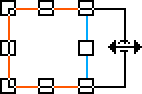

# Transforming and combining graphic objects

## Transforming objects

You can transform graphic objects, as well as groups, text blocks, and
instances, by using the Free Transform tool or the options in the Modify \>
Transform menu. Depending on the type of element you select, you can transform,
rotate, skew, scale, or distort the element. You can change or add to a
selection during a transformation operation.

When you transform an object, group, text box, or instance, the Property
inspector for that item displays any changes made to the item's dimensions or
position.

A bounding box appears during transform operations that involve dragging. The
bounding box is rectangular (unless it was modified with the Distort command or
the Envelope modifier), with its edges initially aligned parallel to the edges
of the Stage. Transformation handles are located on each corner and in the
middle of each side. As you drag, the bounding box previews the transformations.

### Move, realign, change, and track the transformation point

During a transformation, a transformation point appears at the center of a
selected element. The transformation point is initially aligned with the
object's center point. You can move the transformation point, return it to its
default location, and move the default point of origin.

For scaling, skewing, or rotating graphic objects, groups, and text blocks, the
point opposite the point you drag is the point of origin by default. For
instances, the transformation point is the point of origin by default. You can
move the default point of origin for a transformation.

1.  Select the Free Transform tool , or select
    one of the Modify \> Transform commands.

    Once you have begun a transformation, you can track the location of the
    transformation point in the Info panel and in the Property inspector.

2.  Do one of the following:

    - To move the transformation point, drag it from within the selected graphic
      object.

    - To realign the transformation point with the element's center point,
      double-click the transformation point.

    - To switch the point of origin for a scale or skew transformation, hold
      down the Alt key (Windows) or Option key (Macintosh) while dragging your
      chosen object control point during the transformation.

    - To display the transformation point coordinates in the Info panel, click
      the Registration/Transformation Point button in the Info panel. The
      lower-right square in the button becomes a circle to indicate the
      registration point coordinates are being displayed.

    When you select the center square, the X and Y values to the right of the
    coordinate grid in the Info panel display the _x_ and _y_ coordinates of the
    transformation point. In addition, the X and Y values for the transformation
    point appear in the Property inspector for the symbol.

    

    Coordinate grid; Info panel with Registration/Transformation Point button in
    transformation mode, and with x and y coordinates of the selection
    transformation point visible.

    By default, the Registration/Transformation Point button is in registration
    mode, and the X and Y values display the location of the upper-left corner
    of the current selection, relative to the upper-left corner of the Stage.

    **Note:** For symbol instances, the X and Y values display the location of
    the symbol registration point, or the location of the upper-left corner of
    the symbol instance.

### Use the Free Transform tool

You can perform individual transformations or combine several transformations,
such as moving, rotating, scaling, skewing, and distortion.

> **Note:** The Free Transform tool cannot transform symbols, bitmaps, video
> objects, sounds, gradients, or text. If a multiple selection contains any of
> these items, only the shape objects are distorted. To transform a text block,
> first convert the characters to shape objects.

1.  Select a graphic object, group, instance, or text block on the Stage.

2.  Click the Free Transform tool .

    Moving the pointer over and around the selection changes the pointer to
    indicate which transformation function is available.

3.  To transform the selection, drag the handles:

    - To move the selection, position the pointer over the object within the
      bounding box, and drag the object to a new position. Do not drag the
      transformation point.

    - To set the center of rotation or scaling, drag the transformation point to
      a new location.

    - To rotate the selection, position the pointer just outside a corner handle
      and drag. The selection rotates around the transformation point.
      Shift-drag to rotate in 45° increments.

    - To rotate around the opposite corner, Alt-drag (Windows) or Option-drag
      (Macintosh).

    - To scale the selection, drag a corner handle diagonally to scale in two
      dimensions. Shift-drag to resize proportionally.

    - To scale in the respective direction only, drag a corner handle or a side
      handle horizontally or vertically.

    - To skew the selection, position the pointer on the outline between the
      transformation handles and drag.

    - To distort shapes, press Control (Windows) or Command (Macintosh) and drag
      a corner handle or a side handle.

    - To _taper_ the object—to move the selected corner and the adjoining corner
      equal distances from their origins, Shift-Control-click to drag (Windows)
      or Shift-Command-click to drag (Macintosh) a corner handle.

4.  To end the transformation, click outside the selected item.

### Distort objects

When you apply a Distort transformation to a selected object, dragging a corner
handle or an edge handle on the bounding box moves the corner or edge and
realigns the adjoining edges. Shift-drag a corner point to constrain the
distortion to a taper—that is, move that corner and the adjoining corner an
equal distance and in the opposite direction from each other. The adjoining
corner is the corner on the same axis as the direction you drag. Control-click
(Windows) or Command-click (Macintosh) to drag a middle point on an edge to move
the entire edge freely.

You can distort graphic objects by using the Distort command. You can also
distort objects when performing a free transform on them.

> **Note:** The Distort command cannot modify symbols, shape primitives,
> bitmaps, video objects, sounds, gradients, object groups, or text. If a
> multiple selection contains any of these items, only the shape objects are
> distorted. To modify text, first convert the characters to shape objects.

1.  Select a graphic object or objects on the Stage.
2.  Select Modify \> Transform \> Distort.
3.  Place the pointer on one of the transformation handles and drag.
4.  To end the transformation, click outside the selected object or objects.

### Modify shapes with the Envelope modifier

The Envelope modifier lets you warp and distort objects. An envelope is a
bounding box that contains one or more objects. Changes made to an envelope's
shape affect the shape of the objects in the envelope. You edit the shape of an
envelope by adjusting its points and tangent handles.

> **Note:** The Envelope modifier cannot modify symbols, bitmaps, video objects,
> sounds, gradients, object groups, or text. If a multiple selection contains
> any of these items, only the shape objects are distorted. To modify text,
> first convert the characters to shape objects.

1.  Select a shape on the Stage.
2.  Select Modify \> Transform \> Envelope.
3.  Drag the points and tangent handles to modify the envelope.

### Scale objects

Scaling an object enlarges or reduces the object horizontally, vertically, or
both.

1.  Select a graphic object or objects on the Stage.
2.  Select Modify \> Transform \> Scale.
3.  Do one of the following:

    - To scale the object both horizontally and vertically, drag one of the
      corner handles. Proportions are maintained as you scale. Shift-drag to
      scale nonuniformly.

      

    - To scale the object either horizontally or vertically, drag a center
      handle.

      

4.  To end the transformation, click outside the selected object or objects.

    > **Note:** When you increase the size of a number of items, items near the
    > edges of the bounding box might be moved off the Stage. If this occurs,
    > select View \> Pasteboard to see the elements that are beyond the edges of
    > the Stage.

### Rotate and skew objects

Rotating an object turns it around its transformation point. The transformation
point is aligned with the registration point, which defaults to the center of
the object, but you can move the point by dragging it. You can rotate an object
by the following methods:

- Dragging with the Free Transform tool  (you
  can skew and scale the object in the same operation).

- By specifying an angle in the Transform panel (you can scale the object in the
  same operation).

#### Rotate and skew objects by dragging

1.  Select the object or objects on the Stage.
2.  Select Modify \> Transform \> Rotate And Skew.
3.  Do one of the following:

    - Drag a corner handle to rotate the object.

    - Drag a center handle to skew the object.

4.  To end the transformation, click outside the selected object or objects.

#### Rotate objects by 90°

1.  Select the object or objects.
2.  Select Modify \> Transform \> Rotate 90° CW to rotate clockwise, or
    Rotate 90° CCW to rotate counterclockwise.

#### Skew objects

Skewing an object transforms it by slanting it along one or both axes. You can
skew an object by dragging or by entering a value in the Transform panel.

1.  Select the object or objects.
2.  Select Window \> Transform.
3.  Click Skew.
4.  Enter angles for the horizontal and vertical values.

### Flip objects

You can flip objects across their vertical or horizontal axis without moving
their relative position on the Stage.

1.  Select the object.
2.  Select Modify \> Transform \> Flip Vertical or Flip Horizontal.

### Restore transformed objects

When you use the Free Transform tool or the Transform panel to scale, rotate,
and skew instances, groups, and text, Flash saves the original size and rotation
values with the object. This lets you remove the transformations you applied and
restore the original values.

You can undo only the most recent transformation when you select Edit \> Undo.
You can remove all transformations by clicking the Remove Transform button in
the panel before you deselect the object. After you deselect the object the
original values are lost and the transformation cannot be removed.

#### Restore a transformed object to its original state

1.  Ensure the transformed object is still selected.
2.  Do one of the following:

    - Click the Remove Transform button  in the
      Transform panel

    - Select Modify \> Transform \> Remove Transform

## Combining objects

To create new shapes by combining or altering existing objects, use the Combine
Objects commands in the Modify menu (Modify \> Combine Objects). In some cases,
the stacking order of selected objects determines how the operation works.

Each command applies to specific types of graphic objects, which are noted
below. A merge shape is a shape drawn with a tool set to Merge Drawing mode. A
drawing Object is a shape drawn with a tool set to Object Drawing mode.

The Combine Objects commands are:

Union  
Joins two or more merge shapes or drawing objects. The result is a single Object
Drawing mode shape consisting of all the portions visible on the shapes before
they were unified. The unseen, overlapping portions of the shapes are deleted.

> **Note:** Unlike when you use the Group command (Modify \> Group), you cannot
> break apart shapes joined by using the Union command.

Intersect  
Creates an object from the intersection of two or more drawing objects. The
resulting Object Drawing shape consists of the overlapping portions of the
combined shapes. Any part of the shape that doesn't overlap is deleted. The
resulting shape uses the fill and stroke of the top-most shape in the stack.

Punch  
Removes portions of a selected drawing object as defined by the overlapping
portions of another selected drawing object positioned in front of it. Any part
of a drawing object that is overlapped by the top-most object is deleted, and
the top-most object is deleted entirely. The resulting objects remain separate
and are not combined into a single object (unlike the Union or Intersect
commands, which join the objects together).

Crop  
Uses the outline of one drawing object to crop another drawing object. The front
or top-most object defines the shape of the cropped area. Any part of an
underlying drawing object that overlaps with the top-most object remains, while
all other portions of the underlying objects are deleted, and the top-most
object is deleted entirely. The resulting objects remain separate, and are not
combined into a single object (unlike the Union or Intersect commands, which
join the objects).

More Help topics

[About 9-slice scaling and movie clip symbols](../symbols-instances-and-library-assets/scaling-and-caching-symbols.md#about-9-slice-scaling-and-movie-clip-symbols)

[Edit movie clip symbols with 9-slice scaling](../symbols-instances-and-library-assets/scaling-and-caching-symbols.md#edit-movie-clip-symbols-with-9-slice-scaling)
