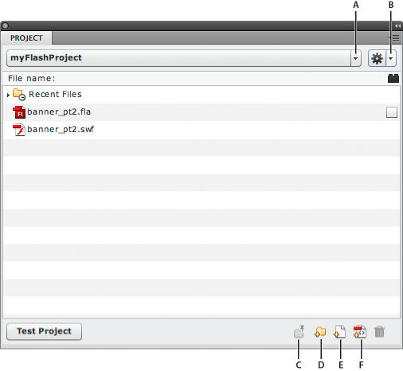

# Working with Flash projects

## Create projects

You can use the Flash Pro Project panel to manage multiple document files in a
single project. Flash Pro projects allow you to group multiple related files
together when creating complex applications.

A Flash Pro project can contain any Flash Pro file or other file type, including
FLA and SWF files from previous versions of Flash.

You use the Project panel to create and manage projects. The panel displays the
contents of a Flash Pro project in a collapsible tree structure. The panel title
bar displays the project name.

If certain types of project files are missing (not in the specified location), a
dialog specifying which items are missing will alert you to the missing files,
and give you an opportunity to browse for their locations. Missing files are
most commonly external folders not inside the root project folder. All other
files are automatically updated based on the root project folder location.

When you publish a project, each FLA file in the Publish List (denoted by a
check mark next to the FLA name) is published with the publish profile specified
for that file.

Only one project can be open at one time. If a project is open and you open or
create another project, Flash Pro automatically saves and closes the first
project.

(Flash CS5.5 only) Upon creation of a project, Flash creates an
AuthortimeSharedAssets.fla file within the project folder. Library items you
choose to share with other FLA files in the project are stored in this file. For
information about sharing library items, see
[Sharing library assets at author-time](../symbols-instances-and-library-assets/sharing-library-assets-across-files.md#sharing-library-assets-at-author-time).

The Project panel

A.  
Project menu

B.  
Options menu

C.  
Pin

D.  
New folder

E.  
New file

F.  
Create class

### Create a project

1.  From the Project menu select New Project.

2.  Browse for a Root folder location.

3.  Choose a name for your project. The default project name is the name of the
    root folder.

4.  Do one of the following:
    - **CS5:** From the ActionScript Version menu, choose the type of project
      you would like to create: ActionScript 3.0 or ActionScript 2.0. Then click
      Create Project.

    - **CS5.5:** If you want to create a new Flash document as part of the
      project, select the Create Default Document checkbox. Then choose a Player
      and ActionScript version for the default document. If you plan to create
      classes from templates, select the template version to use.

    Flash Pro adds the project to the Project menu, and the Project Panel
    displays the contents of the root folder you specified.

    Flash reads the directory of the initial folder you chose. To change
    directories, create another project.

### Create a Quick Project

The Project panel allows you to quickly create a project based on the currently
open FLA file. When you create a Quick Project, the project settings are
determined automatically base on the folder location and ActionScript version of
the current FLA file.

 Select Quick Project from the Project menu.

Flash creates a project using the currently active FLA file as the default
document. The Quick Project will be named after the FLA file.

To remove the Quick Project, delete it from the Project menu.

Multiple Quick Projects are allowed.

> **Note:** Creating a Quick Project from a FLA file that resides in the root of
> another project changes the name of the other project to the name of the FLA
> file, and sets the default document to the FLA file.

### Open an existing project

1.  Select Window \> Other Panels \> Project (CS5) or Window \> Project (CS5.5)
    to open the Project panel.
2.  Select Open Project from the Project pop-up menu in the Project panel.
3.  Using the Browse For Folder dialog box, navigate into the folder containing
    the project and click OK.

> **Note:** In Flash Pro CS5.5, you can open Flash Builder projects in the Flash
> Pro Project panel. The project must have been assigned the Flash Professional
> nature within Flash Builder. Flash Builder can also import Flash Pro projects.
> If a project is open in both aplications, changes made in one application
> automatically update in the other. You cannot open Dreamweaver projects in the
> Flash Pro Project panel.

### Close a project

 Select Close Project from the Panel Options menu.

### Delete a project

1.  Open the Project you want to delete.
2.  From the Panel Options menu select Delete Project.
3.  Select how to delete the project:
    - Delete the currently active project from the Project panel.

    - Delete the currently active project from the Project panel and all of the
      files stored in the project directory. This deletes the entire directory
      of files.

Flash Pro removes the selected project from the Project panel.

> **Note:** CS5.5 only - Deleting the project files from disk will prevent the
> project from being able to be opened in Flash Builder.

### Convert previous projects to the new project format

In versions of Flash Pro prior to CS4, projects used an XML file with the
filename extension .flp—for example, myProject.flp. To use projects created in
previous versions of Flash, you must convert the old project to the new format.

1.  Select Window \> Other Panels \> Project (CS5) or Window \> Project (CS5.5)
    to open the Project panel.
2.  Select Open Project from the Project pop-up menu in the Project panel.
3.  Using the Browse For Folder dialog box, navigate to the folder containing
    the FLP file, and click OK. This also specifies that folder as the converted
    project's root folder. The contents of the specified folder will be
    displayed in the Project panel.

### Tutorials

The following resources provide additional detailed information about working
with projects.

- Article:
  [Working with the Project panel in Flash](https://web.archive.org/web/20120121091804mp_/http://www.adobe.com/devnet/flash/articles/flash_project_panel.html)
  (Adobe.com)

## Manage projects

### Add a new file or folder to a project

The Project panel allows you to open, create, and remove project files and
folders.

The Project panel filters files by filename extension. However, you can manually
hide files by preceding the filename with a special character, such as an
underscore. To enable this feature, enter the special characters to filter in
the "Hide files or folders beginning with" section of the Panel Preferences
(Options \> Panel Preferences).

By default, the Project panel only shows Flash document types (FLA, SWF, SWC,
AS, JSFL, ASC, MXML, TXT, XML), but you can add custom types in the Settings tab
of the Panel Preferences (Options \> Panel Preferences).

The Project panel shows all files opened recently in the panel in the Recent
Files folder at the top of the project tree.

Recent Files are sorted in the order they were opened. Only files opened with
the Project panel appear in this list. To disable/enable the recent files
folder, toggle the Show Recent Files checkbox in the Settings Tab of the Panel
Preferences. You can also specify how many files are shown in the list.

To clear the Recent Files list, select Clear Recent Files from the Options menu,
or right-click the Recent Files folder, and select Clear Recent Files from the
context menu. Clearing the recent files list does not remove the files from your
computer.

To add a new file or folder to a project:

1.  In the Project panel, select the folder in which you want to create the new
    file or folder. If there is no selection, Flash Pro creates the file or
    folder in the project root folder.
2.  Click the New File or New Folder button at the bottom of the panel.
3.  If you are adding a file, choose a name and a file type. Select the Open
    File After Creation checkbox to open the new file in Flash. Then click
    Create File.

> **Note:** If a file or folder with the name you've specified already exists, a
> dialog alerts you about the existing file or folder. The new file appears in
> the Project panel file list.

### Add an external folder to a project

The Project panel allows for the addition of folders external to the project
root folder, referred to as _locations_. Folder paths can be added (and shown or
hidden) on a global basis, accessible to all projects, or per project. Locations
act like any other folder, and have all the same functionality as folders in the
project root folder.

1.  Open the Panel Preferences to set global locations, or the Project
    Properties to set locations for the current project.

2.  Select the Locations tab.

3.  To make locations visible in the project file list, select the "Specify
    additional source folders outside of the root project folder" checkbox.

4.  Click the "+" button.

5.  Browse to the external folder you want to add.

6.  Give the location a name.

    Location names can be changed at any time in the Project Properties or Panel
    Preferences by selecting the desired location and clicking on the Rename
    Location button.

7.  When you are finished adding locations, click OK to close the dialog.
    Location folders appear above all other folders in the file list. You cannot
    delete or remove a location in the operating system file browser. Remove
    them using the Locations tab in the Project Properties or Panel Preferences.

### Remove a file or folder from a project

1.  Select the file or folder you want to remove from the file list.

2.  Click the Delete icon in the far right of the panel icon tray, or press the
    Delete key.

    You can also right-click on the file or folder and choose Delete from the
    context menu.

3.  In the dialog box that appears, confirm your selection.

    Flash Pro deletes the file from your hard drive completely. Deleting a file
    or directory cannot be undone. Deleting a folder also removes its files and
    subdirectories.

### Open a file from the Project panel in Flash

 Double-click the filename in the Project panel.

If the file is of a native file type (a type supported by the Flash Pro
authoring tool), the file opens in Flash Pro. If the file is a non-native file
type, the file opens in the application used to create it.

### Rename a project

1.  Select the project name in the Project panel.
2.  Select Rename Project from the Options pop-up menu.
3.  Enter a new name and click OK.

### Display only a single project subdirectory in the Project panel

When dealing with large projects, you can reduce clutter in the Project panel by
only showing files in a specific directory. This is called pinning the
directory.

1.  Select the directory you would like to pin.

2.  Click the Pin Directory button.

    The Pin Directory button changes to the Unpin Directory button, and the
    selected directory appears at the root of the project listing.

    To pin a different directory, un-pin the current pinned directory first.

Locations and the classes folder (and their subdirectories) can also be pinned.
When a location or the classes folder (or subfolder) is pinned, the classes
folder is not visible.

### Create ActionScript classes

The Project panel supports creating template-based ActionScript classes within
an ActionScript package structure. Use the Create Class button to add class
files to specified packages. ActionScript 3.0 and ActionScript 2.0 templates are
supported. You specify the class templates to use in the Panel Preferences.

Use the Panel Preferences to specify options for classes. If you specify a
folder in the Save Classes In text box in the Classes tab of the Panel
preferences, the Project panel shows that folder in the project directory with a
\<\> symbol to indicate that it is the default location for new classes. Flash
Pro adds this folder to the class path when publishing via the Project panel.

This class path folder can reside in a subdirectory of your project folder, in a
directory relative to your project folder, or anywhere on your computer. You can
set the class path globally in the Panel Preferences, or per project in the
Project Properties. By default, all class packages are stored in the root folder
of your project.

The classes folder visibility can be toggled in the Project Panel Preferences \>
Settings tab.

To create an ActionScript class:

1.  Click the Create Class button at the bottom of the Project panel.

2.  Enter the package (directory) path of your class.

3.  Select Bind Class to Library Symbol to create a movie clip in your library
    (in the same folder structure as your package path). To bind to an existing
    movie clip, select a movie clip in the library, and select Use Selected
    Library Symbol in the Create Class dialog box. Flash moves the movie clip to
    the appropriate location in the library, and updates its symbol linkage to
    reflect the new class.

4.  Select Declare Stage Instances to add variable declarations and import
    statements to the new class file to account for all of the named instances
    on the timeline of the selected movie clip.

5.  Select Open File After Creation to open your class file for editing after it
    is created.

6.  Click Create Class.

    The Project panel creates the class file based on the class template, and
    places it in the appropriate package directory, creating directories if
    necessary.

    Clicking the Create Class button does not overwrite class files. If the file
    exists, it does not create a new file. This can be useful if you would like
    to bind an existing class to a movie clip, move the movie clip into the
    appropriate library folder, and set the appropriate linkages.

### Create class templates

The Project panel supports a simple template structure, used when creating class
files. This system is composed of four files. All the base files are located in
the Flash Configuration folder, in the /Project/templates/ subdirectory.

The four files are:

1.  boundClass_as2.as

2.  boundClass_as3.as

3.  standardClass_as2.as

4.  standardClass_as3.as

Each of these template files has custom template tags that are replaced with
dynamic data when a new class is created. You can place these tags anywhere in
your class template file.

The following are the tags included in each file:

- All classes:

  %PACKAGE_NAME%

  %CLASS_NAME%

  %BASE_CLASS_NAME% (AS3 only)

- Bound class only:

  %LINKAGE_ID%

  %AUTO_IMPORTS%

  %AUTO_ELEMENTS%

To create a template file, you can either modify the template files, or create
your own class template. To change the default class templates, open the Panel
Preferences and browse to the correct template file. Flash Pro then uses this
template file for all your projects.

The Project Properties dialog contains a similar tab that allows you to set
template files on a per-project basis.

The templates specified in the Panel Preferences are only used when creating new
projects. To change a template path for a project, set it in the Project
Properties. Template paths in the Project Properties and Panel Preferences must
be absolute paths. Relative paths are not supported.

### Compiling FLA files

- To test, publish or export a project FLA file, right-click (Windows) or
  command-click (Macintosh) on any FLA file in the project tree and select the
  appropriate action from the context menu.

- To test a project, click the Test Project button.

  Flash compiles the FLA file specified as the project default document and
  opens the resulting SWF file. You can change the default document at any time
  by right-clicking (Windows) or Command-clicking (Macintosh) on any FLA file
  and choosing Make Default Document from the context menu.

The Project panel allows you to create a publish list. This is a list of FLA
files that can be batch-compiled at any time.

- To add or remove files from the publish list, select the checkbox to the right
  of each FLA file in the project list.

- To publish the files in the publish list, click Publish Project in the Project
  panel Options menu.

  If one of the FLA files has errors when compiling, the Project panel stops
  compiling the list and displays the error in the Output panel.

### Create Flash projects for use with Flex class files

In Flash Pro you can create skins and other visual elements for use in
Flex/Flash Builder. You can also create ActionScript code in Flex/Flash Builder
but publish the resulting SWF file using Flash Pro. To support the use of Flex
class files in Flash Pro, the Project panel allows you to indicate the location
of the Flex SDK.

To use Flex classes in Flash Pro, you must specify the location of the Flex SDK.

1.  Create a project.

2.  Select Project Properties from the Options pop-up menu.

3.  Select the Paths tab, and enter the directory path or browse to the Flex
    SDK. For example: C:\Program Files\Adobe FlexBuilder 3\sdks\3.0.0

4.  Within the Paths tab, select the Source tab and add the path(s) to any
    folders containing ActionScript class files.

    Click the Plus (+) button to enter a path, or the Browse button to select a
    folder containing class files. To delete a path, select it and click the
    Minus (-) button.

5.  Select the Library tab, and enter the path to SWC (Flash component) files or
    folders containing SWC files you want to use

    Click the Plus (+) button to enter a path, or the Browse button to select a
    folder containing SWC files. To delete an SWC file or folder, select it and
    click the Minus (-) button.

6.  Select the External Library tab, and enter the path to SWC (Flash component)
    files or folders containing SWC files you want to load as runtime shared
    libraries.

    Click the Plus (+) button to enter a path or the Browse button to select a
    folder containing SWC files. To delete an SWC file or folder, select it and
    click the Minus (-) button.

7.  Click OK.

### Tutorials

The following resources provide additional detailed information about working
with projects.

- Article:
  [Working with the Project panel in Flash](https://web.archive.org/web/20120121091804mp_/http://www.adobe.com/devnet/flash/articles/flash_project_panel.html)
  (Adobe.com)

More Help topics

[Using publish profiles (CS5)](../publishing-and-exporting/publish-settings-cs5.md#using-publish-profiles-cs5)
