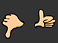
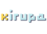

# Creating buttons

## Basic steps for creating buttons

1.  **Decide what button type best suits your needs.**

    Button symbol Most people choose button symbols for their flexibility.
    Button symbols contain a specialized internal timeline for button states.
    You can easily create visually different Up, Down, and Over states. Button
    symbols also change their state automatically as they react to user actions.

    Movie clip button You can use a movie clip symbol to create sophisticated
    button effects. Movie clip symbols can contain almost any type of content,
    including animation. However, movie clip symbols do not have built-in Up,
    Down, and Over states. You create those states yourself, using ActionScript.
    A disadvantage is that movie clip files are larger than button files.

    Use these resources to learn how to create a button with a movie clip
    symbol:
    - Tutorial:
      [Movie Clip Buttons](https://web.archive.org/web/20120104083501mp_/http://schoolofflash.com/2008/05/flash-cs3-tutorial-movie-clip-buttons/)
      (ActionScript 3.0, Schoolofflash.com)

    ActionScript button component Use a button component if you require only a
    standard button or a toggle, and you don't want to customize it extensively.
    Both ActionScript 2.0 and 3.0 button components come with built-in code that
    enables state changes. So, you don't have to define the look and behavior of
    button states. Simply drag the component onto the Stage.
    - **ActionScript 3.0 button components** allow for some customization. You
      can bind the button to other components, and share and display application
      data. They have built-in features, such as accessibility support. Button,
      RadioButton, and CheckBox components are available. For details, see
      [Use the Button component](https://web.archive.org/web/20120104083501mp_/http://help.adobe.com/en_US/as3/components/WS5b3ccc516d4fbf351e63e3d118a9c65b32-7fac.html)
      in _Using Adobe ActionScript 3.0 Components_. For examples of how to use
      Button components, see
      [AS3 Button Component Quick Start](https://web.archive.org/web/20120104083501mp_/http://www.adobe.com/devnet/flash/quickstart/button_component_as3/).

    - **ActionScript 2.0 button components** are not customizable. The component
      enables state changes. For details, see
      [Button component](https://web.archive.org/web/20120104083501mp_/http://help.adobe.com/en_US/AS2LCR/Flash_10.0/help.html?content=00001968.html).

2.  Define your button states.

    **Up frame**  
    The appearance of the button when the user is not interacting with it.

    **Over frame**  
    fThe appearance of the button as the user is about to select it.

    **Down frame**  
    The appearance of the button as the user selects it.

    **Hit frame**  
    The area that is responsive to clicks by the user. Defining this Hit frame
    is optional. If your button is small, or if its graphic area is not
    contiguous, defining this frame can be useful.
    - The contents of the Hit frame are not visible on the Stage during
      playback.

    - The graphic for the Hit frame is a solid area large enough to encompass
      all graphic elements of the Up, Down, and Over frames.

    - If you don't specify a Hit frame, the image for the Up state is used.

      You can make a button that responds when a different area of the stage is
      clicked or rolled over (also called a disjoint rollover). Place the Hit
      frame graphic in a different location than the other button frame
      graphics.

3.  **Associate an action with the button.**

    To make something happen when the user selects a button, you add
    ActionScript code to the Timeline. Place the ActionScript code in the same
    frames as the buttons. The Code Snippets panel has pre-written ActionScript
    3.0 code for many common button uses. See
    [Add interactivity with code snippets](../actionscript/add-interactivity-with-code-snippets.md).

    > **Important:** ActionScript 2.0 is not compatible with ActionScript 3.0.
    > If your version of Flash uses ActionScript 3.0, you can't paste
    > ActionScript 2.0 code into your button (and vice versa). Before you paste
    > ActionScript from another source into your buttons, verify that the
    > version is compatible.

## Adobe recommends

> ###  [Buttons in Flash](https://web.archive.org/web/20120104083501mp_/http://goo.gl/g27rn)
>
> [Flashthusiast.com](https://web.archive.org/web/20120104083501mp_/http://flashthusiast.com/)
>
> How to make a button open a web page using ActionScript 3</td>

> ###  [Multiple buttons](https://web.archive.org/web/20120104083501mp_/http://goo.gl/MfUfm)
>
> [Flashthusiast.com](https://web.archive.org/web/20120104083501mp_/http://www.flashthusiast.com/)
> Creating multiple buttons on the stage at once using ActionScript 3

> ###  [Button symbols in Flash](https://web.archive.org/web/20120104083501mp_/http://goo.gl/i1fSt)
>
> [Kirupa](https://web.archive.org/web/20120104083501mp_/http://www.kirupa.com/me/index.htm)
>
> How to make button symbols. Includes some ActionScript 3.

> ### [Linking buttons to scenes](https://web.archive.org/web/20120104083501mp_/http://goo.gl/i1zes)
>
> [Flashthusiast.com](https://web.archive.org/web/20120104083501mp_/http://www.flashthusiast.com/)
>
> Creating buttons that jump to multiple scenes in the timeline using
> ActionScript 3

## Create a button with a button symbol

To make a button interactive, you place an instance of the button symbol on the
Stage and assign actions to the instance. You assign the actions to the root
timeline of the FLA file. Do not add actions to the timeline of the button
symbol. To add actions to the button timeline, use a movie clip button instead.

1.  Choose Edit \> Deselect All, or click an empty area of the Stage to ensure
    that nothing is selected on the Stage.

2.  Choose Insert \> New Symbol.

3.  In the Create New Symbol dialog box, enter a name. For the symbol Type,
    select Button.

    Flash Pro switches to symbol-editing mode. The Timeline changes to display
    four consecutive frames labeled Up, Over, Down, and Hit. The first frame,
    Up, is a blank keyframe.

4.  To create the Up state button image, select the Up frame in the Timeline.
    Then use the drawing tools, import a graphic, or place an instance of
    another symbol on the Stage.

    You can use graphic symbols or movie clip symbols inside a button, but you
    cannot use another button symbol.

5.  In the Timeline, click the Over frame, and then choose Insert \> Timeline \>
    Keyframe.

    Flash Pro inserts a keyframe that duplicates the contents of the preceding
    Up frame.

6.  With the Over frame still selected, change or edit the button image on the
    Stage to create the appearance you want for the Over state.

7.  Repeat steps 5 and 6 for the Down frame and the optional Hit frame.

8.  To assign a sound to a state of the button, select that state's frame in the
    Timeline and choose Window \> Properties. Then select a sound from the Sound
    menu in the Property inspector. Only sounds you have already imported appear
    in the Sound menu.

9.  When you finish, choose Edit \> Edit Document. Flash returns you to the main
    timeline of your FLA file. To create an instance of the button you created
    on the Stage, drag the button symbol from the Library panel to the Stage.

10. To test a button's functionality, use the Control \> Test Movie \> Test
    command. You can also preview the states of a button symbol on the Stage by
    choosing Control \> Enable Simple Buttons. This command allows you to see
    the up, over, and down states of a button symbol without using Control \>
    Test Movie \> Test.

#### Button symbol tutorials and examples

Some of these items show Flash CS3 or CS4, but still apply to Flash CS5.

- Tutorial:
  [Button symbols in Flash](https://web.archive.org/web/20120104083501mp_/http://www.kirupa.com/developer/flashcs4/buttons_pg1.htm)
  (Includes some ActionScript 3.0, Kirupa.com)

- [Example: Animation portfolio piece (Flash Professional)](https://web.archive.org/web/20120104083501mp_/http://help.adobe.com/en_US/as3/learn/WS5b3ccc516d4fbf351e63e3d118a9b90204-7fd7.html)
  (Adobe.com)

- Example:
  [ActionScript 3.0 for a button to open a web page](https://web.archive.org/web/20120104083501mp_/http://flashthusiast.com/2008/02/25/making-a-button-work-in-flash-cs3-with-actionscript-30-its-not-too-bad/)
  (Flashthusiast.com)

- Example:
  [ActionScript 2.0 for a button to open an web page](https://web.archive.org/web/20120104083501mp_/http://help.adobe.com/en_US/FlashPlatform/reference/actionscript/2/help.html?content=00000394.html)
  (Adobe.com)

- Example:
  [ActionScript 3.0 for buttons to jump to different scenes in the Timeline](https://web.archive.org/web/20120104083501mp_/http://flashthusiast.com/2008/07/31/creating-buttons-that-link-to-different-scenes-using-actionscript-30/)
  (Flashthusiast.com)

- Example:
  [ActionScript 3.0 for multiple buttons on the Stage at the same time](https://web.archive.org/web/20120104083501mp_/http://flashthusiast.com/2008/03/13/adding-more-than-one-button-to-a-fla-file-while-rocking-it-in-actionscript-30/)
  (Flashthusiast.com)

- TechNote:
  [How to create a simple button](https://web.archive.org/web/20120104083501mp_/http://kb2.adobe.com/cps/410/tn_4101.html)
  (Adobe.com)

## Enable, edit, and test button symbols

By default, Flash Pro keeps button symbols disabled as you create them. Select
and then enable a button to see it respond to mouse events. Best practice is to
disable buttons as you work and enable them to quickly test their behavior.

- To select a button, use the Selection tool to drag a selection rectangle
  around the button.

- To enable or disable buttons on the Stage, choose Control \> Enable Simple
  buttons. This command acts as a toggle between the two states.

- To move a button, use the arrow keys.

- To edit a button, use the Property inspector. If it isn't visible, choose
  Windows \> Properties.

- To test the button in the authoring environment, choose Control \> Enable
  Simple Buttons.

- To test the button in Flash Player, choose Control \> Test Movie \[or Test
  Scene\] \> Test. This method is the only way to test movie clip buttons.

- To test the button in the Library Preview panel, select the button in the
  Library and click Play.

## Troubleshooting buttons

Use these resources to troubleshoot common problems with buttons:

- TechNote:
  [Button actions are not working](https://web.archive.org/web/20120104083501mp_/http://kb2.adobe.com/cps/144/tn_14426.html)
  (Adobe.com)

- TechNote:
  [Button hotspots are active even though the buttons are covered with other objects](https://web.archive.org/web/20120104083501mp_/http://kb2.adobe.com/cps/141/tn_14146.html)
  (Adobe.com)

- TechNote:
  [Adding actions to shared buttons](https://web.archive.org/web/20120104083501mp_/http://kb2.adobe.com/cps/159/tn_15914.html)
  (Adobe.com)

## Additional button resources

The following TechNotes contain instructions for some specific button scenarios:

- TechNote:
  [How to create a new button](https://web.archive.org/web/20120104083501mp_/http://kb2.adobe.com/cps/410/tn_4101.html)
  (Adobe.com)

- TechNote:
  [Creating advanced buttons](https://web.archive.org/web/20120104083501mp_/http://kb2.adobe.com/cps/126/tn_12632.html)
  (Adobe.com)

- TechNote:
  [How to create a roll-out animation for a button](https://web.archive.org/web/20120104083501mp_/http://kb2.adobe.com/cps/150/tn_15069.html)
  (Adobe.com)

- TechNote:
  [How to create a reset button](https://web.archive.org/web/20120104083501mp_/http://kb2.adobe.com/cps/155/tn_15541.html)
  (Adobe.com)

- TechNote:
  [How can one button do different things at different times?](https://web.archive.org/web/20120104083501mp_/http://kb2.adobe.com/cps/148/tn_14807.html)
  (Adobe.com)

- TechNote:
  [How to make a 'Back' button in a SWF file](https://web.archive.org/web/20120104083501mp_/http://kb2.adobe.com/cps/148/tn_14831.html)
  (Adobe.com)

More Help topics

[Using sounds in Flash](../sound/using-sounds-in-flash.md)
