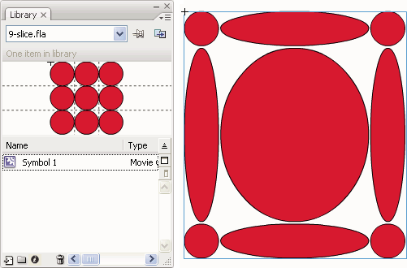

# Scaling and caching symbols

## Scaling content on the Stage

You can scale items on the stage in these ways:

- Scale individual symbol instances with the Free Transform tool, Properties
  panel, or Transform panel.

- Scale individual symbol instances with 9-slice scaling and the tools and
  panels listed above.

- Scaling the entire contents of the Stage when resizing the stage (CS5.5 only).

### Scale an individual symbol instance

1.  Select the symbol instance on the Stage.

2.  Do one of the following:
    - Select the Free Transform tool in the Tools panel and then drag the
      corners or edges of the instance to resize it.

    - Open the Properties panel (Window \> Properties) and edit the Height and
      Width properties of the instance.

    - Open the Transform panel (Window \> Transform) and edit the Scale Width
      and Scale Height properties of the instance.

### Scale all content when resizing the Stage (CS5.5 only)

1.  Choose Modify \> Document.

2.  In the Document Settings dialog box, enter new values for the Height and
    Width dimensions of the document. This is the Stage size.

3.  Select the Scale Content with Stage option. Click OK.

    > Scaling is applied to all content in all frames.

### Tutorials and videos

- ActionScript 3.0 Example:
  [Scaling and resizing assets for use on multiple screens](https://web.archive.org/web/20120102130455mp_/http://cookbooks.adobe.com/post_Scaling_and_resizing_assets_for_use_on_multiple_sc-17559.html)
  (Paul Trani, cookbooks.adobe.com)

## About 9-slice scaling and movie clip symbols

9-slice scaling allows you to specify how scaling is applied to specific areas
of a movie clip. With 9-slice scaling, you can ensure that the movie clip looks
correct when scaled. With normal scaling, Flash Pro scales all parts of a movie
clip equally, and in both the horizontal and vertical dimensions. For many movie
clips, this equal scaling can make the clip's graphics look strange, especially
at the corners and edges of rectangular movie clips. This is often true of movie
clips used as user interface elements, such as buttons.

The movie clip is visually divided into nine sections with a grid-like overlay,
and each of the nine areas is scaled independently. To maintain the visual
integrity of the movie clip, corners are not scaled, while the remaining areas
of the image are scaled (as opposed to being stretched) larger or smaller, as
needed.

When a movie clip symbol has 9-slice scaling applied, it appears in the Library
panel preview with the guides displayed. If Enable Live Preview is turned on
(Control \> Enable Live Preview) when you scale instances of the movie clip on
the Stage, you see the 9-slice scaling applied on the Stage.

> **Note:** 9-slice scaling cannot be applied to Graphic or Button symbols.
> Bitmaps inside 9-slice enabled movie clips are scaled normally, without
> 9-slice distortion, while the other movie clip contents are scaled according
> to the 9-slice guides.

> **Note:** 9-slice scaling is sometimes also referred to as "scale 9." A
> 9-slice-enabled movie clip can contain nested objects within it, but only
> certain types of objects inside the movie clip properly scale in the 9-slice
> manner. To make a movie clip with internal objects that also adhere to 9-slice
> scaling when the movie clip is scaled, those nested objects must be shapes,
> drawing objects, groups, or graphic symbols.

<caption>A 9-slice-enabled symbol in the Library panel and scaled on the Stage</caption>

## Edit movie clip symbols with 9-slice scaling

By default, slice guides are placed at 25% (or one-fourth) of the symbol's width
and height from the edge of the symbol. In symbol-editing mode, the slice guides
appear as dotted lines superimposed on the symbol. The slice guides don't snap
when you drag them on the pasteboard. The guides do not appear when the symbol
is on the Stage. You cannot edit 9-slice-enabled symbols in place on the Stage.
You must edit them in symbol-editing mode.

> **Note:** Instances made from a 9-slice-enabled movie clip symbol can be
> transformed, but should not be edited. Editing these instances can have
> unpredictable results.

### Enable 9-slice scaling for an existing movie clip symbol

1.  With the source document open, select Window \> Library.
2.  Select a movie clip, button, or graphic symbol in the Library panel.
3.  Select Properties from the Library Panel menu.
4.  Select Enable Guides for 9-slice Scaling.

### Edit a 9-slice-enabled movie clip symbol

1.  Enter symbol-editing mode by doing one of the following:
    - Select an instance of the symbol on the Stage and right-click (Windows) or
      Control-click (Macintosh), and select Edit.

    - Select the symbol in the Library panel and right-click (Windows) or
      Control-click (Macintosh), and select Edit.

    - Double-click the symbol in the Library panel.

2.  To move the horizontal or vertical guides, drag and release a guide. The new
    position of the guide is updated in the Library preview for the symbol.

## Improving rendering performance with bitmap caching

Runtime bitmap caching lets you optimize playback performance by specifying that
a static movie clip (for example, a background image) or button symbol be cached
as a bitmap at runtime. By default, Flash Player redraws each vector item on the
Stage in every frame. Caching a movie clip or button symbol as a bitmap prevents
Flash Player from having to continually redraw the item, because the image is a
bitmap and its position on the Stage does not change. This provides a
significant improvement in playback performance.

For example, when you create an animation with a complex background, create a
movie clip containing all the items included in the background. Then select
Cache as Bitmap for the background movie clip in the Property inspector. During
playback, the background is rendered as a bitmap stored at the current screen
depth. Flash Player draws the bitmap on the Stage quickly and only once, letting
the animation play faster and more smoothly.

Without bitmap caching, the animation might play back too slowly.

Bitmap caching lets you use a movie clip and freeze it in place automatically.
If a region changes, vector data updates the bitmap cache. This process
minimizes the number of redraws that Flash Player must perform, and provides
smoother, faster playback performance.

Only use runtime bitmap caching on static, complex movie clips in which the
position, but not the content, of the movie clip changes on each frame in an
animation. The playback or runtime performance improvement from using runtime
bitmap caching is only noticeable on complex-content movie clips. Runtime bitmap
caching with simple movie clips does not enhance performance.

For more information, see When to enable caching in
[_Learning ActionScript 2.0 in Adobe Flash_](https://web.archive.org/web/20120116125748/http://help.adobe.com/en_US/FlashPlatform/reference/actionscript/2/help.html?content=Part1_Learning_AS2_1.html).

Guy Watson has written a detailed article about using bitmap caching in the
Flash Pro Developer Center titled
[Using Bitmap Caching in Flash](https://web.archive.org/web/20120102130455mp_/http://www.adobe.com/devnet/flash/articles/bitmap_caching.html).

> **Note:** You can only use the Use Runtime Bitmap Caching option for movie
> clip and button symbols. Under the following circumstances, a movie clip does
> not use a bitmap (even if Use Runtime Bitmap Caching is selected) but instead
> renders the movie clip or button symbol by using vector data:

- The bitmap is too large (greater than 2880 pixels in either direction).

- Flash Player fails to allocate memory for the bitmap (producing an
  out-of-memory error).

## Specify bitmap caching for a symbol instance

1.  Select the movie clip or button symbol on the Stage.
2.  In the Property inspector, select the Cache as Bitmap option (CS5) or choose
    Cache as Bitmap from the Render menu (CS5.5).

## Specify a backround color for a cached symbol instance (CS5.5 only)

When Bitmap Caching is turned on for a symbol instance, you can choose an opaque
background color for the instance. By default the background is transparent.

1.  Select the instance on the Stage.

2.  In the Display section of the Properties panel, select opaque from the
    Bitmap Background menu.

3.  Select a background color from the color picker.
