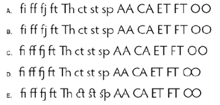
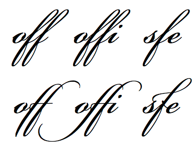

# Working with Text Layout Framework (TLF) text

Beginning in Flash Professional CS5, you can add text to a FLA file using a new
text engine called the Text Layout Framework (TLF). TLF supports a wider array
of rich text layout features and fine control of text attributes. TLF text
allows greater control of text than the previous text engine, now called Classic
text.

TLF text provides the following enhancements over Classic text:

- Print-quality typography.

- Additional character styles, including leading, ligatures, highlight color,
  underline, strikethrough, case, digit case, and more.

- Additional paragraph styles, including multi-column support with gutter width,
  last line justification options, margins, indents, paragraph spacing, and
  container padding values.

- Control of additional Asian text attributes, including Tate Chu Yoko,
  Mojikumi, Kinsoku Shori Type, and Leading model.

- You can apply attributes such as 3D Rotation, Color Effects, and Blend Modes
  to TLF text without placing it in a movie clip symbol.

- Text can flow across multiple text containers. These containers are called
  _threaded_ or _linked_ text containers.

- The ability to create right-to-left text for Arabic and Hebrew scripts.

- Support for bi-directional text, where right-to-left text can contain elements
  of left-to-right text. This is important for embedding English words or Arabic
  numerals within Arabic/Hebrew text, for example.

## Adobe recommends

> ###  [Creating text with the Text Layout Framework (TLF)](https://web.archive.org/web/20120101132528mp_/http://goo.gl/n0cCh)
>
> [Todd Perkins](https://web.archive.org/web/20120101132528mp_/http://www.toddperkins.com/)
>
> Learn how the Text Layout Framework lets you finely control text properties,
> flow text across multiple containers, and work with vertical, right-to-left,
> and multi-language text.

## About TLF text

### Before you begin

When creating text, it is important to understand the following fundamentals of
working with text in Flash:

- TLF text is the default text type in Flash Professional CS5. In Flash Pro
  CS5.5, the default is
  [Classic text](https://web.archive.org/web/20120101132528mp_/http://help.adobe.com/en_US/flash/cs/Using/fla_text_tx.xml#WSd60f23110762d6b883b18f10cb1fe1af6-7d4fa_verCS5).

- There are 2 types of TLF text containers, point text and area text. A point
  text container's size depends solely on the text it contains. An area text
  container's size is independent of the amount of text it contains. Point text
  is the default. To change a point text container to area text, resize it with
  the selection tool or double-click the small circle at the bottom-right corner
  of the container bounding box.

- TLF text requires that ActionScript 3.0 and Flash Player 10 or higher are
  specified in the publish settings of your FLA file. For more information see
  [Publish settings (CS5)](../publishing-and-exporting/publish-settings-cs5.md).

- When using TLF text, the Property inspector has three display modes, depending
  on the current type of text selection:
  - Text tool mode; when the Text tool has been selected in the Tools panel and
    no text is selected in the Flash document.

  - Text object mode; when an entire text block is selected on the Stage.

  - Text edit mode; when a text block is being edited.

- You can create three types of text block with TLF text, depending on how you
  want the text to behave at runtime:
  - Read Only: when published as SWF file, the text cannot be selected or
    edited.

  - Selectable: when published as SWF file, the text is selectable and can be
    copied to the clipboard, but is not editable. This setting is the default
    for TLF text.

  - Editable: when published as SWF file, text is selectable and can be edited.

- Unlike Classic text, TLF text does not support PostScript Type 1 fonts. TLF
  supports only OpenType and TrueType fonts. When working with TLF text,
  PostScript fonts are not available in the Text \> Font menu. Note that if you
  apply a PostScript Type 1 font to a TLF text object using one of the other
  font menus, Flash substitutes the \_sans device font instead. When working
  with Classic text, all installed PostScript fonts are available in the Font
  menus.

- TLF text requires a specific ActionScript library to be available to Flash
  Player at runtime. If this library is not already present on the playback
  computer, Flash Player automatically downloads it. For more information about
  the library, see
  [Publishing SWF files with TLF text](#publishing-swf-files-with-tlf-text).

- TLF text cannot be used as a layer mask at author-time. To create a mask with
  text, create the mask with ActionScript 3.0 or use Classic text for the mask.
  See
  [Masking display objects](https://web.archive.org/web/20120101132528mp_/http://help.adobe.com/en_US/as3/dev/WS5b3ccc516d4fbf351e63e3d118a9b90204-7e0b.html)
  in the ActionScript 3.0 Developer's Guide.

- Anti-aliasing settings for TLF text are not reflected on the Stage until the
  Flash file is exported as a SWF file. To see the effect of anti-aliasing
  settings, use the Control \> Test Movie \> Test command or the File \> Publish
  command.

- To use Cascading Style Sheets (CSS), use ActionScript to apply a stylesheet.
  For more information, see
  [Applying cascading style sheets](https://web.archive.org/web/20120101132528mp_/http://help.adobe.com/en_US/as3/dev/WS8d7bb3e8da6fb92f-20050207122bd5f80cb-7ff3zephyr_serranozephyr.html)
  in the ActionScript 3.0 Developer's Guide.

- TLF has extensive ActionScript APIs for creating and manipulating text flows
  at runtime. These APIs enable additional features like text decoration,
  in-line images, the ability to read HTML and TLFMarkup languages, and others
  useful for creating dynamic content.

### Converting between Classic and TLF text

When you convert a text object from one text engine to the other, Flash
preserves most of the formatting. However, because the text engines are
different in their capabilities, some formatting may be slightly different,
including letter spacing and line spacing. Inspect the text carefully and
reapply any settings that have been changed or lost.

If you need to convert text from Classic to TLF, try to do so only once rather
than converting back and forth more than once. The same is true for converting
TLF text to Classic text.

When converting between TLF and Classic text, Flash converts text types as
follows:

- TLF Read Only\> Classic Static

- TLF Selectable \> Classic Static

- TLF Editable \> Classic Input

### Publishing SWF files with TLF text

To function properly, all TLF text objects rely on a specific TLF ActionScript
library, also called a Runtime Shared Library or RSL. Because the library is
separate from your published SWF file, the SWF file size is minimized. During
authoring, Flash Pro provides the library. At runtime, after you have uploaded
your published SWF file to a web server, the library is provided in the
following ways:

1.  The local computer. Flash Player looks for a copy of the library on the
    local machine it is playing on. If the SWF file is not the first to use TLF
    text on that computer, the computer already has a local copy of the library
    in its Flash Player cache. Once TLF text has been in use on the Internet for
    some time, most end-user computers will have a local copy of the library
    file. However, it is possible for Flash Player end-users to disable this
    feature on their computer.

2.  On Adobe.com. If no local copy is available, Flash Player will query Adobe's
    servers for a copy of the library. The library only has to download one time
    per computer. After that, all subsequent SWF files that play on the same
    computer will use the previously downloaded copy of the library.

3.  On your web server. If Adobe's servers are not available for some reason,
    Flash Player looks for the library in the web server directory where the SWF
    file resides. To provide this extra level of back-up, manually upload the
    library file to the web server along with your SWF file. You can also
    specify an alternate path for the library on your server to allow multiple
    SWF files in different locations to point to a single instance of the
    library. More information about the assets file is provided below.

When you publish a SWF file that uses TLF text, Flash Pro creates an additional
file named textLayout_X.X.X.XXX.swz (where the X's are replaced by the version
number) next to your SWF file. You can optionally choose to upload this file to
your web server along with your SWF file. This allows for the rare case where
Adobe's servers are not available for some reason.

You can also avoid the need for Flash Player to do a separate download of the
TLF assets by compiling the assets within your SWF file. You can do this in the
ActionScript settings of your FLA file. However, remember that these assets add
significantly to the size of your published SWF file and should only be included
when download performance is not a conern. This feature can also be useful when
Adobe servers are not available, such as when deploying SWF files on closed or
private networks which may restirct access to outside URLs.

To compile the TLF ActionScript assets in published SWF files:

1.  Choose File \> Publish Settings.

2.  Click the Flash Tab.

3.  Click the Settings button next to the Script menu.

4.  Click the Library Path tab.

5.  Select Merged Into Code from the Default Linkage menu.

The following are recommendations for handling the TLF library for different
deployment scenarios

- Web-based SWF file: use the default behavior of allowing Flash Player to
  download the RSL if necessary.

- AIR-based SWF file: Compile the RSL into the SWF file. This way text
  functionality of the AIR application will not be compromised while offline.

- iPhone-based SWF: It is not recommended that you use TLF on the iPhone for
  performance reasons. If you do, compile the TLF code into the SWF because the
  iPhone cannot load RSLs.
  > **Note:** For more information about how the Flash Player cache works, see
  > [Improving Flex application performance using the Flash Player cache](https://web.archive.org/web/20120101132528mp_/http://www.adobe.com/go/learn_fl_flash_player_cache_en).The
  > article focuses on Flash Builder, but all of the information about the Flash
  > Player cache applies to Flash Professional as well. When the TLF
  > ActionScript assets are not embedded or available on the local playback
  > computer, there can be a slight delay in SWF playback while Flash Player
  > downloads the assets. You can choose the type of preloader SWF that Flash
  > Player displays while the assets are downloaded. You choose the preloader by
  > setting the Preloader Method in the ActionScript 3.0 settings.

To set the Preloader Method:

1.  Choose File \> Publish Settings.

2.  In the Flash tab, click the ActionScript 3.0 Settings button.

3.  In the Advanced ActionScript 3.0 Settings dialog box, select a method from
    the Preloader Method menu. The available methods are:
    - Preloader SWF: this is the default. Flash embeds a small preloader SWF
      file inside your published SWF file. This preloader displays a progress
      bar while the assets load.

    - Custom Preloader Loop: use this setting is you want to use a preloader SWF
      of your own.

    The Preloader Method setting is only available if the Default Linkage is set
    to Runtime Shared Library (RSL).

#### Tutorials and Videos

- Tutorial:
  [Using a Custom Preloader Loop With TLF Text](https://web.archive.org/web/20120101132528mp_/http://jeffkamerer.com/blog/2010/08/12/using-a-custom-preloader-loop-with-tlf-text/) -
  Jeff Kamerer, Adobe

- TechNote:
  [Loading child SWFs with TLF content generates reference errors](https://web.archive.org/web/20120101132528mp_/http://kb2.adobe.com/cps/838/cpsid_83812.html)

- Cookbook:
  [How Do I Correct This Runtime Library Error?](https://web.archive.org/web/20120101132528mp_/http://cookbooks.adobe.com/post_TLF_is_provided_by_external_library__textLayout_X_-17842.html)

### Reducing SWF file size with TLF text (CS5.5 only)

Most TLF text requires that a specific ActionScript library be compiled into
your SWF file. This library adds about 20k to the file size.

If you need to keep the file size as small as possible, you can prevent the
ActionScript library from being included by limiting your use of TLF text in the
following ways:

- Use only Selectable or Read Only TLF text types.

- Do not give any TLF text instances an instance name in the Properties panel.
  This means that the text cannot be manipluated with ActionScript.

Even with these limitations, you can still take advantage of the text layout
capabilities of TLF text.

## Working with character styles

Character styles are attributes that apply to a single character or a set of
characters, rather than to whole paragraphs or text containers. To set character
styles, you work with the Character and Advanced Character sections of the Text
Property inspector.

The Character section of the Property inspector includes the following text
properties:

**Family**  
The name of the font. (Note TLF text only supports OpenType and TrueType fonts.)

**Style**  
Regular, Bold, or Italic. Faux italic and faux bold styles are not available to
TLF text objects. Some fonts may also include additional styles, such as Black,
BoldItalic, etc.

**Size**  
The size of the characters in pixels.

**Leading**  
The vertical space between lines of text. By default, Leading is expressed as a
percentage but can also be expressed in points.

**Color**  
The color of the text.

**Tracking**  
The amount of space between the selected characters.

**Highlight**  
The highlight color.

**Kerning**  
Kerning: Adds or subtracts space between specific pairs of characters. TLF text
automatically kerns characters using the kerning information built in to most
fonts.

When Asian text options are disabled, the Auto-kerning check box appears. When
Auto-kerning is on, kerning information in the font is used. When Auto-kerning
is off, kerning information in the font is ignored and no kerning is applied.

When Asian text options are enabled, Kerning can have these values:

- Auto: Uses the kerning information built in to the font for Latin characters.
  For Asian characters, applies kerning only to those characters that have
  kerning information built in to them. Asian characters which do not have
  kerning information are Kanji, Hiragana, and Katakana.

- On: Always turns on kerning.

- Off: Always turns off kerning.

**Anti-alias**  
There are three anti-aliasing modes to choose from

- Use Device Fonts: Specifies that the SWF file use the fonts installed on the
  local computer to display the fonts. Typically, device fonts are legible at
  most font sizes. This option doesn't increase the size of the SWF file.
  However, it forces you to rely on the fonts installed on the user's computer
  for font display. When using device fonts, choose only commonly installed font
  families.

- Readability: Allows for improved legibility of fonts, particularly at small
  sizes. To use this option for a given text block, embed the font used by the
  text object. For instructions, see
  [Embed fonts for consistent text appearance](./embed-fonts-for-consistent-text-appearance.md).
  (Do not use this option if you intend to animate text; instead, use the
  Animation mode.)

- Animation: Creates a smoother animation by ignoring alignment and kerning
  information. To use this option for a given text block, embed the font used by
  the text block. For instructions, see
  [Embed fonts for consistent text appearance](./embed-fonts-for-consistent-text-appearance.md).
  For legibility, use 10-point or larger type when specifying this option.

**Rotation**  
Allows you to rotate individual characters. Specifying rotation for fonts that
do not contain vertical layout information can give undesirable results.

Rotation can have the following values:

- 0° - Forces all characters to have no rotation.

- 270° - The primary use for 270-° rotation is Roman text with Vertical
  orientation. If used on other types of text, such as Vietnamese and Thai, this
  setting can give undesirable results

- Auto - Specifies a 90 degree counter-clockwise rotation for full width and
  wide characters only, as determined by the Unicode properties of the
  character. This value is typically used with Asian text to rotate only those
  characters that require rotation. This rotation is applied only in vertical
  text to return full width and wide characters to a vertical orientation
  without affecting other characters.

**Underline**  
Places a horizontal line beneath the characters.

**Strikethrough**  
Places a horizontal line through the center of the characters.

**Superscript**  
Moves the characters slightly above the normal line of type and reduces the
character size. Superscript can also be applied using the Baseline Shift menu in
the Advanced Character section of the TLF Text Property inspector.

**Subscript**  
Moves the characters slightly below the normal line of type and reduces the
character size. Subscript can also be applied using the Baseline Shift menu in
the Advanced Character section of the TLF Text Property inspector.

The Advanced Character section contains the following properties:

**Link**  
Use this field to create a text hyperlink. Enter the URL to load when the
characters are clicked in the published SWF file at runtime.

**Target**  
Used with the link property to specify the window the URL loads into. Target can
have these values:

- \_self - specifies the current frame in the current window.

- \_blank - specifies a new window.

- \_parent - specifies the parent of the current frame.

- \_top - specifies the top-level frame in the current window.

- Custom - You can enter any custom string value you want into the Target field.
  You would do this in cases where you know the custom name of a browser window
  or frame that will already be open when your SWf file is playing.

**Case**  
Allows you to specify how capital and lower-case characters are used. Case can
have these values:

- Default: Uses each character's default typographic case.

- Uppercase: Specifies that all characters use uppercase glyphs.

- Lowercase: Specifies that all characters use lowercase glyphs.

- Caps to Small Caps: Specifies that all capitalized characters use small
  uppercase glyphs. This option requires that the selected font contains small
  caps glyphs. Adobe Pro fonts typically have these glyphs defined.

- Lowercase to Small Caps: Specifies that all lowercase characters use small
  uppercase glyphs. This option requires that the selected font contains small
  caps glyphs. Adobe Pro fonts typically have these glyphs defined.

Hebrew and Perso-Arabic scripts such as Arabic do not distinguish between upper
and lower case and are not affected by this setting.

**Digit Case**  
Lets you specify which numeral style to apply when working with OpenType fonts
that offer both lining and old style numerical figures. Digit Case can have
these values:

- Default: Specifies default digit case. The results are font-dependent;
  characters use the settings specified by the font designer without any
  features applied.

- Lining: Lining (or "aligning") figures are all-cap height and typically
  monospaced in text faces so that they line up vertically on charts.

- Old Style: old style figures have what is considered to be a traditional,
  classic look. They are only available for certain typefaces, sometimes as the
  regular numerals in a font, but more often within a supplementary or expert
  font. The figures are proportionately spaced, eliminating the white spaces
  that result from monospaced lining figures, especially around the numeral one.
  Old style figures are most often used within text. Unlike lining figures, they
  blend in without disturbing the visual line of the body copy. They also work
  well in headlines since they're not as intrusive as lining figures. Many
  typographic designers prefer them for most uses except charts and tables.

**Digit Width**  
Lets you specify whether to use proportional or tabular numerals when working
with OpenType fonts that offer both lining and old style numerical figures.
Digit Width can have these values:

- Default: Specifies default digit width. Results are font-dependent; characters
  use the settings specified by the font designer without any features applied.

- Proportional: Specifies proportional figures. Display typefaces usually
  contain proportional figures. The total character widths of these figures are
  based on the width of the numeral itself plus a small amount of white space
  around it. For example, an 8 takes up more width than a 1. Proportional
  figures can be either lining or old style. Proportional figures don't align
  vertically and are unsuitable for use in tables, charts, or other vertical
  columns.

- Tabular: Specifies tabular figures. Tabular numerals are numeric characters
  that each have the same total character width. The character width is the
  width of the numeral itself plus the white space on both sides. Tabular
  spacing (also called monospacing) allows numerals to align vertically in
  tables, financial statements, and other columns of figures. Tabular figures
  are usually lining figures, meaning that they sit on the baseline and have the
  same height as the capital letters.

**Dominant Baseline**  
Available only when Asian options are turned on in the panel options menu of the
Text Property inspector. Specifies the dominant (or primary) baseline for text
that you explicitly select (as opposed to Leading Basis, which determines the
baseline alignment of an entire paragraph). Dominant Baseline can have these
values:

- Auto: Resolved based on the selected Locale. This setting is the default.

- Roman: For text, the font and point size of the text determine this value. For
  graphic elements, the bottom of the image is used.

- Ascent: Specifies an ascent baseline. For text, the font and point size of the
  text determine this value. For graphic elements, the top of the image is used.

- Descent: Specifies a descent baseline. For text, the font and point size of
  the text determine this value. For graphic elements, the bottom of the image
  is used.

- Ideographic Top: Aligns the small characters in a line to the specified
  position of the large character's em-box.

- Ideographic Center: Aligns the small characters in a line to the specified
  position of the large character's em-box.

- Ideographic Bottom: Aligns the small characters in a line to the specified
  position of the large character's em-box.

**Alignment Baseline**  
Available only when Asian options are turned on in the panel options menu of the
Text Property inspector. Lets you specify a different baseline for text or a
graphic image within a paragraph. For example, if you insert an icon into a line
of text, you can specify an alignment using the top or bottom of the image
relative to the text baseline.

- Use Dominant: Specifies that the Alignment Baseline use the Dominant Baseline
  setting.

- Roman: For text, the font and point size of the text determine this value. For
  graphic elements, the bottom of the image is used.

- Ascent: Specifies an ascent baseline. For text, the font and point size of the
  text determine this value. For graphic elements, the top of the image is used.

- Descent: Specifies a descent baseline. For text, the font and point size of
  the text determine this value. For graphic elements, the bottom of the image
  is used.

- Ideographic Top: Aligns the small characters in a line to the specified
  position of the large character's embox.

- Ideographic Center: Aligns the small characters in a line to the specified
  position of the large character's embox.

- Ideographic Bottom: Aligns the small characters in a line to the specified
  position of the large character's embox. This setting is the default.

**Ligatures**  
Ligatures are typographic replacement characters for certain letter pairs, such
as "fi" and "fl" that are available in some fonts. Ligatures usually replace
consecutive characters sharing common components. They are part of a more
general class of glyphs called contextual forms. With contextual forms, the
specific shape of a letter depends on context, such as surrounding letters or
proximity to the end of a line. Note the Ligatures setting has no effect on
scripts where ligatures or connections between letters are the norm and are not
font-dependent. These scripts include Perso-Arabic, Devanagari, and some others.

The Ligatures property can have these values:

A. No ligatures applied B. Minimum ligatures C. Common ligatures D. Uncommon
ligatures E. Exotic ligatures

<caption>A script-based font with minimum ligatures (top) and common ligatures (bottom).</caption>

- Minimum: Minimum ligatures.

- Common: Common or "standard" ligatures. This setting is the default.

- Uncommon: Uncommon or "discretionary" ligatures.

- Exotic: Exotic or "historical" ligatures. Included in only a few font
  families.

**Break**  
Used to prevent selected words from breaking at the end of lines, such as proper
names or words that could be misread when hyphenated. The Break setting is also
used to keep multiple characters or groups of words together, such as clusters
of initials, or a first and last name. Break can have these values:

- Auto: Line break opportunities are based on the Unicode character properties
  in the font. This setting is the default.

- All: Treats all characters in the selection as mandatory line break
  opportunities.

- Any: Treats any character in the selection as a line break opportunity.

- No Break: Treats no characters in the selection as line break opportunities.

**Baseline Shift**  
This control sets the Baseline Shift in percent or pixels. Positive values move
the character's baseline below the baseline of the rest of the line; negative
values move it above the baseline. The Superscript or Subscript attribute can
also be applied from this menu. The default is 0. The range is +/- 720 points or
percent.

**Locale**  
As a character property, the selected locale affects the shaping of glyphs via
OpenType features in a font. For example, languages like Turkish do not have
ligatures such as fi and ff. Another example is the capital version of 'i' in
Turkish, which is an uppercase i with a dot and not 'I'.

A separate flow-level Locale property is available in the Container and Flow
section of the TLF Text Property inspector. All characters inherit the Container
and Flow Locale property unless it is set differently at the character level.

## Working with paragraph styles

To set paragraph styles, you work with the Paragraph and Advanced Paragraph
sections of the Text Property inspector.

The Paragraph section includes the following text properties:

**Align**  
This property can be used with horizontal or vertical text. Align to Start
aligns the text along the starting edge of the container (the left side for
left-to-right text). Align to End aligns the text along the ending edge of the
container (the right side for left-to-right text).

When the Paragraph Direction of the current selection is right to left, the
appearance of the alignment icons reverses to indicate the correct direction.

**Margins: Start and End**  
These settings specify the width of the left and right margins in pixels. The
default is 0.

**Indent**  
Specifies the indentation of the first word of the selected paragraph, in
pixels.

**Spacing: Before and After**  
Specifies pixel values for space before and after a paragraph.

> **Note:** Note: Unlike traditional page layout applications, the vertical
> space specified between paragraphs collapses when values overlap. For example,
> you have two paragraphs, Para1 followed by Para2. Para1 has 12 pixels of space
> after it (Space After), and Para2 has 24 pixels of space before it (Space
> Before). TLF produces 24 points between the paragraphs, not 36. If a paragraph
> begins at the top of a column, no extra space is added before the paragraph.
> In this case, you can use the first baseline offset options of the paragraph.

**Text Justify**  
Text Justify: Indicates how justification is applied to text. Text Justify can
have these values:

- Letter Spacing: Distributes justification between letters.

- Word Spacing: Distributes justification between words. This setting is the
  default.

**Direction**  
Specifies paragraph direction. Direction settings are only available if
Right-to-Left options are turned on in Preferences. This setting applies only to
the currently selected paragraph within the text container. A separate Direction
property can be set for the container in the Container and Flow section of the
TLF Text Property inspector. Direction can have these values:

- Left to Right: Left to Right text direction. Used for most languages. This
  setting is the default.

- Right to Left: Right-to-Left text direction. Used for Middle Eastern languages
  like Arabic and Hebrew, and languages based on Arabic script such as Farsi or
  Urdu.

The Advanced Paragraph options are only available when Asian Options are turned
on in Preferences or via the Options menu of the TLF Text Property inspector.

The Advanced Paragraph section includes the following properties:

**Mojikumi**  
Sometimes called the justification rule, this property determines how paragraph
justification is applied. The justifiers that are applied based on this setting
affect the spacing of punctuation and the leading. In the Roman version, the
comma and Japanese periods take a full character's width but only half in East
Asian. Additionally, the spacing between sequential punctuation marks becomes
tighter, obeying traditional East Asian typographic conventions. Another item to
note in the example below is the leading, applied to the second line of the
paragraphs. In the East Asian version, the last two lines push left. In the
Roman version, the second and following lines push left.

Paragraphs with Roman (left) and East Asian (right) justification rules.

Mojikumi can have these values:

- Auto: Justification is applied based on the Locale selected in Character and
  Flow section of the Text Property inspector. This setting is the default.

- Space: Use Roman justification rules.

- East Asian: Use East Asian justification rules.

**Kinsoku Shori Type**  
Sometimes called the justification style. this property specifies options for
handling Japanese kinsoku characters, which cannot appear at either the
beginning or end of a line. Kinsoku Shori Type can have these values:

- Auto: Resolved based on the Locale selected in the container and Flow section
  of the Text Property inspector. This setting is the default.

- Prioritize Least Adjustment: Bases justification on either expanding or
  compressing the line, whichever gives a result closest to the desired width.

- Push In Kinsoku: Bases justification on compressing kinsoku at the end of the
  line. Kinsoku expands if no kinsoku occurs or if that end-of-line space is
  insufficient.

- Push Out Only: Bases justification on expanding the line.

**Leading Model**  
Leading Model is a paragraph format composed of allowed combinations of leading
basis and leading direction.

Leading Basis determines the baselines of two consecutive lines that are
intended to be at the distance specified by line height from each other. For
example, for two consecutive lines in a paragraph with Roman leading basis, the
line height is the distance between their respective Roman baselines.

Leading Direction determines the direction in which line height is measured. If
leading direction is Up, line height is the distance of a line's baseline from
the previous line's baseline. If leading direction is Down, line height is the
distance of a line's baseline from the next line's baseline.

Leading Model can have these values:

- Roman; Up: Leading basis is Roman and leading direction is Up. In this case,
  the line height is the distance of a line's Roman baseline from the previous
  line's Roman baseline.

- Ideographic Top; Up: Leading basis is Ideographic Top and leading direction is
  Up. In this case, the line height is the distance of a line's Ideographic Top
  baseline from the previous line's Ideographic Top baseline.

- Ideographic Center; Up: Leading basis is Ideographic Center and leading
  direction is Up. In this case, the line height is the distance of a line's
  Ideographic Center baseline from the previous line's Ideographic Center
  baseline.

- Ideographic Top; Down: Leading basis is Ideographic Top and leading direction
  is Down. In this case, the line height is the distance of a line's Ideographic
  Top baseline from the next line's Ideographic Top baseline.

- Ideographic Center; Down: Leading basis is Ideographic Center and leading
  direction is Down. In this case, the line height is the distance of a line's
  Ideographic Center baseline from the next line's Ideographic Center baseline.

- Auto: The Leading Model is resolved based on the Locale selected in the
  Container and Flow section of the Text Property inspector. (Ideographic Top;
  Down for Japanese and Chinese and Roman; Up for all others. This setting is
  the default value.

## Container and flow properties

### Working with Container and Flow properties

The container and Flow section of the TLF Text Property inspector controls
options that affect the entire text container. These proeprties include:

**Behavior**  
This option controls how the container expands as the amount of text increases.
Behavior has these options:

- Single Line

- Multiline: This option is only available when the selected text is area text.
  It is not available if the selected text is point text.

- Multiline No Wrap

- Password: Makes characters appear as dots instead of letters for password
  security. This option is only available in the menu when the text type is
  Editable (for either point or area text). It is not available for the Read
  Only or Selectable text types.

**Max Chars**  
The maximun number of characters to allow in the text container. Enabled only
for text containers whose type is set to Editable. The maximum value is 65535.

**Alignment**  
Specifies the alignment of text within the container. Settings include:

- Top: Vertically aligns text down from the top of the container.

- Center: Centers lines of text in the container

- Bottom: Vertically align lines of text up from the bottom of the container.

- Justify: Evenly distributes lines of text vertically between the top and
  bottom of the container.

  > **Note:** The Alignment options change appropriately when the text direction
  > is set to Vertical.

**Column Count**  
Specifies the number of columns of text within the container. This property is
only enabled for area text containers. The default value is 1. The maximum value
is 50.

**Column Gutters**  
Specifies the spacing (or gutter) between each column in the selected container.
The default value is 20. The maximum value is 1000. The unit of measurment is
set according to the Ruler Units set in Document Settings.

**Padding**  
Specifies the width of the margins between the text and the selected container.
Padding can be set for all 4 margins.

**Border Color**  
The color of the stroke around the outside of the container. The default is no
border.

**Border width**  
The width of the stroke around the outside of the container. Enabled only when a
border color is chosen. The maximum value is 200.

**Background Color**  
The color of the background behind the text. The default is no color.

**First Line Offset**  
specifies the alignment of the first line of text with the top of the text
container. For example, you can make text fall a specific distance below the top
of the container. First line offset is often referred to as first baseline
offset when working with Roman characters. In this case, the baseline is an
imaginary line on which the majority of the characters in a typeface rest. When
working with TLF, baseline can refer to any of the following, depending on the
language being used: Roman, Ascent, Descent, Ideographic Top, Ideographic
Center, and Ideographic Bottom.

First Line Offset can have these values:

- pt: Specify the distance in points between the baseline of the first line of
  text and the top inset of the frame. This setting enables a field for
  specifying the point distance.

- Auto: Aligns the top of the line, based on the tallest glyph, with the top of
  the container.

- Ascent: The distance between the top inset of the text container and the
  baseline of the first line of text is the height of the tallest glyph in the
  font (typically the "d" character in Roman fonts).

- Line Height: The distance between the top inset of the text container and the
  baseline of the first line of text is the Line Height (leading) of the line.

**Direction**  
Used to specify either a left-to-right or right-to-left text direction for the
selected container. Left-to-right is used for most languages. Right-to-left is
used for Middle Eastern languages such as Arabic and Hebrew, and languages based
on Arabic script such as Farsi or Urdu.

When applied at the paragraph level, direction controls the left-to-right or
right-to-left text direction and the indents and punctuation used by the
paragraph. When applied at the container level, direction controls the column
direction. Paragraphs in the container inherit the direction attribute from the
container.

**Locale**  
Sets the Locale property at the flow level. See
[Working with character styles](#working-with-character-styles).

### Flowing text across multiple containers

Threading, or linking, between text containers is only available for TLF (Text
Layout Framework) text and does not apply to Classic text blocks. Text
containers can be threaded from frame to frame, and inside symbols, as long as
the threaded containers are all within the same timeline.

To link 2 or more text containers:

1.  Use the Selection tool or Text tool to select a text container.

2.  Click the In port or the Out port of the selected text container. (The
    In-port and Out-port positions on the text container are based on the
    container's flow direction and vertical or horizontal setting. For example,
    if the text flow is Left-to-Right and horizontal , the In port is on the
    upper left and the Out port is on the lower right. If the text flow is
    Right-to-Left, the In port is on the upper-right and the Out port is on the
    lower left.)

    The pointer changes to the loaded text icon.

3.  Then do one of the following:
    - To link to an existing text container, position the pointer over the
      target text container. Click the text container to link the two
      containers.

    - To link to a new text container, click or drag on an empty part of the
      Stage. Clicking creates an object of the same size and shape as the
      original; dragging lets you create a rectangular text container of any
      size. You can also add a new container between 2 linked containers.

    The containers are now linked and text can flow between them.

To unlink two text containers, do one of the following:

- Place the container in edit mode and then double-click the In-port or Out-port
  that you want to unlink. The text reflows in the first of the two containers.

- Delete one of the linked text containers.

  > **Note:** After creating a linkage, the second text container acquires the
  > flow direction and locale of the first container. After unlinking, these
  > settings persist in the second container instead of reverting to their
  > pre-linkage settings. In Flash Pro CS5.5, scrolling performance is faster
  > than CS5, except for linked text containers.

### Making text scrollable

You can make a TLF text container scrollable by adding a UIScrollBar component
to the text container. The text container must have the following settings:

- The Text Type must be set to Editable or Selectable.

- The Container and Flow Behavior must be set to Multiline or Multiline No Wrap.

Make a TLF text container scrollable:

- Drag an instance of the UIScrollBar component from the Components Panel onto
  the text container, closest to the side of the container where you want to
  attach it.

  The UIScrollBar component snaps to the side of the text container.

Make a text container scroll horizontally:

1.  Select the UIScrollBar component instance on the Stage.

2.  Set the Direction of the UIScrollBar component to Horizontal in the
    Component Parameters section of the Property Inspector.

3.  Drag the UIScollBar component instance to the top or bottom of the text
    container.

    The UIScrollBar component snaps to the top or bottom of the text container.

### Using tab rulers (CS5.5 only)

You use the tab ruler to add tab stops to TLF text containers. The tab ruler
appears when a TLF text container is in edit mode. The tab ruler displays tab
stops defined for the currently selected paragraphs. It also shows markers for
paragraph margins and first-line indent.

**Hide or show tab ruler**  
Choose Text \> TLF Tab Ruler.

**Set type of tab**  
Double-click a marker or Shift-click several markers and select a type from the
menu.

**Start, Center, or End tab**  
Aligns the start, end, or center of the text to the tab stop.

**Decimal tab**  
Aligns a character in the text to the tab stop. This character is usually a
decimal point, shown by default in the menu. To align to a dash or other
character, enter it in the menu.

**Add tab**  
Click in the tab ruler. The tab marker appears at that location in the tab
ruler.

**Move tab**  
Drag the tab marker to a new location. (To move it precisely, double-click its
tab marker and enter a pixel location for the marker.)

**Delete tab**  
Drag its marker downward off the tab ruler until it disappears. (If the text is
vertically aligned, drag the marker to the left, toward the text, until it
disappears.)

**Change unit of measure**  
Choose Modify \> Document. Then select a unit from the Ruler Units menu in the
dialog box.

## Asian and right-to-left text

### Creating Asian text

To work with properties that apply to Asian text, enable the Asian Text options
by doing one of the following:

- Choose Show Asian Options from the panel options menu in the Property
  inspector while TLF text is selected on the Stage.

- Select Show Asian Text Options in the Text section of Preferences (Edit \>
  Preferences).

The Asian text properties include:

- Tate Chu Yoko: used in combination with Asian text where Roman characters must
  be rotated to a horizontal orientation to display properly in a vertical
  layout.

  

  Roman characters in vertical text without Tate Chu Yoko rotation (left) and
  with Tate Chu Yoko (right).

- Dominant Baseline

- Alignment Baseline

- Mojikumi

- Kinsoku Shori Type

- Leading Model
