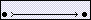
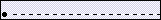
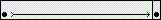
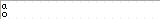
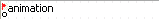
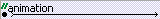
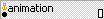

# Animation basics

> **Note:** Like most things in Flash, animation does not require any
> ActionScript. However, you can create animation with ActionScript if you
> choose.

## Types of animation

Adobe® Flash® Professional CS5 provides several ways to create animation and
special effects. Each method provides you with different possibilities for
creating engaging animated content.

Flash supports the following types of animation:

Motion tweens  
Use motion tweens to set properties for an object, such as position and alpha
transparency in one frame and again in another frame. Flash then interpolates
the property values of the frames in between. Motion tweens are useful for
animation that consists of continuous motion or transformation of an object.
Motion tweens appear in the Timeline as a contiguous span of frames that can be
selected as a single object by default. Motion tweens are powerful and simple to
create.

Classic tweens  
Classic tweens are like motion tweens, but are more complex to create. Classic
tweens allow for some specific animated effects not possible with span-based
tweens.

Inverse Kinematics poses  
Inverse kinematic poses allow you to stretch and bend shape objects and link
groups of symbol instances to make them move together in naturalistic ways. Once
you have added bones to a shape or a group of symbols, you can change the
position of the bones or symbols in different keyframes. Flash interpolates the
positions in the in-between frames.

Shape tweens  
In shape tweening, you draw a shape at one specific frame in the Timeline, and
change that shape or draw another shape at another specific frame. Flash Pro
then interpolates the intermediate shapes for the frames in between, creating
the animation of one shape morphing into another.

Frame-by-frame animation  
This animation technique lets you specify different art for each frame in the
Timeline. Use this technique to create an effect that is like the frames of a
film being played in rapid succession. This technique is useful for complex
animation where the graphic elements of each frame must be different.

## About frame rates

The frame rate, the speed the animation is played at, is measured in number of
frames per second (fps). A frame rate that's too slow makes the animation appear
to stop and start; a frame rate that's too fast blurs the details of the
animation. A frame rate of 24 fps is the default for new Flash documents and
usually gives the best results on the web. The standard motion‑picture rate is
also 24 fps.

The complexity of the animation and the speed of the computer playing the
animation affect the smoothness of the playback. To determine optimum frame
rates, test your animations on a variety of computers.

Because you specify only one frame rate for the entire Flash Pro document, set
this rate before you begin creating animation.

## Identifying animations in the Timeline

Flash Pro distinguishes tweened animation from frame-by-frame animation in the
Timeline by displaying different indicators in each frame that contains content.

The following frame content indicators appear in the Timeline:

- A span of frames with a blue background indicates a _motion tween_. A black
  dot in the first frame of the span indicates that the tween span has a target
  object assigned to it. Black diamonds indicate the last frame and any other
  property keyframes. Property keyframes are frames that contain property
  changes explicitly defined by you. You can choose which types of property
  keyframes to display by right-clicking (Windows) or Command-clicking
  (Macintosh) the motion tween span and choosing View Keyframes \> _type_ from
  the context menu. Flash displays all types of property keyframes by default.
  All other frames in the span contain interpolated values for the tweened
  properties of the target object.

  

- A hollow dot in the first frame indicates that the target object of the motion
  tween has been removed. The tween span still contains its property keyframes
  and can have a new target object applied to it.

  

- A span of frames with a green background indicates an inverse kinematics (IK)
  _pose layer_. Pose layers contain IK armatures and _poses_. Each pose appears
  in the Timeline as a black diamond. Flash interpolates the positions of the
  armature in the frames in between poses.

  

- A black dot at the beginning keyframe with a black arrow and blue background
  indicates a _classic tween_.

  

- A dashed line indicates that the classic tween is broken or incomplete, such
  as when the final keyframe is missing.

  

- A black dot at the beginning keyframe with a black arrow and a light green
  background indicates a _shape tween_.

  

- A black dot indicates a single keyframe. Light gray frames after a single
  keyframe contain the same content with no changes. These frames have a
  vertical black line and a hollow rectangle at the last frame of the span.

  

- A small _a_ indicates that the frame is assigned a frame action with the
  Actions panel.

  

- A red flag indicates that the frame contains a label.

  

- A green double slash indicates that the frame contains a comment.

  

- A gold anchor indicates that the frame is a named anchor.

  

## About layers in tweened animation

Each scene in a Flash Pro document can consist of any number of Timeline layers.
Use layers and layer folders to organize the contents of an animation sequence
and separate animated objects. Organizing them in layers and folders prevents
them from erasing, connecting to, or segmenting each other when they overlap. To
create animation that includes tweened movement of more than one symbol or text
field at once, place each object on a separate layer. You can use one layer as a
background layer to contain static artwork and use additional layers to contain
one separate animated object.

When you create a motion tween, Flash Pro converts the layer containing the
object you selected to tween into a tween layer. The tween layer has a tween
icon next to the layer name in the Timeline.

If other objects are present on the same layer as the tweened object, Flash Pro
adds new layers above or below the original layer as needed. Any objects that
existed below the tweened object on its original layer move to a new layer below
the original layer. Any objects that were above the tweened object on its
original layer move to a new layer above the original layer. Flash Pro inserts
these new layers between any pre-existing layers in the Timeline. In this way
Flash Pro preserves the original stacking order of all the graphic objects on
the Stage.

A tween layer can contain only tween spans (contiguous groups of frames
containing a tween), static frames, blank keyframes, or empty frames. Each tween
span can contain only a single target object and an optional motion path for the
target object. Because you cannot draw in a tween layer, create additional
tweens or static frames on other layers and then drag them to the tween layer.
To place frame scripts on a tween layer, create them on another layer and drag
them to the tween layer. A frame script can only reside in a frame outside the
motion tween span itself. In general, it is best to keep all frame scripts on a
separate layer that contains only ActionScript.

When a document has several layers, tracking and editing the objects on one or
more of them can be difficult. This task is easier if you work with the contents
of one layer at a time. To hide or lock layers you are not currently working on,
click the Eye or Lock icon next to the layer name in the Timeline. Using layer
folders can help you organize layers into manageable groups.

## Distributing objects to layers for tweened animation

Flash Pro automatically moves an object to its own tween layer when you apply a
motion tween to the object. However, you can also distribute objects to their
own separate layers yourself. For example, you can choose to distribute objects
yourself when you are organizing content. Manual distribution is also useful for
applying animation to objects while maintaining precise control over how they
move from one layer to another.

When you use the Distribute To Layers command (Modify \> Timeline \> Distribute
To Layers), Flash Pro distributes each selected object to a new, separate layer.
Any objects that you don't select (including objects in other frames) are
preserved in their original layers.

You can apply the Distribute To Layers command to any element on the Stage,
including graphic objects, instances, bitmaps, video clips, and broken-apart
text blocks.

### About new layers created with Distribute to Layers

New layers created during the Distribute To Layers operation are named according
to the name of the element that each contains:

- A new layer containing a library asset (such as a symbol, bitmap, or video
  clip) receives the same name as the asset.

- A new layer containing a named instance receives the name of the instance.

- A new layer containing a character from a broken-apart text block is named
  with the character.

- A new layer containing a graphic object (which has no name) is named Layer1
  (or Layer2, and so on), because graphic objects do not have names.

  Flash Pro inserts the new layers below any selected layers. The new layers are
  arranged top to bottom, in the order that the selected elements were
  originally created. The layers in broken-apart text are arranged in the order
  of the characters, whether left-to-right, right-to-left, or top-to-bottom. For
  example, suppose you break apart the text \_FLASH \_and distribute it to
  layers. The new layers, named F, L, A, S, and H, are arranged top to bottom,
  with F at the top. These layers appear immediately below the layer that
  initially contained the text.

### Distribute objects to layers

1.  Select the objects you want to distribute to separate layers. The objects
    can be in a single layer, or in several layers, including non-contiguous
    layers.
2.  Do one of the following:
    - Select Modify \> Timeline \> Distribute To Layers.

    - Right-click (Windows) or Control-click (Macintosh) one of the selected
      objects, and select Distribute To Layers.

## Additional resources

The following articles are available about working with animation in Flash Pro:

- [Creating a simple animation in Flash](https://web.archive.org/web/20120101132513mp_/http://www.adobe.com/devnet/flash/articles/animation_intro.html)
  (Adobe.com)

- [Animation Learning Guide for Flash Professional](https://web.archive.org/web/20120101132513mp_/http://www.adobe.com/devnet/flash/learning_guide/animation/)
  (Adobe.com)

- [Motion migration guide for Flash Professional](https://web.archive.org/web/20120101132513mp_/http://www.adobe.com/devnet/flash/articles/motion_migration_guide.html)
  (Adobe.com)

- [Creating animation in ActionScript 3.0](https://web.archive.org/web/20120101132513mp_/http://www.adobe.com/devnet/flash/articles/creating_animation_as3.html)
  (Adobe.com)

More Help topics

[Motion tween animation](./motion-tween-animation.md)

[Working with classic tween animation](./working-with-classic-tween-animation.md)

[Inverse kinematics](./inverse-kinematics.md)

[Shape tweening](./shape-tweening.md)

[Frame-by-frame animation](./frame-by-frame-animation.md)

[Create a new document](../managing-documents/working-with-flash-documents.md#create-a-new-document)
