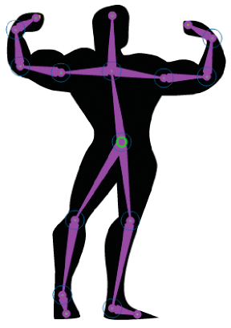
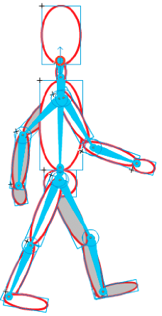
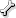

# Inverse kinematics

## About inverse kinematics

_Inverse kinematics_ (IK) is a way of animating objects using _bones_ chained
into linear or branched _armatures_ in parent-child relationships. When one bone
moves, connected bones move in relation to it.

Inverse kinematics lets you easily create natural motion. To animate using
inverse kinematics, you simply specify the start and end positions of bones on
the Timeline. Flash automatically interpolates the positions of the bones in the
armature between the starting and ending frames.

You can use IK in 2 ways:

- By using a shape as a container for multiple bones. For example, you can add
  bones to a drawing of a snake so that it slithers realistically. You can draw
  these shapes in Object Drawing mode.

- By chaining symbol instances. For example, you can link movie clips showing a
  torso, arm, lower arm, and hand so that they move realistically in relation to
  each other. Each instance has only one bone.

  > **Note:** You can animate armatures not only in the Timeline but also with
  > ActionScript 3.0. For more information, see the `fl.ik` classes in the
  > ActionScript 3.0 Language and Components Reference.

<caption>A shape with an IK bone armature added. Note that the head of each bone is round
and the tail is pointed. The first bone added, the root bone, has a circle at
the head.</caption>

<caption>A group of several symbols with an IK bone armature attached. The shoulders and
hips of the figure are branch points in the armature. The default transformation
points are the head of the root bone, interior joints, and the tail of last bone
in a branch.</caption>

> **Note:** To use inverse kinematics, your FLA file must specify ActionScript
> 3.0 as the Script setting in the Flash tab of the Publish Settings dialog box.

#### Bone styles

There are 4 ways that Flash can draw bones on the Stage:

- Solid. This is the default style.

- Wired. Useful when the solid style obscures too much of the artwork beneath
  the bone.

- Line. Useful for smaller armatures.

- None. Hides the bones to show only the artwork beneath them.

To set the Bone Style, select the IK span in the Timeline and then select the
style from the Style menu in the Options section of the Properties panel.

> **Note:** If you save a document with the Bone Style set to None, Flash
> automatically changes bone style to Line the next time you open the document.

#### Pose Layers

When you add bones to symbol instances or shapes, Flash creates a new layer for
them in the Timeline. This new layer is called the _pose layer_. Flash adds the
pose layer to the Timeline between existing layers to maintain the previous
stacking order of objects on the Stage.

In Flash Pro CS5, each pose layer can contain only one armature and its
associated instances or shape. In Flash CS5.5, the pose layer can contain other
objects in addition to one or more bone armatures.

## Add bones to symbols

You can add IK bones to movie clip, graphic, and button instances. To use text,
convert it to a symbol first. The symbol instances can be on different layers
before you add bones. Flash adds them to the pose layer.

> **Note:** You can also break text apart (Modify \> Break Apart) into separate
> shapes and use bones with the individual shapes. As you chain objects,
> consider the parent-child relationships you want to create, for example, from
> shoulder to elbow to wrist.

1.  Create symbol instances on the Stage. To save time later, arrange the
    instances so that they approximate spatial configuration you want.

2.  Select the Bone tool  from the Tools panel.

3.  Click the symbol instance that you want to set as the root bone of the
    armature. Click at the point where you want to attach the bone to the
    symbol.

    By default, Flash creates the bone at the location of mouse click. For a
    more precise way of adding a bone, turn off Auto Set Transformation Point in
    the Drawing Preferences (Edit \> Preferences). With Auto Set Transformation
    Point turned off, the bone will snap to the symbol transformation point when
    you click from one symbol to the next.

4.  Drag to another symbol instance and release the mouse button at the point
    where you want to attach it.

5.  To add another bone to the armature, drag from the tail of the first bone to
    the next symbol instance.

    It's easier to place the tail precisely if you turn off Snap To Objects
    (View \> Snapping \> Snap To Objects).

6.  To create a branched armature, click the head of an existing bone where you
    want the branch to begin. Then drag to create the first bone of the new
    branch.

    An armature can have as many branches as necessary.

    > **Note:** A branch cannot connect to another branch except at its root.

7.  To reposition the elements of the completed armature, drag either the bones
    or the instances themselves.
    - Dragging a bone moves its associated instance without allowing it to
      rotate relative to its bone.

    - Dragging an instance allows it to move as well as rotate relative to its
      bone.

    - Dragging an instance in the middle of a branch causes the parent bones to
      articulate with joint rotation. The child bones move with no joint
      rotation.

    After you create an armature, you can still add new instances from different
    layers to the armature. Drag a new bone to the new instance and Flash moves
    the instance to the pose layer of the armature.

## Add bones to shapes

You add bones to a single shape or to a group of shapes that are on the same
layer. In either case, you must select all the shapes before adding the first
bone. After you add bones, Flash converts all the shapes and bones into an _IK
shape object_ and moves the object to a new pose layer.

After you have added bones to a shape, the shape has the following limitations:

- You cannot merge an IK shape with other shapes outside it.

- You cannot rotate, scale, or skew the shape with the Free Transform tool.

- Editing the control points of the shape is not recommended.

1.  Create a filled shape or shapes on the Stage.

    The shape can contain multiple colors and strokes. Edit the shapes so they
    are as close to their final form as possible. Once you add bones to a shape,
    the options for editing the shape become more limited.

    If the shape is too complex, Flash will prompt you to convert it to a movie
    clip before adding bones.

2.  Select the entire shape on the Stage.

    If the shape contains multiple color areas or strokes, drag a selection
    rectangle around the shape to ensure that the entire shape is selected.

3.  Select the Bone tool  in the Tools panel.

4.  With the Bone tool, click inside the shape and drag to another location
    within the shape.

5.  To add another bone, drag from the tail of the first bone to another
    location in within the shape.

    The second bone becomes a child of the root bone. Link areas of the shape
    with bones in the order of the parent-child relationships you want to
    create. For example, link from shoulder to elbow to wrist.

6.  To create a branched armature, click the head of an existing bone where you
    want the branch to begin. Then drag to create the first bone of the new
    branch.

    An armature can have as many branches as necessary.

    > **Note:** A branch cannot connect to another branch except at its root.

7.  To move the armature, select the IK shape object with the Selection tool and
    then drag any of the bones to move them. Once the shape becomes an IK shape,
    it has the following limitations:

- You can no longer transform (scale or skew) the shape.

- You cannot add new strokes to the shape. You can still add or remove control
  points from the existing strokes of the shape.

- You cannot edit the shape in place (by double-clicking it on the Stage.)

- The shape has its own registration point, transform point, and bounding box.

## Edit IK armatures and objects

You can't edit IK armatures if the pose layer includes poses after the first
frame of the Timeline. Before editing, delete any additional poses after the
first frame of the armature in the Timeline.

If you are simply repositioning an armature for animation purposes, you can
change positions in any frame of the pose layer. Flash converts the frame to a
pose frame.

### Select bones and associated objects

- To select an individual bone, click the bone with the Selection tool.
  Shift-click to select multiple bones.

- To move the selection to adjacent bones, click the Parent, Child, or
  Next/Previous sibling buttons in the Property inspector.

- To select all the bones in the armature, double-click a bone.

- To select an entire armature and display the properties of the armature and
  its pose layer, click a frame in the pose layer containing the armature.

- To select an IK shape, click the shape.

- To select a symbol instance connected to a bone, click the instance.

### Reposition bones and associated objects

- To reposition a linear armature, drag any bone in the armature.

  If the armature contains connected symbol instances, you can also drag an
  instance. In this way you can rotate the instance relative to its bone.

- To reposition a branch of an armature, drag any bone in the branch.

  All the bones in the branch move. Bones in other branches of the armature do
  not move.

- To rotate a bone with its child bones without moving the parent bone,
  Shift-drag the bone.

- To move an IK shape to a new location on the Stage, select the shape and
  change its X and Y properties in the Property inspector. You can also Alt-drag
  (Windows) or Option-drag (Macintosh) the shape.

### Delete bones

Do one of the following:

- To delete an individual bone and all of its children, click the bone and press
  the Delete key.

  You can select multiple bones to delete by Shift-clicking each bone.

- To delete all bones from an IK shape or symbol armature from the Timeline,
  right-click the IK armature span in the Timeline and choose Remove Armature
  from the context menu.

- To delete all bones from an IK shape or a symbol armature on the Stage, double
  click a bone in the armature to select all bones. Then press Delete.

  IK shapes revert to normal shapes.

### Move bones relative to the associated shape or symbol

- To move the location of either end of a bone within an IK shape, drag the end
  of the bone with the Subselection tool.

  > **Note:** The Subselection tool does not work if there are multiple poses in
  > the IK span. Before editing, delete any additional poses after the first
  > frame of the armature in the Timeline.

- To move the location of a bone joint, head, or tail within a symbol instance,
  move the transformation point of the instance. Use the Free Transform tool.

  The bone moves with the transformation point.

- To move an individual symbol instance without moving any other linked
  instances, Alt-drag (Windows) or Command-drag (Macintosh) the instance, or
  drag with the Free Transform tool.

  The bones connected to the instance lengthen or shorten to accommodate the new
  location of the instance.

### Edit an IK shape

You can add, delete, and edit control points of the contours in an IK shape
using the Subselection tool.

- To move the position of a bone without changing the IK shape, drag the
  endpoint of a bone.

- To display the control points of the IK shape boundary, click the stroke of
  the shape.

- To move a control point, drag the control point.

- To add a new control point, click a part of the stroke without any control
  points.

- To delete an existing control point, click to select it, and then press the
  Delete key.

  > **Note:** An IK shape cannot be transformed (scaled or skewed).

## Bind bones to shape points

By default, the control points of a shape are connected to the bone that is
nearest to them. You can use the Bind tool to edit the connections between
individual bones and the shape control points. In this way you can control how
the stroke distorts when each bone moves for better results. This technique is
useful when the stroke of a shape does not distort as you want when the armature
moves.

You can bind multiple control points to a bone and multiple bones to a control
point.

- To highlight the control points connected to a bone, click the bone with the
  Bind tool .

  The connected points are highlighted in yellow while the selected bone is
  highlighted in red. Control points connected to only one bone appear as
  squares. Control points connected to more than one bone appear as triangles.

- To add control points to a selected bone, Shift-click a control point that is
  not highlighted.

  You can also Shift-drag to select multiple control points to add to the
  selected bone.

- To remove control points from the bone, Ctrl-click (Windows) or Option-click
  (Macintosh) a control point that is highlighted in yellow.

  You can also Ctrl-drag (Windows) or Option-drag (Macintosh) to remove multiple
  control points from the selected bone.

- To highlight the bones connected to a control point, click the control point
  with the Bind tool .

  The connected bones are highlighted in yellow while the selected control point
  is highlighted in red.

- To add other bones to the selected control point, Shift-click a bone.

- To remove a bone from a selected control point, Ctrl-click (Windows) or
  Option-click (Macintosh) a bone that is highlighted in yellow.

## Constrain motion of IK bones

To create more realistic motion of IK armatures, you can control the freedom of
motion of specific bones. For example, you can constrain two bones of an arm so
that the elbow cannot bend in the wrong direction.

By default, each IK bone is assigned a fixed length when the bone is created.
Bones can rotate around their parent joint and along the x- and y-axis. However,
they cannot move in ways that require the length of their parent bone to change
unless you enable x- or y-axis motion. By default, bone rotation is enabled and
x- and y-axis motion is disabled.

You can also limit the speed of motion of a bone to create the effect of weight
in a bone.

In armatures with strings of connected bones, you cannot contrain the motion of
the last joint in any branch of the armature. To give the appearance of
contraint of the last joint, use bones with movie clips and connect the last
bone to a movie clip that has its alpha property set to zero. Then constrain the
next-to-last bone instead of the last one.

Examples:

- For an arm, you could constrain the degrees of rotation of the elbow so that
  it cannot rotate beyond the normal range of motion of a forearm.

- To enable a character to move across the Stage, turn on X or Y translation on
  the root bone. Turn off rotation when using X and Y translation for more
  accurate movement.

You set these properties in the Property inspector when one or more bones are
selected.

- To enable a selected bone to move along the x- or y- axis and change the
  length of its parent bone, select Enable in the Joint: X Translation or Joint:
  Y Translation section of the Property inspector.

  A two-headed arrow appears perpendicular to the bone on the joint to indicate
  that x-axis motion is enabled. A two-headed arrow appears parallel to the bone
  on the joint to indicate that y-axis motion is enabled. Enabling both x and y
  translation for a bone simplifyies the task of positioning the bone when
  rotation is disabled for the bone.

- To limit the amount of motion enabled along the x- or y-axis, select Constrain
  in the Joint: X Translation or Joint: Y Translation section of the Property
  inspector and enter a value for the minimum and maximum distance the bone can
  move.

- To disable rotation of the selected bone around the joint, deselect the Enable
  checkbox in the Joint: Rotation section of the Property inspector.

  This checkbox is selected by default.

- To constrain rotation of a bone, enter minimum and maximum degrees of rotation
  in the Joint: Rotation section of the Property inspector.

  The degrees of rotation are relative to the parent bone. An arc appears on top
  of the bone joint indicating the degrees of freedom of rotation.

- To make a selected bone stationary relative to its parent bone, disable
  rotation and x- and y-axis translation.

  The bone becomes rigid and follows the motion of its parent.

- To limit the speed of motion of a selected bone, enter a value in the Joint
  Speed field in the Property inspector.

  Joint speed gives the bone the effect of weight. The maximum value of 100% is
  equivalent to unlimited speed.

#### Constraining bone movement with pinning (CS5.5 only)

You can prevent specific bones from moving by pinning them to the Stage. The
pinned bones are fixed in place while the other bones attached to them continue
to move freely. An example of this in use would be a human figure with the bones
of the feet pinned so that they cannot move above of below the floor the figure
is standing on.

To pin one or more bones to the Stage:

1.  Select the bone(s) on the Stage by clicking them.

2.  Do one of the following:
    - Place the mouse cursor over a bone joint until the Pin cursor appears.
      Then click the joint.

    - In the Location section of the Property inspector, select the Pin
      checkbox.

    The selected bone can no longer move in any direction.

#### Tutorials

- TechNote:
  [Unable to set an IK motion constraint on the last bone in a joint](https://web.archive.org/web/20120109053044mp_/http://kb2.adobe.com/cps/405/kb405264.html)

## Add Springiness to bones

Two bone properties can be used to add springiness to IK bones. The Strength and
Damping properties of bones give real physical movement to IK Bones by
integrating dynamic physics into the Bones IK system. These properties allow
easier creation of physics-enhanced animation. The Strength and Damping
properties give bone animation life-like movement that is highly configurable.
It is best to set these properties before adding poses to a pose layer.

Strength  
The stiffness of the spring. Higher values create a stiffer spring effect.

Damping  
The rate of decay of the spring effect. Higher values cause the springiness to
diminish more quickly. A value of 0 causes the springiness to remain at its full
strength throughout the frames of the pose layer.

To enable springiness, select one or more bones and set the Strength and Damping
values in the Spring section of the Property inspector. The higher the Strength,
the more rigid the spring becomes. Damping determines the rate of decay of the
spring effect, so the higher the value, the faster the animation ends.

To turn off the Strength and Damping properties, select the pose layer in the
Timeline and deselect the Enable checkbox in the Spring section of the Property
inspector. This allows you to see on Stage the poses you have defined in the
pose layer without the effect of the Spring properties.

The following factors affect the final look of your bones animation when working
with the Spring properties. Experiment with adjusting each of these to acheive
the final look you want.

- The Strength property value.

- The Damping property value.

- The number of frames between poses in the pose layer.

- The total number of frames in the pose layer.

- The number of frames between the final pose and the last frame of the pose
  later.

#### Additional resources

- Article:
  [Exploring the Spring tool in Flash Professional CS5](https://web.archive.org/web/20120109053044mp_/http://www.adobe.com/devnet/flash/articles/spring_tool.html)
  (Adobe.com)

## Animate an armature

You animate IK armatures differently from other objects in Flash. With
armatures, you simply add frames to the pose layer and reposition the armature
on the Stage to create a keyframe. Keyframes in pose layers are called _poses_.
Because IK armatures are typically used for animation purposes, each pose layer
acts as a tween layer automatically.

However, IK pose layers are different from tween layers because you cannot tween
properties other than bone position in the pose layer. To tween other properties
of an IK object such as location, transform, color effects, or filters, enclose
the armature and its associated objects in a movie clip or graphic symbol. You
can then animate the properties of the symbol using the Insert \> Motion Tween
command and the Motion Editor panel.

You can also animate IK armatures with ActionScript 3.0 at runtime. If you plan
to animate an armature with ActionScript, you cannot animate it in the Timeline.
The armature can have only one pose in the pose layer. That pose must be in the
first frame in which the armature appears in the pose layer.

The following additional resources demonstrate how to animate an armature:

- Article:
  [Character animation with the Bone Tool in Flash](https://web.archive.org/web/20120109053044mp_/http://www.adobe.com/devnet/flash/articles/character_animation_ik.html)
  (Adobe.com)

### Animate an armature in the Timeline

IK armatures exist on pose layers in the Timeline. To animate armatures in the
Timeline, insert poses by right-clicking a frame in a pose layer and selecting
Insert Pose. Use the Selection tool to change the configuration of the armature.
Flash Pro automatically interpolates the positions of the bones in the frames
between poses.

1.  In the Timeline, if needed, add frames to the pose layer of the armature to
    make room for the animation you want to create.

    You add frames by right-clicking (Windows) or Option-clicking (Macintosh) a
    frame in the pose layer to the right of any existing frames and choosing
    Insert Frame. You can add or delete frames later at any time.

2.  To add a pose to a frame in the pose layer, do one of the following:
    - Place the playhead in the frame where you want to add the pose and then
      reposition the armature on the Stage.

    - Right-click (Windows) or Option-click (Macintosh) the frame in the pose
      layer and choose Insert Pose.

    - Place the playhead in the frame where you want to add the pose and then
      press the F6 key.

    Flash inserts a pose into the pose layer in the current frame. A
    diamond-shaped pose marker in the frame indicates the new pose.

3.  Add additional poses in separate frames to complete the animation to your
    satisfaction.

4.  To change the length of the animation in the Timeline, hover the mouse
    cursor over the last frame of the armature until the Resize cursor appears.
    Then drag the last frame of the pose layer to the right or left to add or
    remove frames.

    Flash repositions the pose frames in proportion to the change in duration of
    the layer and reinterpolates the frames in between. To resize the armature
    span in the Timeline without affecting the location of the pose frames,
    Shift-drag the last frame of the armature span.

    When you finish, scrub the playhead in the Timeline to preview the
    animation. You can see the armature positions interpolated in between the
    pose frames.

You can reposition the armature in the pose frames or add new pose frames at any
time.

### Edit the location of poses in an armature

You can edit the location of poses in the following ways:

- To move a pose to a new location, Ctrl-click (Windows) or Command-click
  (Macintosh) a pose and then drag the pose to a new location in the armature.

- To copy a pose to a new location, Ctrl-click (Windows) or Command-click
  (Macintosh) a pose and then Alt-drag (Windows) or Option-drag (Macintosh) the
  pose to a new location in the armature.

- Cut, copy and paste. Ctrl-click (Windows) or Command-click (Macintosh) the
  pose you want to cut or copy and choose Cut Pose or Copy Pose from the context
  menu.

  Then Ctrl-Click (Windows) or Command-click (Macintosh) the frame in the
  armature span where you want to paste and choose Paste Pose from the context
  menu.

### Apply additional tweened effects to IK object properties

To apply tweened effects to IK object properties other than bone position,
enclose the object in a movie clip or graphic symbol.

1.  Select the IK armature and all of its associated objects.

    For an IK shape you can simply click the shape. For linked sets of symbol
    instances, you can click the pose layer in the Timeline or drag a selection
    marquee around all of the linked symbols on the Stage.

2.  Right-click (Windows) or Ctrl-click (Macintosh) the selection and choose
    Convert To Symbol from the context menu.

3.  In the Convert To Symbol dialog box, enter a name for the symbol and choose
    either Movie Clip or Graphic from the Type menu. Click OK.

    Flash creates a symbol with its own timeline containing the pose layer for
    the armature.

4.  To use the new symbol on the main timeline of your FLA file, drag the symbol
    from the Library to the Stage.

    You can now add motion tween effects to the new symbol instance on the
    Stage.

    You can nest symbols containing IK armatures within as many layers of other
    nested symbols as necessary to create your desired effect.

### Prepare an armature for runtime animation with ActionScript 3.0

You can use ActionScript 3.0 to control IK armatures connected to shapes or
movie clip instances. However, you can't control armatures connected to graphic
or button symbol instances with ActionScript.

Only armatures with a single pose can be controlled with ActionScript. Armatures
with more than one pose can only be controlled in the Timeline.

1.  With the Selection tool, select a frame in a pose layer containing an
    armature.
2.  In the Property inspector, choose Runtime from the Type menu. The hierarchy
    can now be manipulated with ActionScript 3.0 at runtime.

By default, the armature name in the Property inspector is the same as the pose
layer name. Use this name to refer to the armature in ActionScript. You can
change the name in the Property inspector.

## Add easing to IK animation

_Easing_ is adjusting the animation speed in the frames around each pose to
create more realistic motion.

1.  Select either a frame between two pose frames in the pose layer or a pose
    frame.

    **Intervening frame**  
    Ease affects the frames between the pose frames to the left and right of the
    selected frame.

    **Pose frame**  
    Ease affects the frames between the selected pose and the next pose in the
    layer.

2.  In the Property inspector, select a type of ease from the Ease menu.

    **Simple eases**  
    Four eases that slow the motion in the frames either immediately after or
    before the selected frame.

    **Start and Stop eases**  
    Slow the motion in the frames immediately after the prior pose frame and the
    frames immediately before the next pose frame.

    > **Note:** These same ease types are available in the Motion Editor when
    > you use motion tweens. You can view the curve of each type of ease in the
    > Motion Editor when you select a motion tween in the Timeline.

3.  In the Property inspector, enter a value for the Strength of the ease.

    The default Strength is 0, which is equivalent to no easing. The maximum
    value is 100, which applies the most significant easing effect to the frames
    preceding the pose frame. The minimum value is -100, which applies the most
    significant easing effect to the frames immediately after the preceding pose
    frame.

    When you finish, preview the eased motion on the Stage. Scrub the playhead
    in the Timeline between the two pose frames where you applied the ease.

More Help topics

[Drawing modes and graphic objects](../creating-and-editing-artwork/drawing-in-flash/drawing-modes-and-graphic-objects.md)

[Motion tween animation](./motion-tween-animation.md)

[Easing tween animations](./motion-tween-animation.md#easing-tween-animations)
