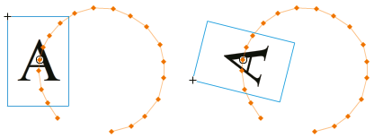
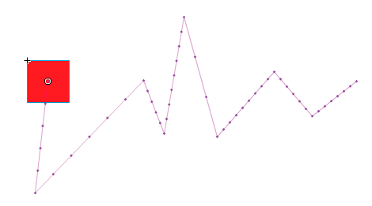
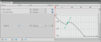
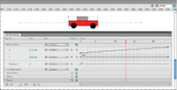
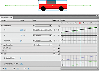
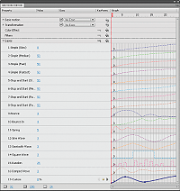

# Motion tween animation

## About tween animation

## Adobe recommends

> ###  [Create Animation in Flash](http://goo.gl/Gs1mt)
>
> [Dan Carr](http://www.dancarrdesign.com/)
>
> Developer and trainer Dan Carr demos the motion workflow and Motion Editor by
> creating motion tweens, bending motion guides, and copying motion presets.

### Before you begin

> **Note:** Like most things in Flash, animation does not require any
> ActionScript. However, you can create animation with ActionScript if you
> choose. Before creating tweens, it is helpful to understand the following
> Flash Pro concepts:

- Drawing on the Stage

- Timeline layers and the stacking order of objects within a single layer as
  well as across layers

- Moving and transforming objects on the Stage and in the Property inspector

- Using the Timeline, including object lifetime and selecting objects at
  specific points in time. See [Frames and keyframes](./frames-and-keyframes.md)
  to learn the basics.

- Symbols and symbol properties. Tweenable symbol types include movie clips,
  buttons, and graphics. Text is also tweenable.

- Nested symbols. Symbol instances can be nested inside other symbols.

- Optional: Bezier curve editing using the Select and Subselect tools. These
  tools can be used for editing tween motion paths.

For more information about these concepts, see the list of links at the bottom
of this page.

### Understanding motion tweens

A
[motion tween](http://www.adobe.com/devnet/flash/articles/concept_motion_tween.html)
is an animation that is created by specifying different values for an object
property in different frames. Flash Pro calculates the values for that property
in between those two frames. The term tween comes from the words "in between".

For example, you can place a symbol left of the Stage in frame 1, and move it to
the right of the Stage in frame 20. When you create a tween, Flash Pro
calculates all the positions of the movie clip in between. The result is an
animation of the symbol moving from left to right, from frame 1 to frame 20. In
each frame in between, Flash Pro moves the movie clip one 20th of the distance
across the Stage.

A _tween span_ is a group of frames in the Timeline in which an object has one
or more properties changed over time. A tween span appears in the Timeline as a
group of frames in a single layer with a blue background. These tween spans can
be selected as a single object and dragged from one location in the Timeline to
another, including to another layer. Only one object on the Stage can be
animated in each tween span. This object is called the _target object_ of the
tween span.

A _property keyframe_ is a frame within a tween span where you explicitly define
one or more property values for the tween target object. These properties could
include position, alpha (transparency), color tint, etc. Each property you
define has its own property keyframes. If you set more than one property in a
single frame, then the property keyframes for each of those properties reside in
that frame. You can view each property of a tween span and its property
keyframes in the Motion Editor. You can also choose which types of property
keyframes to display in the Timeline from the tween span context menu.

In the preceding example of tweening a movie clip from frame 1 to frame 20,
frames 1 and 20 are property keyframes. You can use the Property inspector, the
Motion Editor, and many other tools in Flash to define values for properties you
want to animate. You specify these property values in the frames of your
choosing, and Flash Pro adds the required property keyframes to the tween span.
Flash Pro interpolates the values for each of these properties in the frames in
between the property keyframes you have created.

> **Note:** Beginning in Flash Professional CS4, the concepts of a "keyframe"
> and a "property keyframe" have changed. The term "keyframe" refers to a frame
> in the Timeline in which a symbol instance appears on the Stage for the first
> time. The separate term "property keyframe" refers to a value defined for a
> property of an object at a specific time or frame in a motion tween. If a
> tweened object changes its location on the Stage during the tween, the tween
> span has a motion path associated with it. This motion path shows the path the
> tweened object takes during its movement around the Stage. You can edit the
> motion path on the Stage using the Selection, Subselection, Convert Anchor,
> Remove Anchor, and Free Transform tools, and commands in the Modify menu. If
> you are not tweening position, no motion path appears on the Stage. You can
> also apply an existing path as a motion path by pasting the path onto a tween
> span in the Timeline.

Tweened animation is an effective and efficient way to create movement and
changes over time while minimizing file size. In tweened animation, only the
values for the property keyframes you specify are stored in the FLA file and
published SWF file.

### Tweenable objects and properties

The types of objects that can be tweened include movie clip, graphic and button
symbols, and text fields. The properties of these objects that can be tweened
include the following:

- 2D X and Y position

- 3D Z position (movie clips only)

- 2D rotation (around the z-axis)

- 3D X, Y, and Z rotation (movie clips only)

  3D motion requires that the FLA file target ActionScript 3.0 and Flash Player
  10 or higher in the publish settings. Adobe AIR also supports 3D motion.

- Skew X and Y

- Scale X and Y

- Color effects

  Color effects include: alpha (transparency), brightness, tint, and advanced
  color settings. Color effects can be tweened only on symbols and TLF text. By
  tweening these properties, you can make objects appear to fade in or fade from
  one color to another.

  To tween a color effect on classic text, convert the text to a symbol.

- Filter properties (filters cannot be applied to graphic symbols)

### Differences between motion tweens and classic tweens

Flash Pro supports two different types of tweens for creating motion. _Motion
tweens_, introduced in Flash CS4 Professional, are powerful and simple to
create. Motion tweens allow the greatest control over tweened animation.
_Classic tweens_, which include all tweens created in earlier versions of Flash
Pro, are more complex to create. While motion tweens offer much more control of
a tween, classic tweens provide certain specific capabilities that some users
need.

The differences between motion tweens and classic tweens include the following:

- Classic tweens use keyframes. Keyframes are frames in which a new instance of
  an object appears. Motion tweens can only have one object instance associated
  with them and use property keyframes instead of keyframes.

- A motion tween consists of one target object over the entire tween span.
  Classic tween allows tweening between two keyframes, containing instances of
  the same or different symbols.

- Both motion tweens and classic tweens allow only specific types of objects to
  be tweened. When you apply a motion tween to non-allowed object types, Flash
  offers to convert them to a movie clip when the tween is created. Applying a
  classic tween converts them to graphic symbols.

- Motion tweens consider text a tweenable type and do not convert text objects
  to movie clips. Classic tweens convert text objects to graphic symbols.

- No frame scripts are allowed on a motion tween span. Classic tweens allow
  frame scripts.

- Any object scripts on a tween target cannot change over the course of the
  motion tween span.

- Motion tween spans can be stretched and resized in the Timeline and are
  treated as a single object. Classic tweens consist of groups of individually
  selectable frames in the Timeline.

- To select individual frames in a motion tween span, Ctrl-click (Windows) or
  Command-click (Macintosh) the frames.

- With classic tweens, eases can be applied to the groups of frames between the
  keyframes within the tween. With motion tweens, eases apply across the entire
  length of a motion tween span. Easing only specific frames of a motion tween
  requires the creation of a custom ease curve.

- You can use classic tweens to animate between two different color effects,
  such as tint and alpha transparency. Motion tweens can apply one color effect
  per tween.

- Only motion tweens can be used to animate 3D objects. You cannot animate a 3D
  object using a classic tween.

- Only motion tweens can be saved as Motion Presets.

- With motion tweens, you cannot swap symbols or set the frame number of a
  graphic symbol to display in a property keyframe. Animations that include
  these techniques require classic tweens.

- There can be more than one classic or motion tween on the same layer, but
  there can't be both types of tween on the same layer.

### Additional resources

The following articles and resources are available about the differences between
motion tweens and classic tweens:

- [Creating a simple animation in Flash](http://www.adobe.com/devnet/flash/articles/animation_intro.html)
  (Adobe.com)

- [Motion migration guide for Flash Professional](http://www.adobe.com/devnet/flash/articles/motion_migration_guide.html)
  (Adobe.com)

- Jen DeHaan provides a useful blog post about the motion model in Flash Pro and
  the differences between motion tweens and classic tweens on her
  [Flashthusiast.com](https://web.archive.org/web/20120109053044mp_/http://flashthusiast.com/2008/09/22/the-new-way-of-tweening-in-flash-cs4-or-new-motion-in-flash-cs4-makes-your-animations-better-faster-stronger/)
  site.

## Applying motion presets

Motion presets are pre-configured
[motion tweens](http://www.adobe.com/devnet/flash/articles/concept_motion_tween.html)
that you can apply to an object on the Stage. You simply select the object and
click the Apply button in the Motion Presets panel.

Using motion presets is a quick way to learn the basics of adding animation in
Flash Pro. Once you see how presets work, making your own animations is even
easier.

You can create and save your own custom presets. These can be from existing
motion presets that you have modified, or from custom tweens that you have
created on your own.

The Motion Presets panel also allows you to import and export presets. You can
share presets with people you are collaborating with or take advantage of
presets shared by members of the Flash Pro design community.

Using presets can save significant production time during design and development
of your projects, especially if you use similar kinds of tweens often.

> **Note:** Motion presets can only contain motion tweens. Classic tweens cannot
> be saved as motion presets.

### Preview a motion preset

Each motion preset included with Flash Pro has a preview that you can watch in
the Motion Presets panel. The preview gives you a sense of what the animation
looks like when applied to an object in your FLA file. For custom presets that
you create or import, you can add your own preview.

1.  Open the Motion Presets panel.

2.  Select a motion preset from the list.

    The preview plays in the Preview pane at the top of the panel.

3.  To stop the preview from playing, click outside the Motion Presets panel.

### Apply a motion preset

While a tweenable object (symbol instance or text field) is selected on the
Stage, you can click the Apply button to apply a preset. You can apply only one
preset per object. If you apply the second preset to the same object, the second
preset replaces with the first one.

Once a preset is applied to an object on the Stage, the tween created in the
Timeline no longer has any relationship to the Motion Presets panel. Deleting or
renaming a preset in the Motion Presets panel has no effect on any tweens
previously created with that preset. If you save a new preset over an existing
one in the panel, it has no effect on any tweens already created with the
original preset.

Each motion preset contains a specific number of frames. When you apply a
preset, the tween span created in the Timeline contains this number of frames.
If the target object already had a tween of a different length applied to it,
the tween span adjusts to match the length of the motion preset. You can adjust
the length of the tween span in the Timeline after the preset is applied.

Motion presets that contain 3D motion can only be applied to movie clip
instances. The tweened 3D properties do not apply to graphic or button symbols,
or to classic text fields. You can apply 2D or 3D motion presets to any 2D or 3D
movie clip.

> **Note:** Motion presets that animate the z axis position of a 3D movie clip
> will cause the movie clip to appear to change its x and y position as well.
> This is because movement along the z axis follows the invisible perspective
> lines which radiate from the 3D vanishing point (set in the 3D symbol instance
> Property inspector) to the edges of the Stage. To apply the motion preset:

1.  Select a tweenable object on the Stage. If you apply a motion preset to an
    object that is not tweenable, a dialog box appears to allow you to convert
    the object to a symbol.

2.  Select a preset in the Motion Presets panel.

3.  Click the Apply button in the panel or choose Apply at Current Location from
    the panel menu.

    The motion is applied so that the motion starts at the current position of
    the movie clip on the Stage. If the preset has a motion path associated with
    it, the motion path appears on the Stage.

    To apply the preset so that its motion ends at the current position of the
    object on the Stage, Shift-click the Apply button or select End at Current
    Location from the panel menu.

    You can also apply a motion preset to multiple selected frames on separate
    layers, as long as each selected frame contains only a single tweenable
    object.

### Save a tween as a custom motion preset

If you create your own tween or change a tween that you applied from the Motion
Presets panel, you can save it as a new motion preset. The new preset appears in
the Custom Presets folder in the Motion Presets panel.

To save a custom tween as a preset:

1.  Select one of the following items:
    - The tween span in the Timeline

    - The object on Stage to which the custom tween was applied

    - The motion path on the Stage

2.  Click the Save Selection As Preset button in Motion Presets panel or choose
    Save as Motion Preset from the context menu of the selection.

    The new preset appears in the Motion Presets panel. Flash Pro saves the
    preset as an XML file. The files are stored in the following directories:
    - Windows:
      `C:\Documents and Settings\<userName>\Local Settings\Application Data\Adobe\Flash CS5\<language>\Configuration\Motion Presets\`

    - Macintosh:
      `<HardDisk>/Users/<userName>/Library/Application Support/Adobe/Flash CS5/<language>/Configuration/Motion Presets/`

> **Note:** You cannot undo saving, deleting, or renaming custom presets.

### Import a motion preset

Motion presets are stored as XML files. Import an XML tween file to add it to
the Motion Presets panel.

1.  Choose Import from the Motion Presets panel menu.
2.  In the Open dialog box, navigate to the XML file you want to import and
    click Open. Flash Pro opens the XML file and adds the motion preset to the
    panel.

### Export a motion preset

You can export motion presets as XML files that can be shared with other Flash
Pro users.

1.  Select the preset in the Motion Presets panel.
2.  Choose Export from the panel menu.
3.  In the Save As dialog box, choose a name and location for the XML file and
    click Save.

### Delete a motion preset

You can remove presets from the Motion Presets panel. When you remove a preset,
Flash Pro deletes its XML file from disk. Consider making a backup of any
presets you might want to use again later by exporting copies of them first.

1.  Select the preset to delete in the Motion Presets panel.
2.  Do one of the following:
    - Choose Remove from the panel menu.

    - Click the Remove item button in the panel.

### Create a preview for a custom preset

You can create a preview for any custom motion presets that you create. Do this
by storing a SWF file that demonstrates the tweened animation in the same
directory with the motion preset XML file.

1.  Create the tweened animation and save it as a custom preset.
2.  Create a FLA file that contains only a demonstration of the tween. Save the
    FLA with the exact same name as the custom preset.
3.  Create a SWF file from the FLA file with the Publish command.
4.  Place the SWF file in the same directory as the saved custom motion preset
    XML file. These files are stored in the following directories:
    - Windows: \<hard disk\>\Documents and Settings\\user\>\Local
      Settings\Application Data\Adobe\Flash CS5\\language\>\Configuration\Motion
      Presets\\

    - Macintosh: \<hard disk\>/Users/\<user\>/Library/Application
      Support/Adobe/Flash CS5/\<language\>/Configuration/Motion Presets/

    The preview now displays when the custom tween is selected in the Motion
    Presets panel.

## Create tween animation

### Before you begin

Before you begin animating properties, keep in mind the following:

**ActionScript is not necessary.** Like many things in Flash, animation does not
require any ActionScript. However, you can create animation with ActionScript if
you choose.

**Basics of timeline and editing properties.** Before working with motion
tweens, become familiar with the basic use of the Timeline and editing
properties. See [Frames and keyframes](./frames-and-keyframes.md) and
[Editing instance properties](../symbols-instances-and-library-assets/working-with-symbol-instances.md#editing-instance-properties)
to learn the basics.

You can edit individual property keyframes on Stage, in the Property inspector,
or in the Motion Editor. Note that using the Motion Editor is optional when
creating many types of simple motion tweens.

**Symbol Instances and text fields only.** Flash tweens only symbol instances
and text fields. All other object types are wrapped in a symbol when you apply a
tween to them. The symbol instance can contain nested symbols, which can
themselves be tweened on their own timelines.

**Single object per tween.** The minimal building block in a tween layer is a
tween span. A tween span in a tween layer can contain only one symbol instance
or text field. The symbol instance is called the target of the tween span.
However, a single symbol can contain many objects.

**Changing the target.** Adding a second symbol or text field to the tween span
replaces the original symbol in the tween. You can change the target object of a
tween by dragging a different symbol from the library onto the tween span in the
Timeline or by using the Modify \> Symbol \> Swap Symbol command. You can delete
the symbol from a tween layer without removing or breaking the tween. You can
then add a different symbol instance to the tween at a later time. You can also
change the type of the target symbol or edit the symbol at any time.

**Editing motion paths.** When a tween contains motion, a motion path appears on
the Stage. The motion path shows the position of the tweened object in each
frame. You can edit the motion path on the Stage by dragging its control points.
You cannot add a motion guide to a tween/inverse kinematics layer.

For information about tweening with Inverse Kinematics, see
[Animate an armature](./inverse-kinematics.md#animate-an-armature).

### How tweens are added to the Timeline

When you add a tween to an object on a layer, Flash Pro does one of the
following:

- It converts the layer to a tween layer.

- It creates a new layer to preserve the original stacking order of the objects
  on the layer.

Layers are added according to these rules:

- If there are no objects on the layer other than the selection, the layer
  changes to a tween layer.

- If the selection is at the bottom of the stacking order of the layer (under
  all other objects), Flash creates a layer above the original layer. This new
  layer holds the non-selected items. The original layer becomes a tween layer.

- If the selection is at the top of the stacking order of the layer (above all
  other objects), Flash creates a new layer. The selection is moved to the new
  layer and that layer becomes a tween layer.

- If the selection is in the middle of the stacking order of the layer (there
  are objects above and below the selection), Flash creates two layers. One
  layer holds the new tween and another one above it holds the non-selected
  items at the top of the stacking order. The non-selected items at the bottom
  of the stacking order remain on the original layer, below the newly inserted
  layers.

A tween layer can contain tween spans as well as static frames and ActionScript.
However, frames of a tween layer that contain a tween span cannot contain
objects other than the tweened object. To add additional objects in the same
frame, place them on separate layers.

### Animate position with a tween

To make an object move or slide across the Stage:

1.  Select a symbol instance or a text field to tween on the Stage. The object
    can reside in any of the following layer types: Normal, Guide, Mask, or
    Masked.

    If the selection contains other objects, or it contains multiple objects
    from a layer, Flash offers to convert your selection to a movie clip symbol.

2.  Do one of the following:
    - Choose Insert \> Motion Tween.

    - Right-click (Windows) or Ctrl-click (Macintosh) the selection or current
      frame and choose Create Motion Tween from the context menu.

    If the "Convert selection to symbol for tween" dialog box appears, click OK
    to convert the selection into a movie clip symbol.

    If the tweened object was the only item on the layer, Flash Pro converts the
    layer containing the object to a tween layer. If there are other objects on
    the layer, Flash Pro inserts layers to preserve the stacking order. Flash
    places the tweened object on its own layer.

    If the original object resided in only the first frame of the Timeline, the
    length of the tween span is equal to one second in duration. If the original
    object was present in more than one contiguous frame, the tween span
    contains the number of frames occupied by the original object.

3.  Drag either end of the tween span in the Timeline to shorten or extend the
    span to the desired number of frames. Any existing property keyframes in the
    tween move proportionally with the end of the span.

    To move the end of the span without moving any existing keyframes,
    Shift-drag the end of the tween span.

4.  To add motion to the tween, place the playhead on a frame within the tween
    span and then drag the object to a new position.

    A motion path appears on the Stage showing the path from the position in the
    first frame of the tween span to the new position. Because you explicitly
    defined the X and Y properties of the object, property keyframes are added
    for X and Y in the frame containing the playhead. Property keyframes appear
    as small diamonds in the tween span.

     By default, the Timeline displays the property
    keyframes of all property types. You can choose which types of property
    keyframes to display by right-clicking (Windows) or Command-clicking
    (Macintosh) the tween span and choosing View Keyframes \> _property type_.

5.  To specify another position for the object, place the playhead in another
    frame within the tween span and drag the object on Stage to another
    position.

    The motion path adjusts to include all the positions you specify.

6.  To tween 3D rotation or position, use the 3D Rotation or 3D Translation
    tool. Be sure to place the playhead in the frame where you want to add the
    3D property keyframe first. > **Note:** To create multiple tweens at once,
    place tweenable objects on > multiple layers, select them all, and choose
    Insert \> Motion Tween. You > can also apply motion presets to multiple
    objects in the same way.

### Tween other properties with the Property inspector

The Create Motion Tween command lets you animate most properties of a symbol
instance or text field, such as rotation, scale, transparency, or tint (symbols
and TLF text only). For example, you can edit the alpha (transparency) property
of a symbol instance to make it fade onto the screen. For a list of the
properties you can animate with motion tweens, see
[Tweenable objects and properties](#tweenable-objects-and-properties).

1.  Select a symbol instance or text field on the Stage.

    If the selection contains other objects, or it contains multiple objects
    from the layer, Flash offers to convert it to a movie clip symbol.

2.  Choose Insert \> Motion Tween.

    If the "Convert selection to symbol for tween" dialog box appears, click OK
    to convert the selection into a movie clip symbol.

    When you apply a tween to an object that exists only in a single keyframe,
    the playhead moves to the last frame of the new tween. Otherwise the
    playhead does not move.

3.  Place the playhead in the frame of the tween span where you want to specify
    a property value.

    You can place the playhead in any other frame of the tween span. The tween
    starts with the property values in the first frame of the tween span, which
    is always a property keyframe.

4.  With the object selected on the Stage, set a value for a non-position
    property, such as alpha (transparency), rotation, or skew. Set the value
    with the Property inspector or with one of the tools in the Tools panel.

    The current frame of the span becomes a property keyframe.

     You can display different types of property
    keyframes in tween spans. Right-click (Windows) or Ctrl-click (Macintosh) a
    tween span and choose View Keyframes \> _property type_ from the context
    menu.

5.  Scrub the playhead in the Timeline to preview the tween on the Stage.

6.  To add additional property keyframes, move the playhead to the desired frame
    in the span and set a value for the property in the Property inspector.

> **Note:** You can also tween properties along an entire tween with the Motion
> Editor. See
> [Editing animation property curves with the Motion Editor](./motion-tween-animation.md#editing-animation-property-curves-with-the-motion-editor)
> for more information.

### Add an additional tween to an existing tween layer

You can add additional tweens to an existing tween layer. This allows you to use
fewer layers when creating Flash content with animation.

 Do one of the following:

- Add a blank keyframe to the layer (Insert \> Timeline \> Blank Keyframe), add
  items to the keyframe, and then tween the items.

- Create a tween on a separate layer and then drag the span to the desired
  layer.

- Drag a static frame from another layer to the tween layer and then add a tween
  to an object in the static frame.

- Alt-drag (Windows) or Option-drag (Macintosh) to dulicate an existing span
  from the same layer or a different layer.

- Copy and paste a tween span from the same or different layer.

> **Note:** You can copy the target object of a motion tween to the clipboard at
> any frame in the tween span.

## Edit the motion path of a tween animation

You can edit or change the motion path of a
[motion tween](http://www.adobe.com/devnet/flash/articles/concept_motion_tween.html)
in the following ways:

- Change the position of the object in any frame of the tween span.

- Move the entire motion path to a different location on the Stage.

- Change the shape or size of the path with the Selection, Subselection, or Free
  Transform tools.

- Change the shape or size of the path with the Transform panel or Property
  inspector.

- Use the commands in the Modify \> Transform menu.

- Apply a custom stroke as a motion path.

- Use the Motion Editor.

You can use the Always Show Motion Paths option to show all motion paths on all
layers on the Stage simultaneously. This display is helpful when designing
multiple animations on different motion paths that intersect each other. When a
motion path or tween span is selected, you can choose this option from the
Property inspector options menu.

### Edit the shape of a motion path with the Selection and Subselection tools

With the Selection and Subselection tools, you can reshape a motion path. With
the Selection tool, you can reshape a segment by dragging. Property keyframes in
the tween appear on the path as control points. With the Subselection tool, you
can expose the control points and Bezier handles on the path that correspond to
each position property keyframe. You can use these handles to reshape the path
around the property keyframe points.

When you create a non-linear motion path such as a circle, you can have the
tweened object rotate as it moves along the path. To maintain a constant
orientation relative to the path, select the Orient to Path option in the
Property inspector.

A tweened object not oriented to the motion path (left) and oriented to the
motion path (right).

1.  Click the Selection tool in the Tools panel.

2.  Click the tween target instance so that the motion path becomes visible on
    the Stage.

3.  With the Selection tool, drag any segment of the motion path to reshape it.
    Do not click to select the segment first.

4.  To expose the Bezier control points of a property keyframe point on the
    path, click the Subselection tool and then click the path.

    The property keyframe points appear as control points (small diamonds) on
    the motion path.

5.  To move a control point, drag it with the Subselection tool.

6.  To adjust the curve of the path around a control point, drag the Bezier
    handles of the control point with the Subselection tool.

    If the handles are not extended, you can extend them by Alt-dragging
    (Windows) or Option-dragging (Macintosh) the control point.

7.  To delete an Anchor point click on it with Delete Anchor Point tool.Most
    anchor points generated with Selection tool are smooth points. To convert an
    anchor point click onti with Convert Anchor Point tool. The anchor changes
    to an angle point.

8.  You can also pull out new bezier handles from a point and position them,
    just as you would for a regular anchor point.

    > **Note:** You can't add anchor points to the path with Add Anchor point
    > tool.

### Change the position of the tweened object

The simplest way to edit a motion path is to move the target instance of the
tween on the Stage in any frame of the tween span. If the current frame does not
already contain a property keyframe, Flash Pro adds one to it.

1.  Place the playhead in the frame where you want to move the target instance.
2.  With the Selection tool, drag the target instance to a new location on the
    Stage. The motion path updates to include the new location. All other
    property keyframes in the motion path remain in their original locations.

### Change the location of a motion path on the Stage

You can drag the entire motion path on the Stage or set its location in the
Property inspector.

1.  Click the Selection tool in the Tools panel.
2.  Select the motion path by doing one of the following:
    - Click the tween span in the Timeline and then click the motion path on the
      Stage.

    - Click the tweened object on the Stage and then click the motion path.

    - Drag a marquee around the motion path and the target instance to select
      them both.

    - (CS5.5 only) Select multiple motion paths by Shift-clicking the motion
      path of each tween you want to edit. You can also drag a marquee around
      all of the motion paths.

3.  Move the motion path by doing one of the following:
    - Drag the path to desired location on the Stage.

    - Set the X and Y values for the path in the Property inspector. The X and Y
      values are for the upper-left corner of the bounding box of the motion
      path.

    - Use the Arrow keys to move the motion path.

> **Note:** To move the tween target instance and the motion path by specifying
> a location for the motion path, select both and enter the X and Y locations in
> the Property inspector. To move a tweened object that has no motion path,
> select it and enter X and Y values in the Property inspector.

### Edit a motion path with the Free Transform tool

1.  Click the Free Transform tool in the Tools panel.
2.  With the Free Transform tool, click the motion path. Do not click the tween
    target instance.
3.  Scale, skew, or rotate the path with the Free Transform tool.

> **Note:** You can also perform free transforms on the motion path by selecting
> it with the Subselection tool and then pressing the Control (Windows) or
> Command (Macintosh) key. Pressing the key displays the same controls as the
> Free Transform tool. You can then drag to perform transforms while pressing
> the key.

### (CS5.5 only) Scale multiple tweened objects and motion paths

1.  Place the playback head in the first frame of the tweens you want to edit.
2.  Select the Free Transform tool from the Tools panel.
3.  Select multiple tweened object and their motion paths by doing one of the
    following:
    - Shift-click the tweened objects and their motion paths.

    - Drag a marquee around the tweened objects and their motion paths.

4.  Scale the selection by dragging the corners of the bounding box containing
    the selected objects and motion paths. Because the playback head is in the
    first frame of the tweens, the scaling applies to all tweened frames. No new
    property keyframes are created.

### Delete a motion path from a tween

1.  Select the motion path on the Stage by clicking it with the Selection tool.
2.  Press the Delete key.

### Copy a motion path as a stroke

1.  Click the motion path on the Stage to select it.
2.  Choose Edit \> Copy. You can then paste the path into another layer as a
    stroke or as a motion path for another motion tween.

### Apply a custom stroke as a motion path

You can apply a stroke from a separate layer or a separate timeline as the
motion path for a tween.

1.  Select a stroke on a layer separate from the tween layer and copy it to the
    clipboard.

    The stroke must not be closed. Only uninterrupted strokes can be used.

2.  Select a tween span in Timeline.

3.  With the tween span still selected, paste the stroke.

    Flash Pro applies the stroke as the new motion path for the selected tween
    span. The target instance of the tween now moves along the new stroke.

4.  To reverse the start and end points of the tween, right-click (Windows) or
    Ctrl-click (Macintosh) the tween span and select Motion Path \> Reverse Path
    in the tween span context menu.

### Use roving property keyframes

A roving property keyframe is a keyframe that is not linked to a specific frame
in the Timeline. Flash adjusts the position of roving keyframes so that the
speed of motion is consistent throughout a tween.

Roving keyframes are available only for the spatial properties X, Y, and Z. They
are useful when you have edited a motion path on the Stage by dragging the
tweened object to different locations in different frames. Editing motion paths
this way often creates path segments in which the motion is faster or slower
than the other segments. This is because the number of frames in the path
segment is greater or smaller than other segments.

Using roving property keyframes is helpful for making the speed of an animation
consistent throughout a tween. When property keyframes are set to roving, Flash
adjusts the position of the property keyframes in the tween span so that the
tweened object moves the same distance in each frame of the tween. You can then
use easing to adjust the movement so that the acceleration at the beginning and
end of the tween has a realistic appearance.

When you paste a custom path onto a tween, Flash sets the property keyframes to
roving by default.

To enable roving keyframes for an entire tween:

- Right-click (Windows) or Command-click (Macintosh) the tween span in the
  Timeline and choose Motion Path \> Switch keyframes to roving in the context
  menu.

To enable roving for an individual property keyframe in a tween:

- Right-click (Windows) or Command-click (Macintosh) the property keyframe in
  the Motion Editor panel and choose roving in the context menu. For more
  information about the Motion Editor, see
  [Editing animation property curves with the Motion Editor](#editing-animation-property-curves-with-the-motion-editor).

When property keyframes are set to roving, they appear as round dots instead of
squares in the Motion Editor.

> **Note:** If you enable roving keyframes for a tween span and then disable
> them, the keyframes retain their locations in the span that resulted from
> enabling roving.

<caption>A motion path with roving keyframes turned off. Note the uneven distribution of
frames, resulting in uneven speed of motion.</caption>

<caption>The same motion path with roving keyframes turned on, resulting in even
distribution of frames along the path and even speed of motion.</caption>

## Edit animation tween spans in the Timeline

When creating animation in Flash Pro, it is often appropriate to set up tween
spans in the Timeline first. By establishing the initial arrangement of objects
in layers and frames, you can then finish the tweens by changing the tweened
property values in either the Property inspector or the Motion Editor.

To select tween spans and frames in the Timeline, do any of the following. Be
sure Span-based Selection is turned on in the General Preferences (Edit \>
Preferences).

- To select an entire tween span, click the span.

- To select multiple tween spans, including non-contiguous spans, Shift-click
  each span.

- To select a single frame within a tween span, Ctrl+Alt-click (Windows) or
  Command+Option-click (Macintosh) the frame inside the span.

- To select multiple contiguous frames within a span, Ctrl+Alt-drag (Windows) or
  Command+Option-drag (Macintosh) inside the span.

- To select frames within multiple tween spans on different layers,
  Ctrl+Alt-drag (Windows) or Command+Option-drag (Macintosh) across multiple
  layers.

- To select an individual property keyframe in a tween span, Ctrl+Alt-click
  (Windows) or Command+Option-click (Macintosh) the property keyframe. You can
  then drag it to a new location.

[A complete list of keyboard modifiers](http://flashthusiast.com/2008/11/24/lists-of-keyboard-modifiers-in-the-flash-cs4-motion-model-lets-you-do-more-stuff/)
for working with tween spans in the Timeline is available at Flashthusiast.com.

### Move, duplicate, or delete tween spans

- To move a span to a new location in the same layer, drag the span.

  > **Note:** Locking a layer prevents editing on the Stage but not the
  > Timeline. Moving a span on top of another span consumes the overlapped
  > frames of the second span.

- To move a tween span to a different layer, drag the span to the layer or copy
  and paste the span into the new layer.

  You can drag a tween span onto an existing normal layer, tween layer, guide
  layer, mask layer, or masked layer. If the new layer is a normal empty layer,
  it becomes a tween layer.

- To duplicate a span, Alt-drag (Windows) or Command-drag (Macintosh) the span
  to a new location in the Timeline, or copy and paste the span.

- To delete a span, select the span and choose Remove Frames or Clear Frames
  from the span context menu.

### Edit adjacent tween spans

- To move the breakline between two contiguous tween spans, drag the breakline.

  Each tween is recalculated.

- To separate the adjacent start and end frames of two contiguous tween spans,
  Alt-drag (Windows) or Command-drag (Macintosh) the start frame of the second
  span.

  This allows you to make room for frames between the two spans.

- To split a tween span into two separate spans, Ctrl-click (Windows) or
  Command-click (Macintosh) a single frame in the span and then choose Split
  Motion from the span context menu.

  Both tween spans have same target instance.

  > **Note:** You cannot split motion if more than one frame is selected. If the
  > tween that was split had easing applied, the two smaller tweens may not have
  > exactly the same motion as the original.

- To join two contiguous tween spans, select both spans and choose Join Motions
  from the span context menu.

### Edit the length of a tween span

- To change the length of an animation, drag the right or left edge of the tween
  span.

  Dragging the edge of one span into the frames of another span replaces the
  frames of the second span.

- To extend the presence of a tweened object on Stage beyond either end of its
  tween, Shift-drag either end frame of its tween span. Flash Pro adds frames to
  the end of the span without tweening those frames.

  You can also select a frame after the tween span in the same layer and press
  F6. Flash Pro extends the tween span and adds a property keyframe for all
  properties to the selected frame. If you press F5, Flash Pro adds frames but
  will not add a property keyframe to the selected frame.

  > **Note:** To add static frames to the end of a span that is immediately
  > adjacent to another span, first move the adjacent span to make room for the
  > new frames.

### Add or remove frames within a tween span

- To remove frames from within a span, Ctrl-drag (Windows) or Command-drag
  (Macintosh) to select frames and choose Remove Frames from the span context
  menu.

- To cut frames from within a span, Ctrl-drag (Windows) or Command-drag
  (Macintosh) to select the frames and then choose Cut Frames from the span
  context menu.

- To paste frames into an existing tween span, Ctrl-drag (Windows) or
  Command-drag (Macintosh) to select the frames to replace and choose Paste
  Frames from the span context menu.

  Simply pasting an entire span onto another span replaces the entire second
  span.

### Replace or remove the target instance of a tween

To replace the target instance of a tween span, do one of the following:

- Select the span and then drag the new symbol from the Library panel onto the
  Stage.

- Select the new symbol in the Library panel and the target instance of the
  tween on the Stage and choose Modify \> Symbol \> Swap Symbol.

- Select the span and paste a symbol instance or text from the clipboard.

To remove the target instance of a tween span without removing the tween, select
the span and press the Delete key.

### View and edit property keyframes of a tween span

- To view frames containing property keyframes in a span for different
  properties, select the span and choose View Keyframes from the span context
  menu and then choose the property type from the submenu.

- To remove a property keyframe from a span, Ctrl-click (Windows) or
  Command-click (Macintosh) the property keyframe to select it and then
  right-click (Windows) or Ctrl-click (Macintosh) the property keyframe and
  choose Clear Keyframe for the property type you want to delete the keyframe
  for.

- To add property keyframes for a specific property type to a span, Ctrl-click
  (Windows) or Command-click (Macintosh) to select one or more frames in the
  span. Then right-click (Windows) or Ctrl-click (Macintosh) and choose Insert
  Keyframe \> _property type_ from the span context menu. Flash Pro adds
  property keyframes to the selected frames. You can also set a property of the
  target instance in a selected frame to add a property keyframe.

- To add a property keyframe for all property types to a span, place the
  playhead in the frame where you want to add the keyframe and choose Insert \>
  Timeline \> Keyframe, or press F6.

- To reverse the direction of motion of a tween, choose Motion Path \> Reverse
  Path from the span context menu.

- To change a tween span to static frames, select the span and choose Remove
  Tween from the span context menu.

- To convert a tween span to a frame-by-frame animation, select the span and
  choose Convert to Frame by Frame Animation from the span context menu.

- To move a property keyframe to a different frame in the same tween span or a
  different tween span, Ctrl-click (Windows) or Command-click (Macintosh) the
  property keyframe to select it and then drag the property keyframe to the new
  location.

- To copy a property keyframe to another location in the tween span, Ctrl-click
  (Windows) or Command-click (Macintosh) the property keyframe to select it and
  then Alt-drag (Windows) or Option-drag (Macintosh) the property keyframe to
  the new location.

### Add or remove 3D property keyframes in a tween

 Do one of the following:

- Add 3D properties using the 3D tools in the Tools panel.

- Right-click (Windows) or Ctrl-click (Macintosh) the tween span in the Timeline
  and choose 3D tween from the context menu.

  If the tween span contained no 3D property keyframes, Flash Pro adds them to
  each existing X and Y position and rotation property keyframe. If the tween
  span already contained 3D property keyframes, Flash Pro removes them.

### Move or duplicate a tween span

You can duplicate or move tween spans and parts of tween spans by dragging them
in the Timeline panel.

- Drag a tween span to move it to different location in the Timeline.

- Alt-drag a tween span to duplicate it in a new location in the Timeline.

### Copy and paste a motion tween

You can copy the tweened properties from one tween span to another. The tweened
properties are applied to the new target object, but the location of the target
object is not changed. This allows you to apply a tween from one area of the
Stage to an object in another area without repositioning the new target object.

1.  Select the tween span that contains the tweened properties you want to copy.

2.  Select Edit \> Timeline \> Copy Motion.

3.  Select the tween span to receive the copied tween.

4.  Select Edit \> Timeline \> Paste Motion.

    Flash applies the tweened properties to the target tween span and adjusts
    the length of the tween span to match the copied tween span.

    To copy a motion tween to the Actions panel or use it in another project as
    ActionScript®, use the Copy Motion as ActionScript 3.0 command.

### Copy and paste motion tween properties

You can copy the properties from a selected frame to another frame on the same
tween span or a different tween span. The property values are added only to the
selected frame when the properties are pasted. The copied property values of
color effects, filters, and 3D properties are only pasted if the tweened object
at that frame has the color effect, filter, or 3D properties already applied. 2D
position properties cannot be pasted onto a 3D tween.

These instructions assume that Span-Based Selection is turned on in the
preferences (Edit \> Preferences).

1.  To select a single frame in a tween span, Ctrl+Alt-click (Windows) or
    Command+Option-click (Macintosh) the frame.

2.  Right-click (Windows) or Command-click (Macintosh) the selected frame and
    choose Copy Properties from the context menu.

3.  Select a single frame to receive the copied properties by Ctrl+Alt-clicking
    (Windows) or Command+Option-clicking (Macintosh) the frame.

    The destination frame must be in a tween span.

4.  To paste the copied properties into the selected frame, do one of the
    following:
    - To paste all of the copied properties, right-click (Windows) or
      Command-click (Macintosh) the selected frame of the target tween span and
      choose Paste Properties from the context menu.

    - To paste only some of the copied properties, right-click (Windows) or
      Command-click (Macintosh) the selected frame of the target tween span and
      choose Paste Properties Special from the context menu. In the dialog box
      that appears, select the properties to paste and click OK.

    Flash Pro creates a property keyframe for each of the pasted properties in
    the selected frame and reinterpolates the motion tween.

### Convert a tween span to frame-by-frame animation

You can convert a motion tween span to frame-by-frame animation. In
frame-by-frame animation, each frame contains separate keyframes (not property
keyframes) which each contains separate instances of the animated symbol.
Frame-by-frame animation does not contain interpolated property values. For more
information, see [Frame-by-frame animation](./frame-by-frame-animation.md).

 Right-click (Windows) or Ctrl-click (Macintosh) the
tween span you want to convert and choose Convert to Frame by Frame Animation
from the context menu.

### Copy motion as ActionScript 3.0

Copy the properties that define a motion tween in the Timeline as ActionScript
3.0 and apply that motion to another symbol, either in the Actions panel or in
the source files (such as class files) for a Flash Pro document that uses
ActionScript 3.0.

Use the `fl.motion` classes to customize the Flash Pro-generated ActionScript
for your specific project. For more information, see the `fl.motion` classes in
the _ActionScript 3.0 Language and Components Reference_.

Copy Motion As ActionScript 3.0 can capture the following properties of a motion
tween:

- Position

- Scale

- Skew

- Rotation

- Transformation Point

- Color

- Blend Mode

- Orientation To Path

- Cache As Bitmap Setting

- Easing

- Filters

- 3D rotation and position.

1.  Select the tween span in the Timeline or the object on the Stage that
    contains the motion tween to copy.

    Only one tween span or tweened object can be selected to copy as
    ActionScript 3.0.

2.  Do one of the following:
    - Select Edit \> Timeline \> Copy Motion As ActionScript 3.0.

    - Right-click (Windows) or Control-click (Macintosh) the tween span or the
      tweened instance on the Stage and choose Copy Motion As ActionScript 3.0.

    Flash Pro copies to your system's clipboard the ActionScript 3.0 code that
    describes the selected motion tween. The code describes the tween as a
    frame-by-frame animation.

    To use the copied code, paste it into the Actions panel of a Flash Pro
    document that contains a symbol instance that you want to receive the copied
    tween. Uncomment the line that calls the `addTarget()` function and replace
    the `<instance name goes here>` text in that line with the name of the
    symbol instance you want to animate.

    To name the symbol instance you want to animate with the pasted
    ActionScript, select the instance on the Stage and enter the name in the
    Property inspector.

    You can also name a motion tween instance by selecting the tween span in the
    Timeline and entering a name for the motion tween in the Property inspector.
    You can then reference the tween span in ActionScript 3.0 code.

    For more information about animating with ActionScript 3.0, see the
    `fl.motion` classes in the _ActionScript 3.0 Language and Components
    Reference_.

## Editing animation property curves with the Motion Editor

The following articles demonstrate how to use the Motion Editor:

- Article:
  [List of keyboard modifiers for working with motion tweens](https://web.archive.org/web/20120109053044mp_/http://flashthusiast.com/2008/11/24/lists-of-keyboard-modifiers-in-the-flash-cs4-motion-model-lets-you-do-more-stuff/)
  (Flashthusiast.com)

The Motion Editor panel lets you view and change all tween properties and their
property keyframes. It also provides tools for adding precision and detail to
tweens. The Motion Editor displays the properties of the currently selected
tween. Once you have created a tween in the Timeline, the Motion Editor allows
you to control the tween in several different ways.

> **Note:** Using the Motion Editor is optional for many types of common simple
> motion tweens. The Motion Editor is designed to make it easy to create more
> complex motion tweens. It is not used with classic tweens. The Motion Editor
> panel allows you to:

- Set the value of individual property keyframes.

- Add or remove property keyframes for individual properties.

- Move property keyframes to different frames within the tween.

- Copy and paste a property curve from one property to another.

- Reverse the keyframes for individual properties.

- Reset individual properties or property categories.

- Exert fine control over the shape of the tween curves of most individual
  properties using Bezier controls. (The X, Y, and Z properties do not have
  Bezier controls.)

- Add or remove filters or color effects and adjust their settings.

- Edit the motion path of a tween.

- Add different preset eases to individual properties and property categories.

- Create custom ease curves.

- Add custom easing to individual tweened properties and groups of properties.

- Enable roving for individual property keyframes for X, Y, and Z properties.
  Roving allows the property keyframe to move to different frames or between
  individual frames to create smooth motion.

- (CS5.5 only) Play, rewind, skip forward and backward, and loop animations
  using the Playback buttons at the bottom of the panel.

  

  <caption>The Motion Editor</caption>

A.  
 Property values

B.  
Reset Values button

C.  
Playhead

D.  
Property curve area

E.  
Previous Keyframe button

F.  
Add or Remove Keyframe button

G.  
Next Keyframe button When you select a tween span in the Timeline or a tweened
object or motion path on the Stage, the Motion Editor displays the property
curves of the tween. The Motion Editor displays the property curves on a grid
representing the frames of the Timeline in which the selected tween occurs. The
playhead appears in both the Timeline and the Motion Editor, always in the same
frame number.

The Motion Editor represents tweened property values using a two-dimensional
graph for each property. Each property has its own graph. Each graph represents
time horizontally (from left to right), and the change to a property value
vertically. Each property keyframe for a specific property appears as a control
point on the property curve for that property. If an ease curve is applied to a
property curve, a second curve appears as a dashed line in the property curve
area. The dashed line curve shows the affect of the ease on the property values.

Some properties cannot be tweened because they can have only one value for the
life of an object in the Timeline. An example is the Quality property of the
Gradient Bevel filter. These properties can be set in the Motion Editor, but do
not have graphs.

You can precisely control the shape of most property curves in the Motion Editor
by adding property keyframes and manipulating the curve with standard Bezier
controls. For the X, Y, and Z properties, you can add and remove control points
on the property curves, but you cannot use Bezier controls. When you change the
control points of a property curve, the changes appear on Stage immediately.

The Motion Editor also allows you to apply easing to any property curve.
Applying easing in the Motion Editor lets you create certain types of complex
animation effects without creating complex motion paths. Ease curves are graphs
that show how the values of a tweened property are interpolated over time. By
applying an ease curve to a property curve, you can create complex motion with
little effort.

Some properties have minimum or maximum values that cannot be exceeded, such as
Alpha transparency (0-100%). The graphs for these properties cannot apply values
outside the acceptable range.

### Control the Motion Editor display

In the Motion Editor, you can control which property curves appear, and the size
of the display of each property curve. Property curves that are displayed at a
large size are easier to edit.

- To adjust which properties appear in the Motion Editor, click the triangle
  next to a property category to expand or collapse the category.

- To control the number of frames of a tween shown in the Motion Editor, enter
  the number of frames you want to display in the Viewable Frames field at the
  bottom of the Motion Editor. The maximum number of frames is the total number
  of frames in the selected tween span.

- To toggle a property curve between expanded and collapsed views, click the
  property name. The expanded view provides a lot more room to edit the property
  curve. You can adjust the size of the collapsed and expanded views with the
  Graph Size and Expanded Graph Size fields at the bottom of the Motion Editor.

- To enable or disable tooltips in the graph area, select Show Tooltips from the
  panel options menu.

- To add a new color effect or filter to a tween, click the Add button in a
  property category row and choose the item you want to add. The new item
  appears in the Motion Editor immediately.

### Edit the shape of property curves

The Motion Editor allows you to precisely control the shape of each property
curve of a tween, except for X, Y, and Z. For all other properties, you can edit
the curve of each graph with standard Bezier controls. Using these controls is
similar to how you edit strokes with the Selection tool or the Pen tool. Move a
curve segment or control point upward to increase the property value, move it
downward to decrease the value.

By working with property curves directly, you can:

- Create complex curves for complex tweened effects.

- Adjust property values at property keyframes.

- Increase or decrease property values along the entire property curve.

- Add additional property keyframes to a tween.

- Set individual property keyframes to roving or non-roving.

In the Motion Editor, the basic motion properties X, Y, and Z are different from
other properties. These three properties are linked together. A frame in a tween
span that is a property keyframe for one of these properties must be a property
keyframe for all three of them. In addition, control points on the X, Y, and Z
property curves cannot be edited with Bezier controls.

Control points of property curves can be either smooth points or corner points.
When a property curve passes through a corner point, it forms an angle. When a
property curve passes through a smooth point, it forms a smooth curve. For X, Y,
and Z, the type of a control point in the property curve depends on the type of
the corresponding control point in the motion path on the Stage.

In general it is best to edit the X, Y, and Z properties of a tween by editing
the motion path on the Stage. Use the Motion Editor for minor adjustments to the
property values or to move their property keyframes to different frames of the
tween span.

- To change the shape of a curve segment between two control points, drag the
  segment. When you drag a curve segment, the control points at each end of the
  segment become selected. If the selected control points are smooth points,
  their Bezier handles appear.

- To reset a property curve to a static, non-tweened property value, right-click
  (Windows) or Command-click (Macintosh) the property graph area and choose
  Reset Property.

- To reset an entire category of properties to static, non-tweened values, click
  the Reset Values button for the category.

- To reverse the direction of a property tween, right-click (Windows) or
  Command-click (Macintosh) the property graph area and choose Reverse
  Keyframes.

- To copy a property curve from one property to another, right-click (Windows)
  or Command-click (Macintosh) the graph area of the curve and choose Copy
  Curve. To paste the curve to another property, the graph area of the property
  and choose Paste Curve. You can also copy curves between custom eases and
  between custom eases and properties.

### Work with property keyframes

You can edit the shape of a property curve by adding, removing, and editing
property keyframes along each graph.

- To add a property keyframe to a property curve, place the playhead in the
  desired frame and click the Add or Remove Keyframe button for the property in
  the Motion Editor.

  You can also Ctrl-click (Windows) or Option-click (Macintosh) the graph in the
  frame where you want to add the property keyframe.

  You can also right-click (Windows) or Command-click (Macintosh) the property
  curve and choose Add Keyframe.

- To remove a property keyframe from a property curve, Ctrl-click (Windows) or
  Option-click (Macintosh) the control point for the property keyframe in the
  property curve.

  You can also right-click (Windows) or Command-click (Macintosh) the control
  point and choose Remove Keyframe.

- To toggle a control point between corner point and smooth point modes,
  Alt-click (Windows) or Command-click (Macintosh) the control point.

  When a control point is in smooth point mode, its Bezier handles are exposed
  and the property curve passes through the point as a smooth curve. When a
  control point is a corner point, the property curve forms an angle when it
  passes through the control point. Bezier handles are not exposed for corner
  points.

  To set the point to smooth point mode you can also right-click (Windows) or
  Command-click (Macintosh) the control point and choose Smooth Point, Smooth
  Right, or Smooth Left. To set the point to corner point mode, choose Corner
  Point.

  

  <caption>A property curve showing a smooth point (frame 8) and a corner point (frame 17).</caption>

- To move a property keyframe to a different frame, drag its control point.

  You cannot drag a property keyframe past the keyframes that follow or precede
  it.

- To toggle a property keyframe for the spatial properties X, Y, and Z between
  roving and non-roving, right-click (Windows) or Command-click (Macintosh) the
  property keyframe in the Motion Editor. For more information about roving
  keyframes, see
  [Edit the motion path of a tween animation](./motion-tween-animation.md#edit-the-motion-path-of-a-tween-animation).

  You can also turn off roving for an individual property keyframe in the Motion
  Editor by dragging the roving keyframe to a vertical frame divider.

- To link associated pairs of X and Y properties, click the Link X and Y
  Property Values button for either one of the properties you want to link. When
  the properties are linked, their values are constrained so the ratio between
  them is preserved when you enter a value for either of the linked properties.
  Examples of associated X and Y properties include the Scale X and Scale Y
  properties and the Blur X and Blur Y properties of the Drop Shadow filter.

## Easing tween animations

Easing allows you to speed up or slow down the beginning or end of an animation
for more realistic motion or more pleasing effects. It is a technique for
modifying the way that Flash calculates the property values in between property
keyframes in a tween. Without easing, Flash calculates these values so that the
change to the value is the same in each frame. With easing, you can adjust the
rate of change to the values for more natural or more complex animation.

An ease is a mathematical curve that is applied to the property values of a
tween. The final effect of the tween is the result of the combination of the
range of property values in the tween and the ease curve.

For example, if you animate a picture of a car across the Stage, the motion is
more realistic if the car starts from a stop and slowly gains speed and then
slowly comes to a stop at the other side of the Stage. Without easing, the car
would go from a stop to full speed instantly and then stop instantly at the
other side of the Stage. With easing, you can apply a motion tween to the car
and then make that tween start and end slowly.

<caption>A motion path with no ease applied. Note the even distribution of frames along the path.</caption>

<caption>The same motion path with the Stop and Start (Medium) ease applied. Note the
concentration of frames near the ends of the path, resulting in more realistic
acceleration and deceleration of the car.</caption>

You can apply easing in the Property inspector or the Motion Editor. Eases
applied in the Property inspector affect all of the properties that are included
in a tween. Eases applied in the Motion Editor can affect a single property, a
group of properties, or all properties of a tween.

An ease can be simple or complex. Flash includes a range of preset eases that
you can apply for simple or complex effects. In the Motion Editor, you can also
create your own custom ease curves.

One of the many common uses of easing is when you have edited a motion path on
the Stage and enabled roving keyframes to make the speed of motion consistent in
each segment of the path. You can then use easing to add more realistic
acceleration and deceleration at the ends of the path.

When you apply an ease curve to a property curve, a visual overlay of the ease
curve appears in the property curve graph area. By showing the property curve
and the ease curve in the same graph area, the overlay makes it easier to
understand the final tween effect that you see on the Stage when testing the
animation.

Because ease curves in the Motion Editor can be complex, you can use them to
create complex motion on the Stage without creating complex motion paths on the
Stage. You can also use ease curves to create complex tweens of any other
properties in addition to the spatial properties X, Y, and Z.

**Tutorials and Articles:**

- Tutorial:
  [Modifying and applying custom eases](https://web.archive.org/web/20120109053044mp_/http://flashthusiast.com/2008/11/20/flash-cs4-modifying-and-applying-a-custom-ease-in-the-motion-editor/)
  (Flashthusiast.com)

- Tutorial:
  [Easing between keyframes](https://web.archive.org/web/20120109053044mp_/http://flashthusiast.com/2008/11/20/flash-cs4-how-to-ease-between-keyframes-using-new-motion-tweens/)
  (Flashthusiast.com)

- Tutorial:
  [Creating and Applying a Custom Ease](https://web.archive.org/web/20120109053044mp_/http://www.kirupa.com/developer/flashcs4/custom_easing_flashcs4_pg1.htm)
  (Kirupa.com)

### Ease all properties of a tween in the Property inspector

When you apply an ease to a tween with the Property inspector, the ease affects
all of the properties that are included in the tween. The Property inspector
applies the Simple (Slow) ease curve, which is also available in the Motion
Editor.

1.  Select the tween in the Timeline or the motion path on the Stage.
2.  In the Property inspector, select the ease to apply from the Ease menu.
3.  Enter a value for the strength of the ease in the Ease Value field.

### Ease individual properties in the Motion Editor

You can apply a preset ease to an individual property or a category of
properties in the Motion Editor.

<caption>The shapes of the ease curves included with Flash.</caption>

To use eases in the Motion Editor, add an ease curve to the list of eases
available to the selected tween and then apply the ease to the properties you
choose. When you apply an ease to a property, a dashed-line curve appears
overlayed onto the graph area of the property. The dashed-line curve shows the
affect of the ease curve on the actual values of that property of the tween.

- To add an ease to the list of eases available to the selected tween, click the
  Add button in the Ease section of the Motion Editor and then select the ease
  to add.

- To add an ease to a single property, select the ease from the Selected Ease
  menu for the property.

- To add an ease to a whole category of properties, such as motion,
  transformation, color effect, or filters, select an ease type from the
  Selected Ease menu for the property category.

- To enable or disable the effect of the ease for a property or category of
  properties, click the Enable/Disable Ease checkbox for the property or
  category of properties. This allows you to quickly see the effect of an ease
  on property curves.

- To remove an ease from the list of available tweens, click the Remove Ease
  button in the Eases section of the Motion Editor and then select the ease from
  the pop-up menu.

### Edit ease curves in the Motion Editor

In the Motion Editor, you can edit the properties of the preset ease curves and
make your own custom ease curves.

- To edit a preset ease curve, set the value for the ease in the field next to
  the ease name.

  For simple ease curves, the value is a percentage representing the strength of
  the application of the ease curve to the property curve. Positive values
  increase the ease at the end of the curve. Negative values increase the ease
  at the beginning of the curve.

  For ease curves that are waves, such as the sine wave or sawtooth wave, the
  value represents the number of half-cycles in the wave.

  To edit a preset ease, first add it to the list of available eases with the
  Add button in the Ease section of the Motion Editor.

- To edit a custom ease curve, add an instance of the Custom ease curve to the
  list of eases and then edit the curve using the same techniques as for editing
  any other Bezier curve in Flash. The initial value of the ease curve must
  always be 0%.

  You can also copy and paste the curve from one custom ease to another,
  including to custom eases in separate motion tweens.

More Help topics

[Drawing in Flash](../creating-and-editing-artwork/drawing-in-flash/index.md)

[Create and organize layers](../timelines-and-animation/timeline-layers.md#create-and-organize-layers)

[Transforming objects](../creating-and-editing-artwork/transforming-and-combining-graphic-objects.md#transforming-objects)

[Working with symbols](../symbols-instances-and-library-assets/working-with-symbols.md)

[Reshape lines and shapes](../creating-and-editing-artwork/reshape-lines-and-shapes.md)

[Shape tweening](./shape-tweening.md)

[Break apart groups and objects](../creating-and-editing-artwork/arranging-objects.md#break-apart-groups-and-objects)

[Animate an armature](../timelines-and-animation/inverse-kinematics.md#animate-an-armature)

[3D graphics](../creating-and-editing-artwork/3d-graphics.md)

[Drawing with the Pen tool](../creating-and-editing-artwork/drawing-in-flash/drawing-with-the-pen-tool.md)
