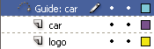
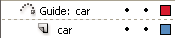
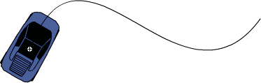
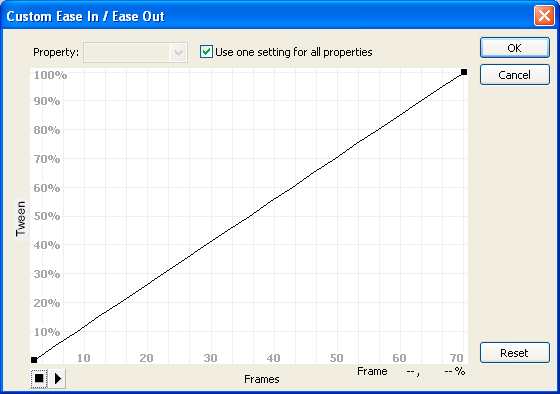

# Working with classic tween animation

## About classic tween animation

> **Note:** Like most things in Flash, animation does not require any
> ActionScript. However, you can create animation with ActionScript if you
> choose.
> [Classic tweens](https://web.archive.org/web/20120103080146mp_/http://www.adobe.com/devnet/flash/articles/concept_classic_tween.html)
> are an older way of creating animation in Flash Pro. These tweens are similar
> to the newer
> [motion tweens](https://web.archive.org/web/20120103080146mp_/http://www.adobe.com/devnet/flash/articles/concept_motion_tween.html),
> but are somewhat more complicated to create and less flexible. However,
> classic tweens do provide some types of control over animation that motion
> tweens do not. Most users will choose to work with the newer motion tweens,
> but some users will still want to use classic tweens. For more information
> about the differences, see
> [Differences between motion tweens and classic tweens](./motion-tween-animation.md#differences-between-motion-tweens-and-classic-tweens).

For information about migrating classic tween animations to motion tweens, see
the
[Motion migration guide for Flash Professional](https://web.archive.org/web/20120103080146mp_/http://www.adobe.com/devnet/flash/articles/motion_migration_guide.html)
in the Adobe Flash Developer Center.

**Before you begin:**

Before working with classic tweens, keep in mind the following points:

- Classic tweens are the older way of creating tweened animation in Flash. The
  newer, easier way is to use motion tweens. See
  [Motion tween animation](./motion-tween-animation.md).

- In some situations, such as lip-synching, classic tweens are still the best
  choice. For a list of these situations, see
  [When to use classic tweens](https://web.archive.org/web/20120103080146mp_/http://www.adobe.com/devnet/flash/articles/motion_migration_guide_08.html).

- You cannot tween 3D properties with classic tweens.

- For a complete guide to transitioning from the classic tween workflow to the
  motion tween workflow, see the
  [Motion migration guide for Flash](https://web.archive.org/web/20120103080146mp_/http://www.adobe.com/devnet/flash/articles/motion_migration_guide.html).

For samples of classic tween animation, see the Flash Pro Samples page at
[www.adobe.com/go/learn_fl_samples](https://web.archive.org/web/20120103080146mp_/http://www.adobe.com/go/learn_fl_samples).
The following samples are available:

- Animated Drop Shadow: Download and decompress the Samples ZIP file and
  navigate to the Graphics\AnimatedDropShadow folder to access the sample.

- Animation and Gradients: Download and decompress the Samples ZIP file and
  navigate to the Graphics\AnimationAndGradients folder to access the sample.

## Create and edit keyframes for classic tween animation

> **Note:** This topic is about creating keyframes for the older
> [classic tweens](https://web.archive.org/web/20120103080146mp_/http://www.adobe.com/devnet/flash/articles/concept_classic_tween.html).
> For help with property keyframes for the newer motion tweens, see
> [Create tween animation](./motion-tween-animation.md#create-tween-animation).
> Changes in a
> [classic tween](https://web.archive.org/web/20120103080146mp_/http://www.adobe.com/devnet/flash/articles/concept_classic_tween.html)
> animation are defined in a
> [keyframe](https://web.archive.org/web/20120103080146mp_/http://www.adobe.com/devnet/flash/articles/concept_keyframe.html).
> In tweened animation, you define keyframes at significant points in the
> animation and Flash Pro creates the contents of frames between. The
> interpolated frames of a tweened animation appear as light blue or light green
> with an arrow drawn between keyframes. Because Flash Pro documents save the
> shapes in each keyframe, create keyframes only at those points in the artwork
> where something changes.

Keyframes are indicated in the Timeline: a solid circle represents a keyframe
with content on it, and an empty circle before the frame represents an empty
keyframe. Subsequent frames added to the same layer have the same content as the
keyframe.

Only keyframes are editable in a classic tween. You can view tweened frames, but
you can't edit them directly. To edit tweened frames, change one of the defining
keyframes or insert a new keyframe between the beginning and ending keyframes.
Drag items from the Library panel onto the Stage to add the items to the current
keyframe.

To display and edit more than one frame at a time, see
[Use onion skinning](./frame-by-frame-animation.md#use-onion-skinning).

### Create keyframes

 Do one of the following:

- Select a frame in the Timeline, and select Insert \> Timeline \> Keyframe.

- Right-click (Windows) or Control‑click (Macintosh) a frame in the Timeline and
  select Insert Keyframe.

### Insert frames in the Timeline

- To insert a new frame, select Insert \> Timeline \> Frame.

- To create a new keyframe, select Insert \> Timeline \> Keyframe, or
  right-click (Windows) or Control‑click (Macintosh) the frame where you want to
  place a keyframe, and select Insert Keyframe.

- To create a new blank keyframe, select Insert \> Timeline \> Blank Keyframe,
  or right-click (Windows) or Control‑click (Macintosh) the frame where you want
  to place the keyframe, and select Insert Blank Keyframe.

### Delete or modify a frame or keyframe

- To delete a frame, keyframe, or frame sequence, select it and right-click
  (Windows) or Control‑click (Macintosh) and select Remove Frames. Surrounding
  frames remain unchanged.

- To move a keyframe or frame sequence and its contents, select it and drag to
  the desired location.

- To extend the duration of a keyframe, Alt‑drag (Windows) or Option-drag
  (Macintosh) it to the final frame of the new sequence.

- To copy and paste a frame or frame sequence, select it and select Edit \>
  Timeline \> Copy Frames. Select a frame or sequence to replace, and select
  Edit \> Timeline \> Paste Frames.

- To convert a keyframe to a frame, select the keyframe and select Modify \>
  Timeline \> Clear Keyframe, or right-click (Windows) or Control‑click
  (Macintosh) it and select Clear Keyframe. The cleared keyframe and all frames
  up to the subsequent keyframe are replaced with the contents of the frame
  preceding the cleared keyframe.

- To copy a keyframe or frame sequence by dragging, select it and Alt‑drag
  (Windows) or Option-drag (Macintosh) to the new location.

- To change the length of a tweened sequence, drag the beginning or ending
  keyframe left or right.

- To add a library item to the current keyframe, drag the item from the Library
  panel onto the Stage.

- To reverse an animation sequence, select the appropriate frames in one or more
  layers and select Modify \> Timeline \> Reverse Frames. Keyframes must be at
  the beginning and end of the sequence.

## Add classic tween animation to an instance, a group, or text

> **Note:** This topic is about creating older
> [classic tweens](https://web.archive.org/web/20120103080146mp_/http://www.adobe.com/devnet/flash/articles/concept_classic_tween.html).
> For help with creating the newer motion tweens, see
> [Create tween animation](./motion-tween-animation.md#create-tween-animation).
> To tween the changes in properties of instances, groups, and type, you can use
> a
> [classic tween](https://web.archive.org/web/20120103080146mp_/http://www.adobe.com/devnet/flash/articles/concept_classic_tween.html).
> Flash Pro can tween position, size, rotation, and skew of instances, groups,
> and type. Additionally, Flash Pro can tween the color of instances and type,
> creating gradual color shifts or making an instance fade in or out.

Before tweening the color of groups or type, make them into symbols. Before
animating individual characters in a block of text separately, place each
character in a separate text block.

If you apply a classic tween and then change the number of frames between the
two keyframes, or move the group or symbol in either keyframe, Flash Pro
automatically tweens the frames again.

### Create a classic tween animation

1.  Click a layer name to make it the active layer, and select an empty keyframe
    in the layer where you want the animation to start. This will be the first
    frame of the classic tween.

2.  To add content to the first frame of the classic tween, do one of the
    following:
    - Create a graphic object with the Pen, Oval, Rectangle, Pencil, or Brush
      tool, and then convert it to a symbol.

    - Create an instance, group, or text block on the Stage.

    - Drag an instance of a symbol from the Library panel.

    > **Note:** To create a tween, you must have only one item on the layer.

3.  Create a second keyframe where you want the animation to end, and leave the
    new keyframe selected.

4.  To modify the item in the ending frame, do any of the following:
    - Move the item to a new position.

    - Modify the item's size, rotation, or skew.

    - Modify the item's color (instance or text block only). To tween the color
      of elements other than instances or text blocks, use shape tweening.

5.  To create the classic tween, do one of the following:
    - Click any frame in the tween's frame span and select Insert \> Classic
      Tween.

    - Right-click (Windows) or Control-click (Macintosh) any frame in the
      tween's frame span and select Create Classic Tween from the context menu.

    If you created a graphic object in step 2, Flash Pro automatically converts
    the object to a symbol and names it _tween1_.

6.  If you modified the size of the item in step 4, select Scale in the Tweening
    section of the Property inspector to tween the size of the selected item.

7.  To produce a more realistic sense of motion, apply easing to the classic
    tween. To apply easing to a classic tween, use the Ease field in the
    Tweening section of the Property inspector to specify an easing value for
    each classic tween you create. Use the Custom Ease In/Ease Out dialog box to
    more precisely control the speed of the classic tween.

    Drag the value in the Easing field or enter a value to adjust the rate of
    change between tweened frames:
    - To begin the classic tween slowly and accelerate the tween toward the end
      of the animation, enter a negative value between ‑1 and ‑100.

    - To begin the classic tween rapidly and decelerate the tween toward the end
      of the animation, enter a positive value between 1 and 100.

    - To produce a more complex change in speed within the tween's frame span,
      click the Edit button next to the Ease field to open the Custom Ease
      In/Ease Out dialog box.

      By default, the rate of change between tweened frames is constant. Easing
      creates a more natural appearance of acceleration or deceleration by
      gradually adjusting the rate of change.

8.  To rotate the selected item during the tween, select an option from the
    Rotate menu in the Property inspector:
    - To prevent rotation, select None (the default setting).

    - To rotate the object once in the direction requiring the least motion,
      select Auto.

    - To rotate the object as indicated, and then enter a number to specify the
      number of rotations, select Clockwise (CW) or Counterclockwise (CCW).

    > **Note:** The rotation in step 8 is in addition to any rotation you
    > applied to the ending frame in step 4.

9.  If you're using a motion path, select Orient To Path in the Property
    inspector to orient the baseline of the tweened element to the motion path.

10. To synchronize the animation of graphic symbol instances with the main
    Timeline, select the Sync option in the Property inspector.

    > **Note:** Modify \> Timeline \> Synchronize Symbols and the Sync option
    > both recalculate the number of frames in a tween to match the number of
    > frames allotted to it in the Timeline. Use the Sync option if the number
    > of frames in the animation sequence inside the symbol is not an even
    > multiple of the number of frames the graphic instance occupies in the
    > document.

11. If you're using a motion path, select Snap to attach the tweened element to
    the motion path by its registration point.

## Create a motion guide layer

To control the movement of objects in a _classic tween_ animation, create a
motion guide layer.

You cannot drag a _motion tween_ layer or inverse kinematics _pose layer_ onto a
guide layer.

 Drag a normal layer onto a guide layer. This converts
the guide layer to a motion guide layer and links the normal layer to the new
motion guide layer.

> **Note:** To prevent accidentally converting a guide layer, place all guide
> layers at the bottom of the layer order.

## Create classic tween animation along a path

> **Note:** This topic is about working with older
> [classic tweens](https://web.archive.org/web/20120103080146mp_/http://www.adobe.com/devnet/flash/articles/concept_classic_tween.html).
> For help with using the newer motion tweens with motion paths, see
> [Edit the motion path of a tween animation](./motion-tween-animation.md#edit-the-motion-path-of-a-tween-animation).
> Motion guide layers let you draw paths along which tweened instances, groups,
> or text blocks can be animated. You can link multiple layers to a motion guide
> layer to have multiple objects follow the same path. A normal layer that is
> linked to a motion guide layer becomes a guided layer.

In this example, two objects on separate layers are attached to the same motion
path.

### Create a motion path for classic tweened animation

1.  Create a classic-tweened animation sequence.

    If you select Orient To Path in the Property inspector, the baseline of the
    tweened element orients to the motion path. If you select Snap, the
    registration point of the tweened element snaps to the motion path.

2.  Right-click (Windows) or Control-click (Macintosh) the layer name of the
    layer containing the classic tween and choose Add Classic Motion Guide.

    Flash Pro adds a motion guide layer above the classic tween layer and
    indents the name of the classic tween layer to show that it is bound to the
    motion guide layer.

    > **Note:** If you already have a guide layer in the Timeline, you can drag
    > a layer containing the classic tween below the guide layer to convert the
    > guide layer to a motion guide and bind the classic tween to it.

    

    <caption>A motion guide layer above the layer containing the classic tween.</caption>

3.  To add a path to the motion guide layer to guide the classic tween, select
    the motion guide layer and use the Pen, Pencil, Line, Circle, Rectangle, or
    Brush tool to draw the desired path.

    You can also paste a stroke onto the motion guide layer.

4.  Drag the object you are tweening to snap it to the beginning of the line in
    the first frame, and to the end of the line in the last frame.

    

    <caption>A graphic of a car snapped to the beginning of a guide stroke.</caption>

    > **Note:** For best snapping results, drag the symbol by its transformation
    > point.

5.  To hide the motion guide layer and the path so that only the object's
    movement is visible while you work, click in the Eye column on the motion
    guide layer.

    The group or symbol follows the motion path when you play the animation.

### Link layers to a motion guide layer

 Do one of the following:

- Drag an existing layer below the motion guide layer. The layer is indented
  under the motion guide layer. All objects on this layer automatically snap to
  the motion path.

- Create a new layer under the motion guide layer. Objects you tween on this
  layer are automatically tweened along the motion path.

- Select a layer below a motion guide layer. Select Modify \> Timeline \> Layer
  Properties, and select Guide.

### Unlink layers from a motion guide layer

 Select the layer to unlink and do one of the following:

- Drag the layer above the motion guide layer.

- Select Modify \> Timeline \> Layer Properties, and select Normal as the layer
  type.

## Paste classic tween animation properties

> **Note:** This topic is about pasting properties of older
> [classic tweens](https://web.archive.org/web/20120103080146mp_/http://www.adobe.com/devnet/flash/articles/concept_classic_tween.html).
> For help with pasting properties of the newer motion tweens, see
> [Copy and paste motion tween properties](./motion-tween-animation.md#copy-and-paste-motion-tween-properties).

The Paste Motion command lets you copy a
[classic tween](https://web.archive.org/web/20120103080146mp_/http://www.adobe.com/devnet/flash/articles/concept_classic_tween.html),
and paste only specific properties to apply to another object.

1.  Select the frames in the Timeline that contain the classic tween to copy.
    The frames you select must be on the same layer, however, they do not have
    to span a single classic tween. The selection can span a tween, empty
    frames, or two or more tweens.

2.  Select Edit \> Timeline \> Copy Motion.

3.  Select the symbol instance to receive the copied classic tween.

4.  Select Edit \> Timeline \> Paste Motion Special. Select the specific classic
    tween properties to paste to the symbol instance. The classic tween
    properties are:

    **X Position**  
    How far an object moves in the x direction.

    **Y Position**  
    How far an object moves in the y direction.

    **Horizontal Scale**  
    The ratio between the current size of the object and its natural size in the
    horizontal direction (X).

    **Vertical Scale**  
    Specifies the ratio between the current size of the object and its natural
    size in the vertical direction (Y).

    **Rotation And Skew**  
    The rotation and skew of the object. These properties must be jointly
    applied to an object. Skew is a measurement of rotation in degrees, and when
    you rotate and skew, each property affects the other.

    **Color**  
    All color values such as Tint, Brightness, and Alpha are applied to the
    object.

    **Filters**  
    All filter values and changes for the selected span. If filters are applied
    to an object, the filter is pasted with all values intact, and its state
    (enabled or disabled) applies to the new object as well.

    **Blend Mode**  
    Applies the blend mode of the object.

    **Override Target Scale Properties**  
    When unchecked, specifies that all properties be pasted relative to the
    target object. When checked, this option overrides the scale properties of
    the target.

    **Override Target Rotation And Skew Properties**  
    When unchecked, specifies that all properties be pasted relative to the
    target object. When checked, the pasted properties override the existing
    rotation and scale properties of the object.

    The necessary frames, tween, and symbol information are inserted to match
    the original, copied tween.

    To copy a symbol's classic tween to the Actions panel or use it in another
    project as ActionScript, use the Copy Motion as ActionScript 3.0 command.

## Apply custom ease in/ease out to classic tween animation

> **Note:** This topic is about adding easing to older
> [classic tweens](https://web.archive.org/web/20120103080146mp_/http://www.adobe.com/devnet/flash/articles/concept_classic_tween.html).
> For help with adding easing to the newer motion tweens, see
> [Easing tween animations](./motion-tween-animation.md#easing-tween-animations).

The Custom Ease In/Ease Out dialog box displays a graph representing the degree
of motion over time. The horizontal axis represents frames, and the vertical
axis represents percentage of change. The first keyframe is represented as 0%,
and the last keyframe is represented as 100%.

The slope of the graph's curve represents the rate of change of the object. When
the curve is horizontal (no slope), the velocity is zero; when the curve is
vertical, an instantaneous rate of change occurs.

Custom Ease In/Ease Out graph showing constant velocity. Open this dialog by
selecting a frame in a classic tween and clicking the Edit button in the Ease
section of the Property inspector.

### Additional controls for the Custom Ease In/Ease Out dialog box

Use One Setting For All Properties check box  
The default is selected; the displayed curve is used for all properties, and the
Properties pop-up menu is disabled. When the check box is not selected, the
Properties pop-up menu is enabled, and each property has a separate curve
defining the velocity of that property.

Property pop-up menu  
Enabled only when the Use One Setting for All Properties check box is not
selected. When enabled, a separate curve is maintained for each of the five
properties appearing in the menu. Selecting a property in the menu displays the
curve for that property. The properties are:

Position  
Specifies custom ease settings for the position of an animated object on the
Stage.

Rotation  
Specifies custom ease settings for the rotation of an animated object. For
example, you can fine-tune how quickly or slowly an animated character turns
around to face the user on the Stage.

Scale  
Specifies custom ease settings for the scale of an animated object. For example,
you can more easily customize the scale of an object so it appears to be moving
away from the viewer, then coming closer, and then moving away again.

Color  
Specifies custom ease settings for color transitions applied to an animated
object.

Filters  
Specifies custom ease settings for filters applied to an animated object. For
example, you can control the ease setting of a drop shadow that simulates a
change in the direction of a light source.

Play and Stop buttons  
Let you preview an animation on the Stage using all the current velocity curves
defined in the Custom Ease In/Ease Out dialog box.

Reset button  
Lets you reset the velocity curve to the default, linear state.

Position of the selected control point  
In the lower-right corner of the dialog box, a numeric value displays the
keyframe and position of the selected control point. If no control point is
selected, no value appears.

To add a control point to the line, click the diagonal line once. To achieve a
precise degree of control over the motion of an object, drag the positions of
the control points.

Using frame indicators (represented by square handles), click where you want an
object to slow down or speed up. Clicking the square handle of a control point
selects that control point, and displays the tangent points on either side of
it. Hollow circles represent tangent points. Drag the control point or its
tangent points with the mouse or use the keyboard's arrow keys to position them.
 By default, the control points snap to a grid. You can
turn off snapping by pressing the X key while dragging the control point.
Clicking an area of the curve away from any control points adds a new control
point to the curve at that point, without changing the shape of the curve.
Clicking away from the curve and control points deselects the currently selected
control point.

### Add a custom ease

1.  Select a layer in the Timeline that has a
    [classic tween](https://web.archive.org/web/20120103080146mp_/http://www.adobe.com/devnet/flash/articles/concept_classic_tween.html)
    applied to it.
2.  Click the Edit button next to the Ease slider in the frame Property
    inspector.
3.  (Optional) To display the curve for a single tweened property, deselect Use
    One Setting For All Properties, and select a property in the menu.
4.  To add a control point, Control‑click (Windows) or Command-click (Macintosh)
    the diagonal line.
5.  To increase the speed of the object, drag the control point up; to slow down
    the speed of the object, drag it downwards.
6.  To further adjust the ease curve, and fine tune the ease value of the tween,
    drag the vertex handles.
7.  To view the animation on the Stage, click the play button in the lower-left
    corner.
8.  Adjust the controls until you achieve the desired effect.

> **Note:** If you use the Custom Ease In/Ease Out dialog box to apply a custom
> ease to a frame, the edit box that shows the ease value shows '--'. If you use
> the Edit box or the pop-up slider to apply an ease value to a frame, the
> Custom Ease graph is set to the equivalent curve, and the Use One Setting For
> All Properties check box is selected.

### Copy and paste an ease curve

- To copy the current ease curve, press Control+C (Windows) or Command+C
  (Macintosh).

- To paste the copied curve into another ease curve, press Control+V (Windows)
  or Command+V (Macintosh).

  You can copy and paste the ease curve. The copied curve remains available
  until you exit the Flash Pro application.

### Unsupported easing curves

Certain types of easing curves are not supported. No part of the graph can
represent a nonlinear curve (such as a circle).

The Custom Ease dialog box automatically prevents moving a control point or a
tangent handle to a position that would render an invalid curve:

- All points must exist on the graph. Control points cannot be moved beyond the
  bounds of the graph.

- All segments of the curve must exist within the graph. The shape of the curve
  is flattened to prevent it from extending beyond the bounds of the graph.

More Help topics

[About tween animation](./motion-tween-animation.md#about-tween-animation)

[Create symbols](../symbols-instances-and-library-assets/working-with-symbols.md#create-symbols)
