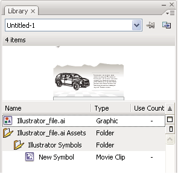

# Working with Illustrator AI files in Flash

## About Adobe Illustrator AI files

Flash Pro lets you import Adobe® Illustrator® AI files and preserves the
majority of the editability and visual fidelity of your artwork. The AI Importer
also provides you with a great degree of control in determining how your
Illustrator artwork is imported into Flash Pro, letting you specify how to
import specific objects into an AI file.

The Flash Pro AI Importer provides the following key features:

- Preserves editability of the most commonly used Illustrator effects as Flash
  Pro filters.

- Preserves editability of blend modes that Flash Pro and Illustrator have in
  common.

- Preserves the fidelity and editability of gradient fills.

- Maintains the appearance of RGB (red, green, blue) colors.

- Imports Illustrator Symbols as Flash Pro Symbols.

- Preserves the number and position of Bezier control points.

- Preserves the fidelity of clip masks.

- Preserves the fidelity of pattern strokes and fills.

- Preserves object transparency.

- Converts the AI file layers to individual Flash Pro layers, keyframes, or a
  single Flash Pro layer. You can also import the AI file as a single bitmap
  image, in which case Flash Pro flattens (rasterizes) the file.

- Provides an improved copy-and-paste workflow between Illustrator and Flash
  Pro. A copy-and-paste dialog box provides settings to apply to AI files being
  pasted onto the Flash Pro stage.

#### Compatibility between Flash and Illustrator

Certain visual attributes can either not be accurately imported, or, after they
are imported, lose their ability to be further edited in the Flash Pro authoring
environment. The AI Importer provides you with several options to import and
place artwork to best maintain its visual appearance and editability. However,
certain visual attributes cannot be preserved. Use the following guidelines to
improve the appearance of AI files imported into Flash Pro:

- Flash Pro supports only the RGB color space, and not the CMYK color space,
  which is common in printing. Flash Pro can convert CMYK images to RGB,
  however, colors are better preserved if you convert the colors to RGB in
  Illustrator.

- To preserve the drop shadow, inner glow, outer glow, and Gaussian blur AI
  effects as editable Flash Pro filters, Flash Pro imports the objects to which
  they are applied as a Flash Pro movie clip. If you attempt to import an object
  with these attributes as something other than a movie clip, Flash Pro displays
  an incompatibility alert, and recommends importing the object as a movie clip.

## Working with Illustrator and Flash

You can move Illustrator artwork into the Flash editing environment or directly
into Flash Player. You can copy and paste artwork, save files in SWF format, or
export artwork directly to Flash. In addition, Illustrator provides support for
Flash dynamic text and movie clip symbols.

You can also use Device Central to see how Illustrator artwork will appear in
Flash Player on different handheld devices.

#### Pasting Illustrator artwork

You can create graphically rich artwork in Illustrator and copy and paste it
into Flash simply, quickly, and seamlessly.

When you paste Illustrator artwork into Flash, the following attributes are
preserved:

- Paths and shapes

- Scalability

- Stroke weights

- Gradient definitions

- Text (including OpenType fonts)

- Linked images

- Symbols

- Blending modes

In addition, Illustrator and Flash support pasted artwork in the following ways:

- When you select entire top-level layers in Illustrator artwork and paste them
  into Flash, the layers are preserved along with their properties (visibility
  and locking).

- Non-RGB Illustrator colors (CMYK, grayscale, and custom) convert to RGB in
  Flash. RGB colors paste as expected.

- When you import or paste Illustrator artwork, you can use various options to
  preserve effects (such as drop shadow on text) as Flash filters.

- Flash preserves Illustrator masks.

#### Exporting SWF files from Illustrator

From Illustrator, you can export SWF files that match the quality and
compression of SWF files exported from Flash.

When you export, you can choose from a variety of presets to ensure optimal
output, and you can specify how to handle multiple artboards, symbols, layers,
text, and masks. For example, you can specify whether Illustrator symbols are
exported as movie clips or graphics, or you can choose to create SWF symbols
from Illustrator layers.

#### Importing Illustrator files into Flash

When you want to create complete layouts in Illustrator and then import them
into Flash in one step, you can save your artwork in the native Illustrator
format (AI) and import it, with high fidelity, into Flash using the File \>
Import To Stage or File \> Import To Library commands in Flash.

If your Illustrator file contains multiple artboards, you select the artboard
you want to import from the Import dialog box in Flash, and specify settings for
each layer in that artboard. All objects on the selected artboard import as a
single layer in Flash. If you import another artboard from that same AI file,
the objects from that artboard import as a new layer in Flash.

When you import Illustrator artwork as an AI, EPS, or PDF file, Flash preserves
the same attributes as for pasted Illustrator artwork. In addition, when an
imported Illustrator file contains layers, you can import them in any of the
following ways:

- Convert Illustrator layers to Flash layers

- Convert Illustrator layers to Flash frames

- Convert all Illustrator layers to a single Flash layer

#### Symbol workflow

Symbol workflow in Illustrator is similar to symbol workflow in Flash.

Symbol creation  
When you create a symbol in Illustrator, the Symbol Options dialog box lets you
name the symbol and set options specific to Flash: movie clip symbol type (which
is the default for Flash symbols), Flash registration grid location, and 9-slice
scaling guides. In addition, you can use many of the same symbol keyboard
shortcuts in Illustrator and Flash (such as F8 to create a symbol).

Isolation mode for symbol editing  
In Illustrator, double-click a symbol to open it in isolation mode for easier
editing. In isolation mode, only the symbol instance is editable—all other
objects on the artboard are dimmed and unavailable. After you exit isolation
mode, the symbol in the Symbols panel, and all instances of that symbol are
updated accordingly. In Flash, symbol-editing mode and the Library panel work in
a similar fashion.

Symbol properties and links  
Using the Symbols panel or the Control panel, you can easily assign names to
symbol instances, break links between instances and symbols, swap a symbol
instance with another symbol, or create a copy of the symbol. In Flash, the
editing features in the Library panel work in a similar way.

#### Static, dynamic, and input text objects

When you bring static text from Illustrator into Flash, Flash converts the text
to outlines. In addition, you can set up your text in Illustrator as dynamic
text. Dynamic text enables you to edit text content programmatically in Flash,
and easily manage projects that require localization in multiple languages.

In Illustrator, you can specify individual text objects as static, dynamic, or
input text. Dynamic text objects in Illustrator and Flash have similar
properties. For example, both use kerning that affects all characters in a text
block rather than individual characters, both anti-alias text the same way, and
both can be linked to an external XML file containing text.

## About importing AI files to the Flash library

Importing an AI file into the library is similar to importing to the Stage, the
difference being that the entire AI file is encapsulated as a Flash Pro symbol.
The content is imported into the library and organized by the layering and
grouping structure of the AI file. When you import an AI file into the library,
the root folder uses the name of the AI file. After the AI file is imported into
the library, you can change the name of the root folder, or move the layers out
of the folder.

> **Note:** The Library panel orders the contents of the imported AI file
> alphabetically. The hierarchical grouping and folder structure remains the
> same, but the library reorders them alphabetically.

When converting AI layers to keyframes, the AI file is imported as a movie clip;
converting the AI layers to Flash layers, or as a single Flash layer, imports
the AI file as a graphic symbol. The resulting movie clip or graphic symbol
contains all of the content of the AI file imported to its timeline, as if the
content were imported to the Stage. Almost all movie clips have a bitmap or
other asset associated with them. To minimize confusion and naming conflicts,
these assets are stored in an Assets folder in the same folder as the movie
clip.

> **Note:** When you import to the library, the AI file's contents are imported
> to the movie clip's timeline, not the main Flash Pro timeline.

The Library panel after importing an AI file

#### AI File Importer preferences

The Flash Preferences dialog box lets you set import preferences for AI files
and the AI File Import dialog box. The preferences you specifiy for importing AI
files affect the options the AI Import dialog box is initially populated with
for the Illustrator object types.

> **Note:** To override the preferences specified for different layer types on
> an object by object basis, use the AI Import dialog box. Select the layer,
> object, or group to change its import options, and specify the necessary
> options.

General  
Preferences that affect how the AI Importer will respond when importing AI
files:

Show Import Dialog Box  
Specifies that the AI File Import Dialog dialog box appears.

Exclude Objects Outside Crop Area  
Excludes objects on the Illustrator canvas which fall outside the artboard or
crop area.

Import Hidden Layers  
Specifies that hidden layers be imported by default.

Import Text As  
Lets you specify the following import preferences for text objects:

Editable Text  
Specifies that imported Illustrator text is editable Flash Pro text. The
appearance of the text may be compromised to maintain the editability of the
text.

Vector Outlines  
Converts text to vector paths. Use this option to preserve the visual appearance
of the text. Some visual effects might be sacrificed—such as unsupported blend
modes and filters—but visual attributes such as text on a path are maintained if
the text is imported as a movie clip. The text itself is no longer editable, but
opacity and compatible blend modes maintain their editability.

> **Note:** To preserve the drop shadow, inner glow, outer glow, and Gaussian
> blur that AI effects applied to text as editable Flash Pro filters, select
> Create Movie Clip Import to import the text as a movie clip.

Bitmaps  
Rasterizes the text into a bitmap to preserve the exact appearance of the text
as it was in Illustrator. If filters or other effects are applied that are not
compatible with Flash Pro, importing the text as a bitmap preserves the visual
appearance. Rasterized text is no longer editable.

Create Movie Clips  
Specifies that text objects be imported inside a movie clip. To maintain
supported blend modes, AI effects, and transparency of less than 100% between
Illustrator and Flash Pro, specify that the text object be imported as a movie
clip.

Import Paths As  
Lets you specify the following path import preferences:

Editable Paths  
Creates an editable vector path. Supported blend modes, effects, and object
transparency are preserved, but attributes not supported in Flash Pro are
discarded.

Bitmaps  
Rasterizes the path into a bitmap to preserve the exact appearance of the path
in Illustrator. A rasterized image is no longer editable.

Create Movie Clips  
Specifies that path objects be imported inside a movie clip.

Images  
Lets you specify the import preference for images:

Flatten Bitmaps To Maintain Appearance  
Rasterizes the image into a bitmap to preserve the appearance of blending modes
and effects that are not supported in Flash Pro. A rasterized image is no longer
editable.

Create Movie Clips  
Specifies that images be imported inside a movie clip.

Groups  
Lets you specify the import preferences for groups:

Import As Bitmaps  
Rasterizes the group into a bitmap to preserve the appearance of the objects as
they appeared in Illustrator. After a group is converted to a bitmap, the
objects in it cannot be selected or renamed.

Create Movie Clips  
Specifies that all objects in the group be encapsulated into a single movie
clip.

Layers  
Lets you specify the import preferences for layers:

Import As Bitmaps  
Rasterizes the layer into a bitmap to preserve the appearance of the objects as
they appeared in Illustrator.

Create Movie Clips  
Specifies that the layer is encapsulated into a movie clip.

Movie Clip Registration  
Specifies a global registration point for movies that are created. This setting
applies to the registration point for all object types. This option can be
changed on an object by object basis in the AI File Import dialog box; this is
the initial setting for all object types. For more information on movie clip
registration, see
[Edit symbols](../symbols-instances-and-library-assets/working-with-symbols.md#edit-symbols).

## Import Adobe Illustrator files

Flash Pro can import Illustrator AI files in version 10 or earlier. If the
raster file in Illustrator is linked, only JPEG, GIF, and PNG are imported with
native format preserved. All other files are converted to PNG format in Flash
Pro. Additionally, conversion to PNG depends on the version of QuickTime
installed.

> **Note:** The AI Importer was developed to import AI files created with
> Illustrator CS3 and later. While there are no known issues importing AI files
> created in earlier versions of Illustrator, we recommend importing AI files
> created using Illustrator CS3 and later. If you encounter issues importing AI
> files created in an earlier version of Illustrator, open the file in
> Illustrator CS3 or later, save the AI file as a CS3 or later compatible file,
> and re-import it into Flash Pro. To import an Illustrator EPS or Adobe®
> Acrobat® PDF file, open the file in Illustrator CS3 or later, save it as a CS3
> or later compatible AI file, and import the resulting AI file into Flash Pro.

In certain instances, you may need to ungroup all the Illustrator objects on all
layers when Flash Pro cannot group items on import. After all the objects are
ungrouped, they can be manipulated like any other Flash Pro object.

Illustrator AI Import dialog box

A.  
Layers panel

B.  
Import options available for the selected object

Choose from the following options when importing Adobe Illustrator files:

- Convert layers to Flash Pro layers or keyframes, or single Flash Pro layers.

- Import text as editable text, vector outlines, or bitmaps.

- Import as a single bitmap image. Choosing this option imports the AI file as a
  single bitmap image and disables the layers list and import options within the
  AI Import dialog box.

1.  Select File \> Import To Stage or Import To Library.

2.  Navigate to the AI file to import, select it, and click OK. The Import
    Illustrator Document To Stage or The Import Illustrator Document To Library
    dialog box appears.

    This dialog box provides options to import the Illustrator file. Depending
    on the types of objects in the Illustrator file you're importing, the
    options available to you vary.

3.  (Optional) To generate a list of items in the AI file that are incompatible
    with Flash Pro, click Incompatibility Report. The Incompatibility Report
    button appears only if incompatibilities exist with Flash Pro in the AI
    file.

    The incompatibilty report analyzes possible incompatibilities between
    Illustrator and Flash Pro. The Import Options area (next to the Alert
    button) of the AI Import dialog box displays recommendations to obtain the
    maximum compatibility for any incompatible item.

    The incompatibilty report includes an Apply Recommended Import Settings
    checkbox. If checked, Flash Pro automatically applies the recommended import
    options to any incompatible objects within the AI file. The exceptions to
    this are when the AI document is larger in size than that supported by Flash
    Pro, and when the AI document uses the CMYK color mode. To correct either of
    these incompatibilities, reopen the document in Illustrator CS3, and adjust
    the size of the document, or change the color mode to RGB.

4.  (Optional) In the AI Import dialog box, select layers, groups, and
    individual objects, and choose how to import each item. For information on
    the import options available for the different types of Illustrator layers
    and objects, see
    [Illustrator object import options](#illustrator-object-import-options).

5.  For Convert Layers To, select one of the following:

    **Flash Layers**  
    Converts each layer in the imported document to a layer in the Flash
    document.

    **Keyframes**  
    Converts each layer in the imported document to a keyframe in the Flash
    document.

    **Single Flash Layer**  
    Converts all layers in the imported document to a single flattened layer in
    the Flash Pro document.

6.  For the remaining options, select from the following:

    **Place Objects At Original Position**  
    The contents of the AI file retain the exact position that they had in
    Illustrator. For example, if an object was positioned at X = 100 Y = 50 in
    Illustrator, it assumes the same coordinates on the Flash Pro Stage.

    If this option is not selected, the imported Illustrator layers are centered
    within the current view. The items in the AI file remain relative to each
    other when imported; however, all objects are centered as one block in the
    current view. This feature can be useful if you are zoomed in to an area of
    the Stage and are importing a specific object for that area of the Stage. If
    you imported the object using the original coordinates, you might not see it
    imported, because it might be placed outside of the current stage view.

    > **Note:** When importing the AI file into the Flash Pro library, this
    > option is not available.

    **Set Stage Size To Same Size As Illustrator Artboard**  
    The Flash Pro stage size resizes to the same size as the Illustrator
    artboard (or active crop area) used to create the AI file. This option is
    not selected by default.

    > **Note:** When importing the AI file into the Flash Pro library, this
    > option is not available.

    **Import Unused Symbols**  
    Any symbols in the AI file's library that have no instances on the artboard
    are imported into the Flash Pro library. If this option is not selected, the
    unused symbols are not imported into Flash Pro.

    **Import As A Single Bitmap Image**  
    Imports the AI file as a single bitmap image and disables the layers list
    and import options within the AI Import dialog box.

7.  Click OK.

## Illustrator object import options

Layers manage all the items that make up Illustrator artwork. By default, all
items are organized in a single, parent layer. You can import all items in a
given parent layer as a single, flattened bitmap, or, individually select each
object and specify import options specific to the type of object it is (text,
path, group, and so on). The AI Importer provides options to select layers in
the artwork you are importing and specify individual import options based on
preserving the visual appearance of an object, or its editability in Flash Pro.

### Correcting incompatible graphic effects

1.  To generate an incompatibilty report, click Incompatibility Report. The
    incompatibility report lists items in the AI file that are incompatible with
    Flash Pro.
2.  Select Change Import Settings To Resolve Object Incompatibilities. Many
    incompatibilities between Illustrator and Flash Pro can be automatically
    corrected using the incompatibility report and the import recommendations
    suggested in the Import options area of the AI Import dialog box.

### Select individual objects

1.  Select the object to specify import options for. Illustrator objects that
    you can select include layers, groups, individual paths, text, and images.
2.  Review the import options available for the type of object you've selected
    in the object options section of the dialog box. Note whether any
    incompatibilities are listed and what the recommended correction is to
    import the object.
3.  Select the desired import options, and select another object to specify
    import options for, or click OK.

### Selecting layers

The Layers panel lists the objects in a document. By default, every Illustrator
document contains at least one layer, and each object in a given file is listed
under that layer. When an item in the Layers panel contains other items, a
triangle appears to the left of the item's name. To show or hide the content,
click the triangle. If no triangle appears, the layer contains no additional
items.

> **Note:** You can expand or collapse all groups and layers using the AI
> Importer context menu. Right-click to display the context menu and select
> Expand All or Collapse All.

Selection column  
Controls whether items are selected for import or not. If an item is checked,
you can select that layer and specify import options; if Edit is not checked,
the layer is dimmed and you cannot specify any import setting for the item in
that layer.

Object Type column  
An icon indicates what the Flash Pro object type located on that layer will be
when imported and, if visible, that the item is selected. The object types are:

- Text 

- Path 

- Group 

- Movie clip 

- Graphic symbol 

- Image 

### Text import options

Flash Pro lets you import text as editable text, vector outlines, or a flattened
bitmap. To maintain supported blend modes, AI effects, and transparency of less
than 100% between Illustrator and Flash Pro, import text as a movie clip.
Importing text as a movie clip preserves the editability of compatible visual
effects.

Editable Text  
By default, Illustrator text imports as editable Flash Pro text. The appearance
of the text can be compromised to maintain the editability of the text.

Vector Outlines  
Converts text to vector paths. Use this option to preserve the visual appearance
of the text. Some visual effects might be sacrificed—such as unsupported blend
modes and filters—but visual attributes such as text on a path are maintained if
the text is imported as a movie clip. The text itself is no longer editable, but
opacity and compatible blend modes maintain their editability.

> **Note:** To preserve the drop shadow, inner glow, outer glow, and Gaussian
> blur that AI effects applied to text as editable Flash Pro filters, select
> Create Movie Clip Import to import the text as a movie clip.

Bitmap  
Rasterizes the text into a bitmap to preserve the exact appearance of the text
as it was in Illustrator. If filters or other effects are applied that are not
compatible with Flash Pro, importing the text as a bitmap preserves the visual
appearance. Rasterized text is no longer editable.

### Path import options

A path is the line that results from drawing in Illustrator. A path is either
open, like an arc, or closed, like a circle. For an open path, the starting and
ending anchor points for the path are called endpoints. Editable paths can be
imported into Flash Pro, however, if certain blend modes, filters, or other
effects are applied to the path, those effects might not be compatible with
Flash Pro.

Bitmap  
Rasterizes the path into a bitmap to preserve the exact appearance of the path
in Illustrator. A rasterized image is no longer editable.

Editable Path  
Creates an editable vector path. Supported blend modes, effects, and object
transparency are preserved, but attributes not supported in Flash Pro are
discarded.

### Image import options

Bitmap images are the most common electronic medium for continuous-tone images,
such as photographs or digital paintings. Illustrator creates bitmap effects by
using filters, effects, and graphic styles. While many of these effects are
compatible with Flash Pro, some might need to be flattened—or rasterized—to
preserve their visual appearance.

> **Note:** If a raster file in Illustrator is linked, only JPEG, GIF, and PNG
> are imported with their native format preserved. All other file types are
> converted to the PNG format in Flash Pro. Additionally, the conversion (to
> PNG) depends on the version of QuickTime® installed on your computer.

Flatten Bitmap To Maintain Appearance  
Rasterizes the image into a bitmap to preserve the appearance of blending modes
and effects that are not supported in Flash Pro. A rasterized image is no longer
editable.

Create Movie Clip  
Imports Illustrator images as movie clips.

### Group import options

Groups are collections of graphic objects that are treated as a single unit.
Grouping lets you move or transform a number of objects without affecting their
attributes or relative positions. For example, you might group the objects in a
logo design so that you can move and scale the logo as one unit. Groups can also
be nested. That is, they can be grouped in other objects or groups to form
larger groups.

Groups appear as \<Group\> items in the Import panel. When an item such as a
group contains other items, a triangle appears to the left of the item's name.
Click the triangle to show or hide the contents of the group. If no triangle
appears, the item contains no additional items.

Import As Bitmap  
Rasterizes the group into a bitmap to preserve the appearance of the objects as
they appeared in Illustrator. After a group is converted to a bitmap, the
objects in it cannot be selected or renamed.

Create Movie Clip  
Encapsulates all objects in the group into a single movie clip.

## Copy and pasting between Illustrator and Flash

If you copy and paste (or drag-and-drop) artwork between Illustrator and Flash
Pro, the Paste dialog box appears, which provides import settings for the AI
file being copied (or pasted).

Paste As Bitmap  
Flattens the file being copied into a single bitmap object.

Paste Using AI File Importer Preferences  
Imports the file using the AI file import setting specified in Flash Pro
Preferences (Edit \> Preferences).

Apply Recommended Import Settings To Resolve Incompatibilities  
Enabled by default when Paste Using AI File Importer Preferences is selected.
Automatically fixes any incompatibilities detected in the AI file.

Maintain Layers  
Enabled by default when Paste Using AI File Importer Preferences is selected.
Specifies that layers in the AI file be converted to Flash Pro layers (the same
as if you selected Convert To Flash Layers from the AI Import dialog box). If
deselected, all layers are flattened into a single layer.

More Help topics

[Set preferences in Flash](../workspace/set-preferences-in-flash.md)

[Import Photoshop PSD files](./working-with-photoshop-psd-files-in-flash.md#import-photoshop-psd-files)

[Exporting images and graphics](../publishing-and-exporting/exporting.md)
