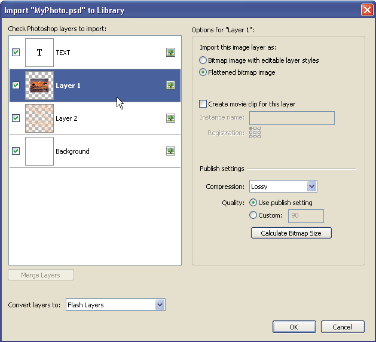

# Working with Photoshop PSD files in Flash

## Working with Photoshop and Flash

You can use Adobe® Photoshop® and Adobe® Flash® together to create visually
compelling web-based applications, animations, or interactive messaging
elements. Photoshop lets you create still images and artwork, providing a high
degree of creative control. Flash lets you bring those still images together and
incorporate them into interactive Internet content.

The Photoshop drawing and selection tools provide you with a greater degree of
creative control than the tools found in Flash. If you have to create complex
visual images, or retouch photographs for use in interactive presentations, use
Photoshop to create your artwork, and then import the finished images into
Flash.

#### Importing still images into Flash

Flash can import still images in many formats, but you usually use the native
Photoshop PSD format when importing still images from Photoshop into Flash.

When importing a PSD file, Flash can preserve many of the attributes that were
applied in Photoshop, and provides options for maintaining the visual fidelity
of the image and further modifying the image. When you import a PSD file into
Flash, you can choose whether to represent each Photoshop layer as a Flash
layer, individual keyframes, or a single, flattened image. You can also
encapsulate the PSD file as a movie clip.

#### Exchanging QuickTime movies

You can exchange QuickTime video files between Photoshop and Flash. For example,
you can render a QuickTime movie directly from Photoshop, and then import it
into Flash, converting it into an FLV (Flash Video) file, which can be played in
Flash® Player.

When you use Photoshop to modify video footage, you can paint nondestructively
on its frames. When you save a Photoshop file with a video layer, you are saving
the edits that you made to the video layer, not edits to the footage itself.

> **Note:** When you import a QuickTime video file from Photoshop to Flash, use
> the Import Video dialog box (File \> Import Video). Using the Photoshop PSD
> import feature to import video only imports the first frame of a video file.

You can also export Flash documents as QuickTime video, and import them into
Photoshop where you can paint non-destructively on the video frames. For
example, you can create an animated sequence in Flash, export the Flash document
as a QuickTime video, and then import the video into Photoshop.

#### Color

Flash works internally with colors in the RGB (red, green, blue) or HSB (hue,
saturation, brightness) color space. Although Flash can convert CMYK images to
RGB, you should create Photoshop artwork in RGB. Before you import CMYK artwork
from Photoshop into Flash, convert the image to RGB in Photoshop.

### About importing Photoshop PSD files

Flash Pro lets you import Photoshop PSD files and preserves most of your
artwork's data. The PSD Importer also lets you control how your Photoshop
artwork is imported into Flash Pro, letting you specify how to import specific
objects in a PSD file, as well as specifying that the PSD file be converted to a
Flash Pro movie clip.

The Flash Pro PSD Importer provides the following key features:

- PSD files imported into Flash Pro maintain their color fidelity from
  Photoshop.

- Preserves editability of blend modes that both Flash Pro and Photoshop have in
  common.

- Smart Objects in the PSD file are rasterized, and imported into Flash Pro as
  bitmaps which preserves object transparency.

- Converts the PSD file layers to individual Flash Pro layers or keyframes or
  imports the PSD file as a single bitmap image, in which case Flash Pro
  flattens (rasterizes) the file.

- Drag-and-drop from Photoshop to Flash Pro invokes the PSD file importer,
  letting you choose how to import your Photoshop artwork.

#### Compatibility between Flash and Photoshop

Certain visual attributes can either not be accurately imported, or, after they
are imported, lose their ability to be further edited in the Flash Pro authoring
environment. The PSD Importer provides you with several options to import and
place artwork to best maintain its visual appearance and editability. However,
certain visual attributes cannot be preserved. Use the following guidelines to
improve the appearance of PSD files imported into Flash Pro:

- Flash Pro supports only the RGB color space, and not the CMYK color space,
  which is common in printing. Flash Pro can convert CMYK images to RGB;
  however, colors are better preserved if you convert CMYK colors to RGB in
  Photoshop.

- Flash Pro can import the following Photoshop blend modes, and maintain their
  editability: Normal, Darken, Multiply, Lighten, Screen, Hard Light,
  Difference, and Overlay.

  If you use a blend mode that Flash Pro does not support, you can rasterize the
  layer to maintain its visual appearance, or remove the blend mode from the
  layer.

- Flash Pro cannot import Photoshop Smart Objects as editable objects. To
  preserve the visual attributes of Smart Objects, they are rasterized and
  imported into Flash Pro as bitmaps.

- Flash Pro can only import the first frame of Photoshop Video layers.

- Image and Fill layers are always rasterized when imported into Flash Pro.

- PNG objects in Photoshop are converted to JPG files when imported into Flash
  Pro. Transparency in the original PNG is preserved in the resulting JPG file.

- Photoshop does a better job of scaling bitmap images than Flash Pro. If you
  know that you plan to scale a bitmap that is coming from Photoshop into Flash
  Pro, scale the bitmap in Photoshop before importing it into Flash Pro.

- When importing objects containing transparent areas as flattened bitmaps, any
  objects on the layers behind the transparent portion of the object will be
  visible through the transparent area—assuming the objects behind the object
  containing transparency are also being imported. To prevent this, import only
  the transparent object as a flattened bitmap.

  To import multiple layers and maintain transparency without having any visible
  remnants of the layers behind the transparency, import the PSD file using the
  Bitmap Image With Editable Layer Styles option. This will encapsulate the
  imported objects as a movie clip, and use the movie clip's transparency. This
  is particularly useful if you need to animate the different layers in Flash
  Pro.

### Import Photoshop PSD files

_Photoshop format_ (PSD) is the default Photoshop file format. Flash Pro can
directly import PSD files and preserve many Photoshop features, retaining the
image quality and editability of the PSD file in Flash Pro. You can also flatten
PSD files when importing them, creating a single bitmap image file that retains
the image's visual effects but removes the hierarchical layer information native
to the PSD file format.

The PSD Import dialog box

A.  
Layers in the PSD file being imported

B.  
Import options available for the selected layer or object

1.  Select File \> Import To Stage or Import To Library.
2.  Navigate to the Adobe Photoshop PSD file to import, select it, and click OK.
3.  (Optional) In the PSD Import dialog box, select layers, groups, and
    individual objects and choose how to import each item.
4.  For Convert Layers To, select one of the following:

    **Flash Layers**  
    All selected layers in the Select Photoshop layers list are placed on their
    own layer. Each layer is labeled with the name of the layer in the Photoshop
    file. The layers in Photoshop are objects on the individual layers. The
    objects also have the name of the layer in Photoshop when put into the
    Library panel.

    **Keyframes**  
    All selected layers in the Select Photoshop layers list are placed in
    individual keyframes on a new layer. The new layer is named for the
    Photoshop file (for example, myfile.psd). The layers in Photoshop become
    objects on the individual keyframes. The objects also have the name of the
    layer in Photoshop when put into the Library panel.

5.  For the remaining options, select from the following:

    **Place Layers At Original Position**  
    The contents of the PSD file retain the exact position that they had in
    Photoshop. For example, if an object was positioned at X = 100 Y = 50 in
    Photoshop, it assumes the same coordinates on the Flash Pro Stage.

    If this option is not selected, the imported Photoshop layers are centered
    on the Stage. The items in the PSD file remain relative to each other when
    imported; however, all objects are centered as one block in the current
    view. This feature can be useful if you are zoomed in to an area of the
    Stage and are importing a specific object for that area of the Stage. If you
    imported the object using the original coordinates, you might not see it
    imported, because it might be placed outside of the current stage view.

    > **Note:** When you import the PSD file to the Flash Pro library, this
    > option is not available.

    **Set Stage Size To Same Size As Photoshop Canvas**  
    The Flash Pro Stage size resizes to the same size as the Photoshop document
    size (or active crop area) used to create the PSD file. This option is not
    selected by default.

    > **Note:** When you import the PSD file to the Flash Pro library, this
    > option is not available.

6.  Click OK.

#### Importing PSD files to the Flash library

Importing a PSD file into the library is similar to importing to the Stage. When
you import a PSD file into the library, the root folder uses the name of the PSD
file. After the PSD file is imported into the library, you can change the name
of the root folder, or move the layers out of the folder.

> **Note:** The library orders the contents of the imported PSD file
> alphabetically. The hierarchical grouping and folder structure remains the
> same, but the library reorders them alphabetically.

A movie clip is created that contains all of the content of the PSD file
imported to its timeline, as if the content were imported to the Stage. Almost
all movie clips have a bitmap or other asset associated with them. To minimize
confusion and naming conflicts, these assets are stored in an Assets folder in
the same folder as the movie clip.

> **Note:** When you import to the library, the PSD file's contents are imported
> to the movie clip's timeline, not the main Flash timeline.

## Photoshop Import options

When you import a Photoshop PSD file that contains multiple layers, you can set
the following options:

Layer Comp  
If the Photoshop file contains layer comps, you can specify which version of the
image to import. A _layer comp_ is a snapshot of a state of the Photoshop Layers
palette. Layer comps record three types of layer options, all of which are
imported into Flash Pro:

- **Layer visibility**: whether a layer is displayed or hidden.

- **Layer position** in the document.

- **Layer appearance**: whether a layer style is applied to the layer and the
  layer's blending mode.

If no layer comps are present, this pop-up menu is hidden. Flash Pro supports
all aspects of the layer comp's fidelity, including visibility, position, and
layer style.

Select Photoshop Layers  
Lists all layers, groups, and layer effects in an image. To select which layers
to import, use the options to the left of the layer's thumbnail. By default, all
layers visible in Photoshop are checked and invisible layers are not checked.

> **Note:** Adjustment layers do not have a compatible layer type in Flash Pro.
> For this reason, when importing as a flattened bitmap, the visual effect of
> the adjustment layer is applied to maintain the appearance of the Photoshop
> layer being imported. If you've selected other import options, the adjustment
> layers will not be applied.

Merge Layers  
Merge (or collapse) two or more layers into a single bitmap, and then import the
resulting single bitmap object rather than individual objects. You can only
merge layers that are on the same level and the selection must be contiguous.
For example, you cannot select an item inside a folder and an item outside a
folder and merge them. Instead, select the folder and the item outside the
folder to merge them. You cannot Control-click individual items that are out of
sequence and merge them.

> **Note:** If you select a merged bitmap object, the Merge Layers button
> changes to the Separate button. To separate any merged bitmap objects you
> create, select the resulting single bitmap, and click the Separate button.

### Importing text objects

Text objects are text layers in Photoshop. Choose how to import text into Flash
Pro.

Editable Text  
Creates an editable text object from the text on the selected Photoshop layer.
The appearance of the text might be compromised to maintain the editability of
the text. If you import the text as a movie clip, the movie clip contains an
editable text object.

> **Note:** When importing editable text into the library, it must be inside a
> movie clip. Only movie clips, bitmaps, and graphic symbols can be stored in
> the library. When Editable Text is selected as an option for a text layer
> being imported into the library, it is automatically imported as a graphic
> symbol.

Vector Outlines  
Converts text to vector paths to preserve the visual appearance of the text. The
text itself is no longer editable, but opacity and compatible blend mode
maintain their editability. If this option is selected, the object must be
converted to a movie clip.

Flattened Bitmap Image  
Rasterizes the text into a bitmap to preserve the exact appearance of the text
layer in Photoshop. Rasterized text is no longer editable.

> **Note:** When importing text on a path you must import it as a flattened
> bitmap image to preserve the visual fidelity of the object.

### Importing shape objects

A Shape Layer object is an object that was originally a shape layer in Photoshop
or an image layer with a vector clipping mask on it.

Editable Paths And Layer Styles  
Creates an editable vector shape with a bitmap clipped inside the vector.
Supported blend modes, filters, and opacity are maintained. Unsupported blend
modes that cannot be reproduced in Flash Pro are removed. The object must be
converted to a movie clip.

Flattened Bitmap Image  
Rasterizes the shape into a bitmap to preserve the exact appearance of the shape
layer in Photoshop. A rasterized image is no longer editable.

### Importing image or fill layers

If the image or fill layer is associated with a vector mask, it is treated as a
shape layer object.

Bitmap Image With Editable Layer Styles  
Creates a movie clip with a bitmap inside. Supported blend modes, filters, and
opacity are maintained. Unsupported blend modes that cannot be reproduced in
Flash Pro are removed. The object must be converted to a movie clip.

Flattened Bitmap Image  
Rasterizes the image into a bitmap to preserve the exact appearance of the image
or fill layer in Photoshop.

### Importing merged bitmap objects and objects in a merged bitmap

A _merged bitmap_ is an object that contains more than one Photoshop layer that
is flattened (or merged) into a single bitmap when imported into Flash Pro.
Objects in a merged bitmap represent layers in Photoshop. To create a merged
bitmap, select two or more layers, and select the Merge Layers button.

### Importing multiple objects of different types

If you import multiple objects of different types, Flash Pro only lets you
import the selected objects with the import options they share in common, such
as Create Movie Clip and Registration.

### Importing multiple objects of the same type

If you import multiple objects of the same type, the import options displayed
are the same as if a single object of that type was selected. If the objects do
not share the same attributes, the import options displayed are in an
indeterminate state, and your results may not be as expected.

### Importing a Group folder

When you import a group folder, you can import it as a movie clip, or place each
layer in the group on its own layer or keyframe on the timeline.

If you select Import As Movie Clip, each layer in the group folder is placed on
a layer in a movie clip, which is then placed on its own layer or keyframe on
the timeline. The movie clip uses the same name as that group folder had in
Photoshop, and if you import the movie clip to a Flash Pro layer, the layer uses
the same name.

If you do not place the group in a movie clip, each layer is converted to the
type that is currently set for it, and each layer in the group is imported to
its own Flash Pro layer. The Flash Pro layers are named for the individual
layers in the PSD file.

### Importing and merging layers

The PSD Importer lets you merge two or more layers into a merged bitmap that is
imported as a single bitmap file rather than individual objects.

The layers you select to create a merged bitmap must be a continuous range of
two or more layers at the same level. For example, you cannot select one layer
inside a group and a layer outside that group, and merge them. Instead, you must
select the entire group and the separate layer.

### Setting publish options

The publish settings in the PSD Importer let you specify the degree of
compression and document quality to apply to the image when publishing the Flash
Pro document as a SWF file. These settings take effect only when you publish the
document as a SWF file and have no effect on the image when you import it to the
Flash Pro Stage or library.

Compression  
Lets you choose either lossy or lossless compression formats:

Lossy  
Lossy (JPEG) compresses the image in JPEG format. To use the default compression
quality specified for the imported image, select Use Publish Setting. To specify
a new quality compression setting, select the Custom option and enter a value
between 1 and 100 in the Quality text field. (A higher setting preserves greater
image integrity but yields a larger file size.)

Lossless  
Lossless (PNG/GIF) compresses the image with lossless compression, in which no
data is discarded from the image.

> **Note:** Use lossy compression for images with complex color or tonal
> variations, such as photographs or images with gradient fills. Use lossless
> compression for images with simple shapes and relatively few colors. Calculate

Bitmap Size  
Determines the number of bitmaps that are created for a given layer based on
your import selections and the compressed size in kilobytes of the resulting
bitmaps on the layer. For example, if you select a layer with a drop shadow and
a blur and maintain layer styles, the Calculate Bitmap Size information states
that three bitmaps will result from the import—one for each filter effect and
another for the image itself. To calculate the size of all the bitmaps to be
imported, select all of the layers and click Calculate Bitmap Size.

## Photoshop file importer preferences

The Flash Preferences dialog box lets you set import preferences for Photoshop
PSD files. The preferences you specify for importing PSD files affect the
options the PSD Import dialog box is initially populated with for the Photoshop
layer types.

> **Note:** To override the preferences specified for different layer types on
> an object by object basis, use the PSD Import dialog box. Select the layer to
> change import options for, and specify the necessary options.

### Import Image Layers Preferences

These options specify how the import options for image layers will initially be
set. You can import image layers as any of the following:

Bitmap Images With Editable Layer Styles  
Creates a movie clip with a bitmap nested inside. Specifying this option
maintains supported blend modes and opacity, but other visual attributes that
cannot be reproduced in Flash will be removed. If this option is selected, the
object must be converted into a movie clip.

Flattened Bitmap Images  
Rasterizes any text into a flattened bitmap image to maintain the exact
appearance the text layer had in Photoshop.

Create Movie Clips  
Specifies that the image layers be converted to movie clips when imported into
Flash. This option can be changed in the PSD Import dialog box on a layer by
layer basis if you do not want all of the image layers to be converted to movie
clips.

### Text layer import preferences

These options specify how the import options for text layers will initially be
set.

Editable Text  
Creates an editable text object from the text on the Photoshop text layer. The
appearance of the text will be sacrificed to maintain the editability of the
text. If this option is selected, the object must be converted into a movie
clip.

Vector Outlines  
Vectorizes the text into paths. The appearance of the text may be altered, but
visual attributes will be maintained. If this option is selected, the object
must be converted into a movie clip.

Flattened Bitmap Images  
Rasterize the text to maintain the exact appearance the text layer had in
Photoshop.

Create Movie Clips  
Automatically converts the text layer to a movie clip when imported into Flash.
This option can be changed in the PSD Import dialog box on an object by object
basis if you do not want all of the text layers to be converted to movie clips.
This option is required when either Editable Text or Vector Outlines is
selected.

### Shape layer import preferences

These options specify how the import options for shape layers will initially be
set.

Editable Paths And Layer Styles  
This option will create an editable vector shape with a bitmap clipped inside
the vector shape. Supported blend modes and opacity will also be maintained with
this option, but other visual attributes that cannot be reproduced in Flash will
be sacrificed. If this option is selected, then the object must be converted
into a movie clip.

Flattened Bitmap Images  
This option will rasterize the shape and maintain the exact appearance the shape
layer had in Photoshop.

Create Movie Clips  
This option will set the shape layers to be converted to a movie clip when
imported into Flash. This option can be changed on an object by object basis if
you do not want some shape layers to be converted to movie clips. This option is
disabled if the Maintain Editable Paths and Layers Styles checkbox is checked.

### Layer group import preferences

This option specifies how the options for layer groups will initially be set.

Create Movie Clips  
Specifies that all groups be converted to a movie clip when imported into Flash.
This can be changed on an object by object basis if you do not want some layer
groups to be movie clips.

### Merged bitmap import preferences

This option specifies how the import options for merged bitmaps will initially
be set.

Create Movie Clips  
This option will set the merged bitmaps to be converted to a movie clip when
imported into Flash. This option can be changed on an object by object basis if
you do not want some merged bitmaps to be converted to movie clips. This option
is disabled if the Maintain Editable Paths And Layers Styles checkbox is
checked.

### Movie clip registration import preferences

Specifies a global registration point for movies that are created. This setting
applies to the registration point for all object types. This option can be
changed on an object by object basis in the PSD Import dialog box; this is the
initial setting for all object types. For more information on movie clip
registration, see
[Edit symbols](../symbols-instances-and-library-assets/working-with-symbols.md#edit-symbols).

### Publish settings for imported images

The publish settings preferences for a FLA file let you specify the degree of
compression and document quality to apply to images when publishing the Flash
Pro document as a SWF file. These settings take effect only when you publish the
document as a SWF file, and have no effect on the image when you import it to
the Flash Pro stage or library.

Compression  
Lets you choose either lossy or lossless compression formats:

Lossy  
Lossy (JPEG) compresses the image in JPEG format. To use the default compression
quality specified for the imported image, select Use Publish Setting. To specify
a new quality compression setting, select the Custom option and enter a value
between 1 and 100 in the Quality text field. (A higher setting preserves greater
image integrity but yields a larger file size.)

Lossless  
Lossless (PNG/GIF) compresses the image with lossless compression, in which no
data is discarded from the image.

> **Note:** Use lossy compression for images with complex color or tonal
> variations, such as photographs or images with gradient fills. Use lossless
> compression for images with simple shapes and relatively few colors.

Quality  
Lets you set a quality level for the comression.

Use Publish Setting  
Applies the current JPEG Quality setting from the Publish Settings.

Custom  
Lets you specify a separate specific quality setting.

More Help topics

[Export QuickTime](../publishing-and-exporting/exporting.md#export-quicktime)

[Set preferences in Flash](../workspace/set-preferences-in-flash.md)
