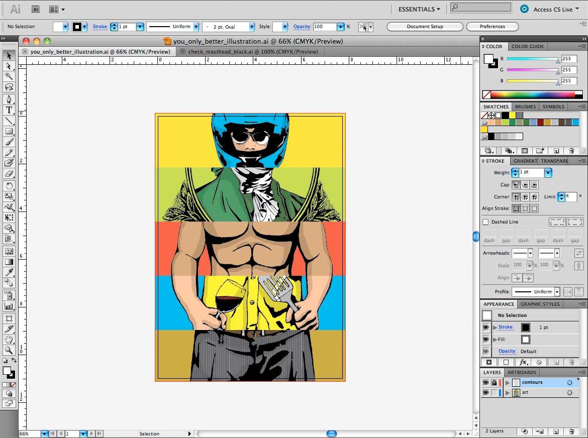
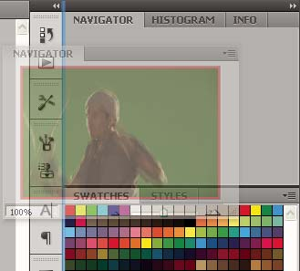
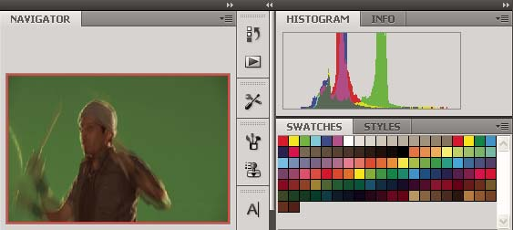
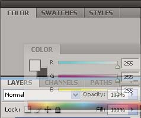
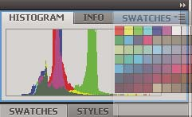
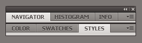
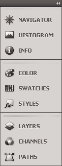
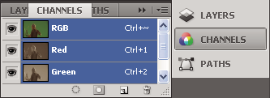

# Flash workflow and workspace

> **Note:** Most things in Flash can be done either with or without
> ActionScript. The things that actually require ActionScript are non-linear
> playback, and any situation where the author prefers to avoid using the
> Timeline.

## General Flash workflow

To build a Flash Pro application, you typically perform the following basic
steps:

#### Plan the application.

Decide which basic tasks the application will perform.

#### Add media elements.

Create and import media elements, such as images, video, sound, and text.

#### Arrange the elements.

Arrange the media elements on the Stage and in the Timeline to define when and
how they appear in your application.

#### Apply special effects.

Apply graphic filters (such as blurs, glows, and bevels), blends, and other
special effects as you see fit.

#### Use ActionScript to control behavior.

Write ActionScript® code to control how the media elements behave, including how
the elements respond to user interactions.

#### Test and publish your application.

Test your FLA file (Control \> Test Movie) to verify that your application is
working as you intended and find and fix any bugs you encounter. You should test
the application throughout the creation process. You can test your file in Flash
Pro, Device Central, the AIR Debug Launchers, and on-device via USB (Flash CS5.5
only).

Publish your FLA file (File \> Publish) as a SWF file that can be displayed in a
web page and played back with Flash® Player.

Depending on your project and your working style, you might use these steps in a
different order.

For more help getting started with the Flash Pro workflow, see the following:

- Article: _Introducing Adobe Flash Professional_:
  [http://www.adobe.com/devnet/logged_in/dwinnie_flcs4.html](https://web.archive.org/web/20120102010447mp_/http://www.adobe.com/devnet/logged_in/dwinnie_flcs4.html)

- Article: _Creating a simple document in Flash Professional_:
  [http://www.adobe.com/devnet/flash/articles/flash_cs4_createfla.html](https://web.archive.org/web/20120102010447mp_/http://www.adobe.com/devnet/flash/articles/flash_cs4_createfla.html)

## Workspace overview

You create and manipulate your documents and files using various elements, such
as panels, bars, and windows. Any arrangement of these elements is called a
_workspace_. The workspaces of the different applications in Adobe® Creative
Suite® 5 share the same appearance so that you can move between the applications
easily. You can also adapt each application to the way you work by selecting
from several preset workspaces or by creating one of your own. Although the
default workspace layout varies in different products, you manipulate the
elements much the same way in all of them.

Default Illustrator workspace

A.  
Tabbed Document windows

B.  
Application bar

C.  
Workspace switcher

D.  
Panel title bar

E.  
Control panel

F.  
Tools panel

G.  
Collapse To Icons button

H.  
Four panel groups in vertical dock

- The _Application bar_ across the top contains a workspace switcher, menus
  (Windows only), and other application controls. On the Mac for certain
  products, you can show or hide it using the Window menu.

- The _Tools panel_ contains tools for creating and editing images, artwork,
  page elements, and so on. Related tools are grouped.

- The _Control panel_ displays options for the currently selected tool. In
  Illustrator, the Control panel displays options for the currently selected
  object. (In Adobe Photoshop® this is known as the Options bar. In Adobe
  Flash®, Adobe Dreamweaver®, and Adobe Fireworks® this is known as the Property
  Inspector and includes properties of the currently selected element.)

- The \_Document window \_displays the file you're working on. Document windows
  can be tabbed and, in certain cases, grouped and docked.

- _Panels_ help you monitor and modify your work. Examples include the Timeline
  in Flash, the Brush panel in Illustrator, the Layers panel in Adobe
  Photoshop®, and the CSS Styles panel in Dreamweaver. Panels can be grouped,
  stacked, or docked.

- The _Application frame_ groups all the workspace elements in a single,
  integrated window that lets you treat the application as a single unit. When
  you move or resize the Application frame or any of its elements, all the
  elements within it respond to each other so none overlap. Panels don't
  disappear when you switch applications or when you accidentally click out of
  the application. If you work with two or more applications, you can position
  each application side by side on the screen or on multiple monitors.

  If you are using a Mac and prefer the traditional, free-form user interface,
  you can turn off the Application frame. In Adobe Illustrator®, for example,
  select Window \> Application Frame to toggle it on or off. (In Flash, the
  Application frame is on permanently for Mac, and Dreamweaver for Mac does not
  use an Application frame.)

### Hide or show all panels

- (Illustrator, Adobe InCopy®, Adobe InDesign®, Photoshop, Fireworks)To hide or
  show all panels, including the Tools panel and Control panel, press Tab.

- (Illustrator, InCopy, InDesign, Photoshop) To hide or show all panels except
  the Tools panel and Control panel, press Shift+Tab.

   You can temporarily display hidden panels if
  Auto-Show Hidden Panels is selected in Interface preferences. It's always on
  in Illustrator. Move the pointer to the edge of the application window
  (Windows®) or to the edge of the monitor (Mac OS®) and hover over the strip
  that appears.

- (Flash, Dreamweaver, Fireworks) To hide or show all panels, press F4.

### Display panel options

 Click the panel menu icon  in
the upper-right corner of the panel.

 You can open a panel menu even when the panel is
minimized.

 In Photoshop, you can change the font size of the text
in panels and tool tips. In the Interface preferences, choose a size from the UI
Font Size menu.

### (Illustrator) Adjust panel brightness

  In User Interface preferences, move the Brightness
slider. This control affects all panels, including the Control panel.

### Reconfigure the Tools panel

You can display the tools in the Tools panel in a single column, or side by side
in two columns. (This feature is not available in the Tools panel in Fireworks
and Flash.)

 In InDesign and InCopy, you also can switch from
single-column to double-column (or single-row) display by setting an option in
Interface preferences.

  Click the double arrow at the top of the Tools panel.

## Manage windows and panels

You can create a custom workspace by moving and manipulating Document windows
and panels. You can also save workspaces and switch among them. For Fireworks,
renaming custom workspaces can lead to unexpected behavior.

> **Note:** The following examples use Photoshop for demonstration purposes. The
> workspace behaves the same in all the products.

### Rearrange, dock, or float document windows

When you open more than one file, the Document windows are tabbed.

- To rearrange the order of tabbed Document windows, drag a window's tab to a
  new location in the group.

- To undock (float or untab) a Document window from a group of windows, drag the
  window's tab out of the group.

  > **Note:** In Photoshop you can also choose Window \> Arrange \> Float in
  > Window to float a single Document window, or Window \> Arrange \> Float All
  > In Windows to float all of the Document windows at once. See tech note
  > [kb405298](https://web.archive.org/web/20120102010447mp_/http://kb2.adobe.com/cps/405/kb405298.html)
  > for more information.

  > **Note:** Dreamweaver does not support docking and undocking Document
  > windows. Use the Document window's Minimize button to create floating
  > windows (Windows), or choose Window \> Tile Vertically to create
  > side-by-side Document windows. Search "Tile Vertically" in Dreamweaver Help
  > for more information on this topic. The workflow is slightly different for
  > Macintosh users.

- To dock a Document window to a separate group of Document windows, drag the
  window into the group.

- To create groups of stacked or tiled documents, drag the window to one of the
  drop zones along the top, bottom, or sides of another window. You can also
  select a layout for the group by using the Layout button on the Application
  bar.

  > **Note:** Some products do not support this functionality. However, your
  > product may have Cascade and Tile commands in the Window menu to help you
  > lay out your documents.

- To switch to another document in a tabbed group when dragging a selection,
  drag the selection over the document's tab for a moment.

  > **Note:** Some products do not support this functionality.

### Dock and undock panels

A _dock_ is a collection of panels or panel groups displayed together, generally
in a vertical orientation. You dock and undock panels by moving them into and
out of a dock.

- To dock a panel, drag it by its tab into the dock, at the top, bottom, or in
  between other panels.

- To dock a panel group, drag it by its title bar (the solid empty bar above the
  tabs) into the dock.

- To remove a panel or panel group, drag it out of the dock by its tab or title
  bar. You can drag it into another dock or make it free-floating.

  

  Navigator panel being dragged out to new dock, indicated by blue vertical
  highlight

  

  Navigator panel now in its own dock

 You can prevent panels from filling all the space in a
dock. Drag the bottom edge of the dock up so it no longer meets the edge of the
workspace.

### Move panels

As you move panels, you see blue highlighted _drop zones_, areas where you can
move the panel. For example, you can move a panel up or down in a dock by
dragging it to the narrow blue drop zone above or below another panel. If you
drag to an area that is not a drop zone, the panel floats freely in the
workspace.

> **Note:** The position of the mouse (rather than the position of the panel),
> activates the drop zone, so if you can't see the drop zone, try dragging the
> mouse to the place where the drop zone should be.

- To move a panel, drag it by its tab.

- To move a panel group, drag the title bar.

  

  Narrow blue drop zone indicates Color panel will be docked on its own above
  the Layers panel group.

A.  
Title bar

B.  
Tab

C.  
Drop zone

 Press Ctrl (Windows) or Command (Mac OS) while moving a
panel to prevent it from docking. Press Esc while moving the panel to cancel the
operation.

### Add and remove panels

If you remove all panels from a dock, the dock disappears. You can create a dock
by moving panels to the right edge of the workspace until a drop zone appears.

- To remove a panel, right-click (Windows) or Control-click (Mac) its tab and
  then select Close, or deselect it from the Window menu.

- To add a panel, select it from the Window menu and dock it wherever you want.

### Manipulate panel groups

- To move a panel into a group, drag the panel's tab to the highlighted drop
  zone in the group.

  

  <caption>Adding a panel to a panel group</caption>

- To rearrange panels in a group, drag a panel's tab to a new location in the
  group.

- To remove a panel from a group so that it floats freely, drag the panel by its
  tab outside the group.

- To move a group, drag the title bar (the area above the tabs).

### Stack floating panels

When you drag a panel out of its dock but not into a drop zone, the panel floats
freely. The floating panel allows you to position it anywhere in the workspace.
You can stack floating panels or panel groups so that they move as a unit when
you drag the topmost title bar.

Free-floating stacked panels

- To stack floating panels, drag a panel by its tab to the drop zone at the
  bottom of another panel.

- To change the stacking order, drag a panel up or down by its tab.

  > **Note:** Be sure to release the tab over the narrow drop zone between
  > panels, rather than the broad drop zone in a title bar.

- To remove a panel or panel group from the stack, so that it floats by itself,
  drag it out by its tab or title bar.

### Resize panels

- To minimize or maximize a panel, panel group, or stack of panels, double-click
  a tab. You can also double-click the tab area (the empty space next to the
  tabs).

- To resize a panel, drag any side of the panel. Some panels, such as the Color
  panel in Photoshop, cannot be resized by dragging.

### Collapse and expand panel icons

You can collapse panels to icons to reduce clutter on the workspace. In some
cases, panels are collapsed to icons in the default workspace.

<caption>Panels collapsed to icons</caption>

<caption>Panels expanded from icons</caption>

- To collapse or expand all panel icons in a column, click the double arrow at
  the top of the dock.

- To expand a single panel icon, click it.

- To resize panel icons so that you see only the icons (and not the labels),
  adjust the width of the dock until the text disappears. To display the icon
  text again, make the dock wider.

- To collapse an expanded panel back to its icon, click its tab, its icon, or
  the double arrow in the panel's title bar.

   In some products, if you select Auto-Collapse Icon
  Panels from the Interface or User Interface Options preferences, an expanded
  panel icon collapses automatically when you click away from it.

- To add a floating panel or panel group to an icon dock, drag it in by its tab
  or title bar. (Panels are automatically collapsed to icons when added to an
  icon dock.)

- To move a panel icon (or panel icon group), drag the icon. You can drag panel
  icons up and down in the dock, into other docks (where they appear in the
  panel style of that dock), or outside the dock (where they appear as floating
  icons).

## Save and switch workspaces

By saving the current size and position of panels as a named workspace, you can
restore that workspace even if you move or close a panel. The names of saved
workspaces appear in the workspace switcher in the Application bar.

### Save a custom workspace

1.  With the workspace in the configuration you want to save, do one of the
    following:
    - (Illustrator) Choose Window \> Workspace \> Save Workspace.

    - (Photoshop, InDesign, InCopy) Choose Window \> Workspace \> New Workspace.

    - (Dreamweaver) Choose Window \> Workspace Layout \> New Workspace.

    - (Flash) Choose New Workspace from the workspace switcher in the
      Application bar.

    - (Fireworks) Choose Save Current from the workspace switcher in the
      Application bar.

2.  Type a name for the workspace.

3.  (Photoshop, InDesign) Under Capture, select one or more options:

    **Panel Locations**  
    Saves the current panel locations (InDesign only).

    **Keyboard shortcuts**  
    Saves the current set of keyboard shortcuts (Photoshop only).

    **Menus or Menu Customization**  
    Saves the current set of menus.

### Display or switch workspaces

 Select a workspace from the workspace switcher in the
Application bar.  In Photoshop, you can assign keyboard
shortcuts to each workspace to navigate among them quickly.

### Delete a custom workspace

- Select Manage Workspaces from the workspace switcher in the Application bar,
  select the workspace, and then click Delete. (The option is not available in
  Fireworks.)

- (Photoshop, InDesign, InCopy) Select Delete Workspace from the workspace
  switcher.

- (Illustrator) Choose Window \> Workspace \> Manage Workspaces, select the
  workspace, and then click the Delete icon.

- (Photoshop, InDesign) Choose Window \> Workspace \> Delete Workspace, select
  the workspace, and then click Delete.

### Restore the default workspace

1.  Select the Default or Essentials workspace from the workspace switcher in
    the application bar. For Fireworks, see the article
    [http://www.adobe.com/devnet/fireworks/articles/workspace_manager_panel.html](https://web.archive.org/web/20120102010447mp_/http://www.adobe.com/devnet/fireworks/articles/workspace_manager_panel.html).

    > **Note:** In Dreamweaver, Designer is the default workspace.

2.  For Fireworks (Windows), delete these folders:

    **Windows Vista**  
    \\Users\\username\>\AppData\Roaming\Adobe\Fireworks CS4\\

    **Windows XP**  
    \\Documents and Settings\\username\>\Application Data\Adobe\Fireworks CS4

3.  (Photoshop, InDesign, InCopy) Select Window \> Workspace \> Reset
    _\[Workspace Name\]_.

### (Photoshop) Restore a saved workspace arrangement

In Photoshop, workspaces automatically appear as you last arranged them, but you
can restore the original, saved arrangement of panels.

- To restore an individual workspace, choose Window \> Workspace \> Reset
  `Workspace Name`.

- To restore all the workspaces installed with Photoshop, click Restore Default
  Workspaces in the Interface preferences.  To rearrange
  the order of workspaces in the application bar, drag them.
