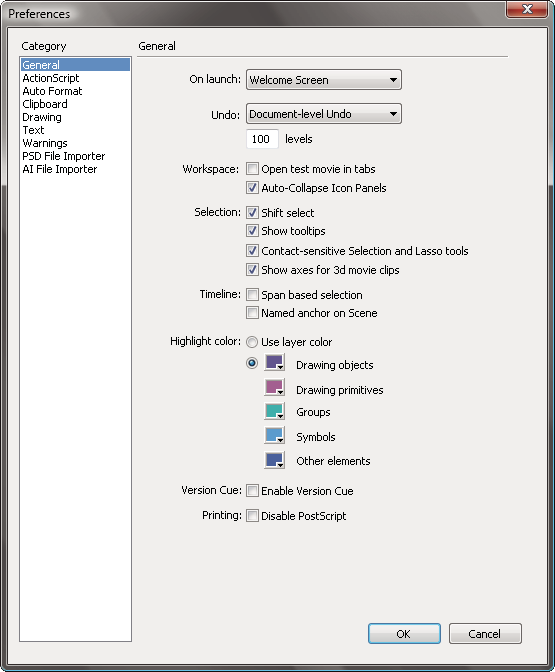

# Set preferences in Flash

You can set preferences for general application operations, editing operations,
and clipboard operations.

The General category in the Preferences dialog box.

## Set preferences

1.  Select Edit \> Preferences (Windows) or Flash \> Preferences (Macintosh).
2.  Make a selection in the Category list and select from the respective
    options.

## Set General preferences

On Launch  
Specify which document opens when you start the application.

Document- or Object-level undo  
Document-level undo maintains a single list of all your actions for the entire
Flash Pro document. Object-level undo maintains separate lists of your actions
for each object in your document. Object-level lets you undo an action on one
object without having to also undo actions on other objects that might have been
modified more recently than the target object.

Undo levels  
To set the number of undo or redo levels, enter a value from 2 to 300. Undo
levels require memory; the more undo levels you use, the more system memory is
consumed. The default is 100.

Workspace  
To open a new document tab in the application window when you select Control \>
Test Movie \> Test, select Open Test Movie In Tabs. The default is to open the
test movie in its own window. To have panels in icon mode auto collapse when you
click outside them, select Auto-Collapse Icon Panels.

Selection  
To control how multiple elements are selected, select or deselect Shift Select.
When **Shift Select** is off, clicking additional elements adds them to the
current selection. When Shift Select is on, clicking additional elements
deselects other elements unless you hold down the Shift key.

Show Tooltips  
Shows tooltips when the pointer pauses over a control. To hide the tooltips,
deselect this option.

Contact Sensitive  
Selects objects when any part of them is included in the marquee rectangle when
dragging with the Selection or Lasso tools. The default is that objects are only
selected when the tool's marquee rectangle completely surrounds the object.

Show axes for 3D  
Displays an overlay of the X, Y, and Z axes on all 3D movie clips. This makes
them easier to identify on the Stage.

Timeline  
To use span-based selection in the Timeline, rather than the default frame-based
selection, select Span Based Selection.

Named Anchor On Scene  
Make the first frame of each scene in a document a named anchor. Named anchors
let you use the Forward and Back buttons in a browser to jump from scene to
scene.

Highlight Color  
To use the current layer's outline color, select a color from the panel, or
select Use Layer Color.

Printing (Windows only)  
To disable PostScript® output when printing to a PostScript printer, select
Disable PostScript. By default, this option is deselected. Select this option if
you have problems printing to a PostScript printer; however, this option slows
down printing.

Auto-Recovery (CS5.5 only)  
When enabled (the default setting), this setting saves a copy of each open file
at the specified time interval, in the same folder as the originals. If you have
not saved the file yet, Flash saves the copies in its Temp folder. The file
names are the same as the originals, with "RECOVER\_" added to the beginning of
the file name. If Flash Pro quits unexpectedly, a dialog box appears when you
restart to allow you to open the auto-recover file. When you exit Flash Pro
normally, the auto-recover files are deleted.

Scale Content (CS5.5 only)  
Options for scaling content when resizing the Stage with the Document Properties
dialog box (Modify \> Document). To keep objects aligned to the top left corner
of the Stage, select **Align Top Left**. To resize items in locked and hidden
layers of the Timeline, select **Include Locked and Hidden Layers**.

## Set AutoFormat preferences for ActionScript

 Select any of the options. To see the effect of each
selection, look in the Preview pane.

## Clipboard preferences

The Clipboard preferences control how Flash handles bitmap images that are
copied to the clipboard.

Color Depth  
(Windows only) Specifies the maximum color depth of image data copied to the
clipboard. Higher depth images are copied at the lower resolution. It is best to
set this to the highest depth of the images you plan to work with

Type  
(Macintosh only) Specifies the maximum color depth of image data copied to the
clipboard. Higher depth images are copied at the lower resolution. It is best to
set this to the highest depth of the images you plan to work with

Resolution  
Indicates the resolution to use for image data copied to the clipboard. It is
best to set this to the highest resolution of the images you plan to work with.

Size Limit  
(Windows only) To specify the amount of RAM that is used when placing a bitmap
image on the Clipboard, enter a kilobyte value in the Size Limit text field.
Increase this value when working with large or high-resolution bitmap images.

## Set text preferences

- For Font Mapping Default, select a font to use when substituting missing fonts
  in documents you open in Flash Pro.

- For Vertical Text options, select Default Text Orientation (deselected by
  default).

- To reverse the default text display direction, select Right To Left Text Flow
  (deselected by default).

- To turn off kerning for vertical text, select No Kerning (deselected by
  default). Turning off kerning is useful to improve spacing for some fonts that
  use kerning tables.

- For Input Method, select the appropriate language.

## Set warning preferences

- To receive a warning when you try to save documents with content that is
  specific to the Adobe® Flash® Professional CS5 authoring tool as a Flash
  CS5/5.5 file, select Warn On Save For Adobe Flash CS4 Compatibility (default).

- To receive a warning if the URL for a document changed since the last time you
  opened and edited it, select Warn On URL Changes In Launch And Edit.

- To receive an alert when Flash Pro inserts frames in your document to
  accommodate audio or video files that you import, select Warn On Inserting
  Frames When Importing Content.

- To receive an alert when selecting Default Encoding that could potentially
  lead to data loss or character corruption, select Warn On Encoding Conflicts
  When Exporting ActionScript Files. (For example, if you create a file with
  English, Japanese, and Korean characters and select Default Encoding on an
  English system, the Japanese and Korean characters are corrupted.)

- To receive a warning when you attempt to edit a symbol with timeline effects
  applied to it, select Warn On Conversion Of Effect Graphic Objects.

- To receive a warning when you create a site in which the local root folder
  overlaps with another site, select Warn On Sites With Overlapped Root Folder.

- To receive a warning when you convert a symbol with a behavior attached to a
  symbol of a different type—for example, when you convert a movie clip to a
  button—select Warn On Behavior Symbol Conversion.

- To receive a warning when you convert a symbol to a symbol of a different
  type, select Warn On Symbol Conversion.

- To receive a warning when Flash Pro converts a graphic object drawn in Object
  Drawing mode to a group, select Warn On Automatically Converting From Drawing
  Object To Group.

- To display warnings on controls for features not supported by the Flash Player
  version that the current FLA file is targeting in its publish settings, select
  Show Incompatibility Warnings On Feature Controls.

- Warn on Document Auto-Save and Auto-Recovery (Flash Pro CS5.5 only). If
  checked, Flash will remind you to enable Auto-Save for any document that you
  have saved and then modified if it does not already have Auto-Save enabled.
  This reminder occurs only once for each document.

## Set Publish Cache preferences (CS5.5 only)

The Publish Cache stores fonts and MP3 sounds in order to speed up SWF file
creation when you use the Publish or Test Movie commands.

During a Flash session, the first time you create a SWF file from a FLA file,
Flash Pro puts compressed copies of any fonts and MP3 sounds you are using into
the Publish Cache. During subsequent Test Movie or Publish operations, if the
fonts and sounds are unchanged in the FLA, the versions from the cache are used
to create the SWF file.

> **Note:** Only MP3 event sounds to which Flash is adding additional
> compression are added to the Publish Cache. Streaming sounds are not added to
> the cache.

The Publish Cache preferences include these settings:

Enable Publish Cache  
Select this option to enable or disable the Publish Cache.

Disk cache size limit  
The maximum amount of disk space to use for the Publish Cache.

Memory cache size limit  
The maximum amount of RAM to use for the Publish Cache. When the cache exceeds
this amount, entries that have not been recently used are moved to disk.

Maximum size for memory cache entry  
The maximum size of an individual compressed font or MP3 sound that can be added
to the Publish Cache in RAM. Larger items are written to disk.

To clear the Publish Cache, choose Control \> Clear Publish Cache or Control \>
Clear Publish Cache and Test Movie.

## Restore all preferences to default settings

 Press and hold Control+Alt+Shift (Windows) or
Command+Option+Shift (Mac OS) as you start Flash.

More Help topics

[Drawing preferences](../creating-and-editing-artwork/drawing-in-flash/drawing-preferences.md)

[Change the appearance of the Timeline](./the-timeline.md#change-the-appearance-of-the-timeline)

[About the Timeline](./the-timeline.md#about-the-timeline)

[Managing documents](../managing-documents/index.md)

[Embed fonts for consistent text appearance](../text/embed-fonts-for-consistent-text-appearance.md)

[Pen tool preferences](../creating-and-editing-artwork/drawing-in-flash/drawing-with-the-pen-tool.md#pen-tool-preferences)

[Illustrator object import options](../using-imported-artwork/working-with-illustrator-ai-files-in-flash.md#illustrator-object-import-options)

[Photoshop file importer preferences](../using-imported-artwork/working-with-photoshop-psd-files-in-flash.md#photoshop-file-importer-preferences)
