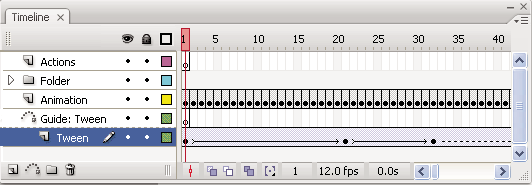
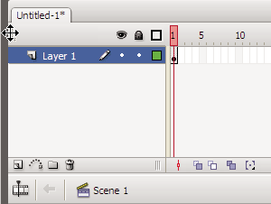
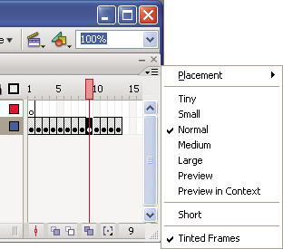
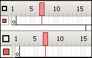
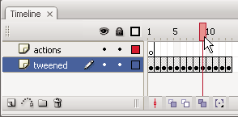

# The Timeline

## About the Timeline

The Timeline organizes and controls a document's content over time in layers and
frames. Like films, Flash Pro documents divide lengths of time into frames.
Layers are like multiple film strips stacked on top of one another, each
containing a different image that appears on the Stage. The major components of
the Timeline are layers, frames, and the playhead.

Layers in a document are listed in a column on the left side of the Timeline.
Frames contained in each layer appear in a row to the right of the layer name.
The Timeline header at the top of the Timeline indicates frame numbers. The
playhead indicates the current frame displayed on the Stage. As a document
plays, the playhead moves from left to right through the Timeline.

The Timeline status displayed at the bottom of the Timeline indicates the
selected frame number, the current frame rate, and the elapsed time to the
current frame.

> **Note:** When an animation is played, the actual frame rate is displayed;
> this may differ from the document's frame rate setting if the computer can't
> calculate and display the animation quickly enough.

Parts of the Timeline

A.  
Playhead

B.  
Empty keyframe

C.  
Timeline header

D.  
Guide layer icon

E.  
Frame View pop‑up menu

F.  
Frame-by-frame animation

G.  
Tweened animation

H.  
Center Frame button

I.  
Onion-skinning buttons

J.  
Current Frame indicator

K.  
Frame Rate indicator

L.  
Elapsed Time indicator The Timeline shows where animation occurs in a document,
including frame-by-frame animation, tweened animation, and motion paths.

Controls in the layers section of the Timeline let you hide, show, lock, or
unlock layers, as well as display layer contents as outlines. You can drag
Timeline frames to a new location on the same layer or to a different layer.

## Change the appearance of the Timeline

By default, the Timeline appears below the main document window. To change its
position, detach the Timeline from the document window and float it in its own
window or dock it to any other panel you choose. You can also hide the Timeline.

To change the number of layers and frames that are visible, resize the Timeline.
To view additional layers when the Timeline contains more layers than can be
displayed, use the scroll bars on the right side of the Timeline.

Dragging the Timeline

- To move the Timeline when it is docked to the document window, drag the title
  bar tab at the upper-left corner of the Timeline.

- To dock an undocked Timeline to the application window, drag the title bar tab
  to the top or bottom of the document window.

- To dock an undocked Timeline to other panels, drag the Timeline title bar tab
  to the location you choose. To prevent the Timeline from docking to other
  panels, press Control while you drag. A blue bar appears to indicate where the
  Timeline will dock.

- To lengthen or shorten layer name fields in the Timeline panel, drag the bar
  separating the layer names and the frames portions of the Timeline.

#### Change the display of frames in the Timeline

1.  To display the Frame View pop‑up menu, click Frame View in the upper-right
    corner of the Timeline.

    

    <caption>Frame View pop‑up menu.</caption>

2.  Select from the following options:
    - To change the width of frame cells, select Tiny, Small, Normal, Medium, or
      Large. (The Large frame-width setting is useful for viewing the details of
      sound waveforms.)

    - To decrease the height of frame cell rows, select Short.

      

      <caption>Short and Normal frame view options.</caption>

    - To turn the tinting of frame sequences on or off, select Tinted Frames.

    - To display thumbnails of the content of each frame scaled to fit the
      Timeline frames, select Preview. This can cause the apparent content size
      to vary and requires extra screen space.

    - To display thumbnails of each full frame (including empty space), select
      Preview In Context. This is useful for viewing the way elements move in
      their frames over the course of the animation, but previews are generally
      smaller than with the Preview option.

#### Change layer height in the Timeline

1.  Do one of the following:
    - Double-click the layer's icon (the icon to the left of the layer name) in
      the Timeline.

    - Right-click (Windows) or Control-click (Macintosh) the layer name and
      select Properties from the context menu.

    - Select the layer in the Timeline and select Modify \> Timeline \> Layer
      Properties.

2.  In the Layer Properties dialog box, select an option for Layer Height and
    click OK.

## Resize the Timeline

- If the Timeline is docked to the main application window, drag the bar
  separating the Timeline from the Stage area.

- If the Timeline is not docked to the main application window, drag the
  lower-right corner (Windows) or the size box in the lower-right corner
  (Macintosh).

## Move the playhead

The red playhead at the top of the Timeline moves as a document plays to
indicate the current frame displayed on the Stage. The Timeline header shows the
frame numbers of the animation. To display a frame on the Stage, move the
playhead to the frame in the Timeline. To display a specific frame when you're
working with a large number of frames that can't all be displayed in the
Timeline at once, move the playhead along the Timeline.

- To go to a frame, click the frame's location in the Timeline header, or drag
  the playhead to the desired position.

- To center the Timeline on the current frame, click the Center Frame button at
  the bottom of the Timeline.

- (CS5.5 only) To play, rewind, skip back, and skip forward in the Timeline, use
  the Playback buttons at the bottom of the Timeline panel.

- (CS5.5 only) To loop through a specific range of frames, click the Loop button
  at the bottom of the Timeline panel. Then move the frame range markers to the
  first and last frames you want to loop.

<caption>Moving the playhead</caption>

More Help topics

[Working with timelines](../timelines-and-animation/working-with-timelines/index.md)

[Motion tween animation](../timelines-and-animation/motion-tween-animation.md)
