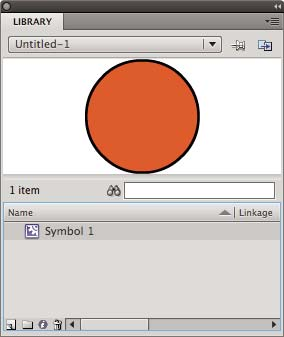
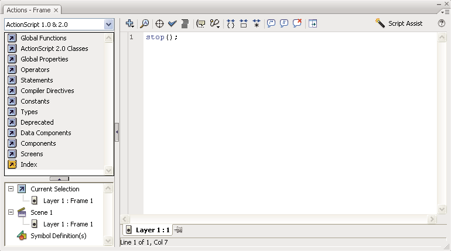

# Using Flash authoring panels

## About the Property inspector

The Property inspector provides easy access to the most commonly used attributes
of the current selection, either on the Stage or in the Timeline. You can make
changes to the object or document attributes in the Property inspector without
accessing the menus or panels that also control these attributes.

Depending on what is currently selected, the Property inspector displays
information and settings for the current document, text, symbol, shape, bitmap,
video, group, frame, or tool. When two or more different types of objects are
selected, the Property inspector displays the total number of objects selected.

To display the Property inspector, Select Window \> Properties, or press
Control+F3 (Windows) or Command+F3 (Macintosh).

## About the Library panel

The Library panel (Window \> Library) is where you store and organize symbols
created in Flash Pro, as well as imported files, including bitmap graphics,
sound files, and video clips. The Library panel lets you organize library items
in folders, see how often an item is used in a document, and sort items by name,
type, date, use count, or ActionScript® linkage identifier. You can also search
the Library panel with the search field and set properties on most
multiple-object selections.

The Library panel showing a movie clip symbol.

## About the Actions panel

The Actions panel lets you create and edit ActionScript code for an object or
frame. Selecting a frame, button, or movie clip instance makes the Actions panel
active. The Actions panel title changes to Button Actions, Movie Clip Actions,
or Frame Actions, depending on what is selected.

The Actions panel showing a stop() action in a frame.

To display the Actions panel, select Window \> Actions or press F9.

## Use the Movie Explorer

The Movie Explorer lets you view and organize the contents of a document and
select elements in the document for modification. It contains a display list of
currently used elements, arranged in a navigable hierarchical tree.

Use the Movie Explorer to perform the following actions:

- Filter which categories of items in the document appear in the Movie Explorer.

- Display the selected categories as scenes, symbol definitions, or both.

- Expand and collapse the navigation tree.

- Search for an element in a document by name.

- Familiarize yourself with the structure of a Flash Pro document that another
  developer created.

- Find all the instances of a particular symbol or action.

- Print the navigable display list that appears in the Movie Explorer.

The Movie Explorer has a Panel menu and a context menu with options for
performing operations on selected items or modifying the Movie Explorer display.
A check mark with a triangle below it in the Movie Explorer panel indicates the
Panel menu.

> **Note:** The Movie Explorer has slightly different functionality when you are
> working with screens.

### View the Movie Explorer

 Select Window \> Movie Explorer.

### Filter the categories of items that appear in the Movie Explorer

- To show text, symbols, ActionScript, imported files, or frames and layers,
  click one or more of the filtering buttons to the right of the Show option. To
  customize which items to show, click the Customize button. Select options in
  the Show area of the Movie Explorer Settings dialog box to view those
  elements.

- To show items in scenes, select Show Movie Elements from the Movie Explorer
  Panel menu.

- To show information about symbols, select Show Symbol Definitions from the
  Movie Explorer Panel menu.

  > **Note:** The Movie Elements option and the Symbol Definitions option can be
  > active at the same time.

### Search for an item using the Find box

 In the Find box, enter the item name, font name,
ActionScript string, or frame number. The Find feature searches all items that
appear in the Movie Explorer.

### Select an item in the Movie Explorer

 Click the item in the navigation tree. Shift-click to
select more than one item.

The full path for the selected item appears at the bottom of the Movie Explorer.
Selecting a scene in the Movie Explorer shows the first frame of that scene on
the Stage. Selecting an element in the Movie Explorer selects that element on
the Stage if the layer containing the element is not locked.

### Use the Movie Explorer Panel menu or context menu commands

1.  Do one of the following:
    - To view the Panel menu, click the Panel menu control in the Movie Explorer
      panel.

    - To view the context menu, right-click (Windows) or Control-click
      (Macintosh) an item in the Movie Explorer navigation tree.

2.  Select an option from the menu:

    **Go To Location**  
    Jumps to the selected layer, scene, or frame in the document.

    **Go To Symbol Definition**  
    Jumps to the symbol definition for a symbol that is selected in the Movie
    Elements area of the Movie Explorer. The symbol definition lists all the
    files associated with the symbol. (The Show Symbol Definitions option must
    be selected. See its definition in this list.)

    **Select Symbol Instances**  
    Jumps to the scene containing instances of a symbol that is selected in the
    Symbol Definitions area of the Movie Explorer. (The Show Movie Elements
    option must be selected.)

    **Show In Library**  
    Highlights the selected symbol in the document's library. (Flash Pro opens
    the Library panel if it is not already visible.)

    **Rename**  
    Lets you enter a new name for a selected element.

    **Edit In Place**  
    Lets you edit a selected symbol on the Stage.

    **Edit In New Window**  
    Lets you edit a selected symbol in a new window.

    **Show Movie Elements**  
    Shows the elements in your document organized into scenes.

    **Show Symbol Definitions**  
    Shows all the elements associated with a symbol.

    **Copy All Text To Clipboard**  
    Copies selected text to the clipboard. For spell checking or other editing,
    paste the text into an external text editor.

    **Cut, Copy, Paste, And Clear**  
    Performs these common functions on a selected element. Modifying an item in
    the display list modifies the corresponding item in the document.

    **Expand Branch**  
    Expands the navigation tree at the selected element.

    **Collapse Branch**  
    Collapses the navigation tree at the selected element.

    **Collapse Others**  
    Collapses the branches in the navigation tree that do not contain the
    selected element.

    **Print**  
    Prints the hierarchical display list that appears in the Movie Explorer.

## About Flash components and the Components panel

A component in Flash is a reusable, packaged module that adds a particular
capability to a Flash document. Components can include graphics as well as code,
so they're pre-built functionality that you can easily include in your Flash
projects. For example, a component can be a radio button, a dialog box, a
preload bar, or even something that has no graphics at all, such as a timer, a
server connection utility, or a custom XML parser.

If you are less experienced with writing ActionScript, you can add components to
a document, set their parameters in the Property inspector or Component
inspector, and use the Behaviors panel to handle their events. For example, you
could attach a Go To Web Page behavior to a Button component that opens a URL in
a web browser when the button is clicked without writing any ActionScript code.

If you are a programmer who wants to create more robust applications, you can
create components dynamically, use ActionScript to set properties and call
methods at run time, and use the event listener model to handle events.

### Insert a component using the Component panel

When you first add a component to a document, Flash imports it as a movie clip
into the Library panel. You can also drag a component from the Components panel
directly to the Library panel and then add an instance of it to the Stage. In
any case, you must add a component to the library before you can access its
class elements.

1.  Select Window \> Component panel.
2.  Select an instance of a component in the Component panel, and drag it to the
    Stage or Library panel. After a component is added to the library, you can
    drag multiple instances to the Stage.
3.  Configure the component as needed using either the Property inspector or the
    Components inspector. For information on the parameters the component uses,
    refer to the appropriate component documentation for the version of
    ActionScript you are using in the Flash document.

### Enter parameters for a component using the Component inspector

1.  Select Window \> Component Inspector.
2.  Select an instance of a component on the Stage.
3.  Click the Parameters tab and enter values for any of the listed parameters.

## About the Web Services panel

You can view a list of web services, refresh web services, and add or remove web
services in the Web Services panel (Window \> Other Panels \> Web Services).
When you add a web service to the Web Services panel, the web service is then
available to any application you create.

You can use the Web Services panel to refresh all your web services at once by
clicking the Refresh Web Services button. If you are not using the Stage but
instead are writing ActionScript code for the connectivity layer of your
application, you can use the Web Services panel to manage your web services.

For detailed information about using the web services panel, see
[Data Integration PDF](https://web.archive.org/web/20100615184118/http://livedocs.adobe.com/flash/9.0/main/fl_data_integration.pdf).

More Help topics

[Work with libraries](../symbols-instances-and-library-assets/working-with-the-library.md#work-with-libraries)

[The Actions panel](../actionscript/working-with-actionscript/the-actions-panel.md)

[Script window overview](../actionscript/working-with-actionscript/script-window-overview.md)

[About ActionScript 3.0 Components](https://web.archive.org/web/20120102130516mp_/http://help.adobe.com/en_US/as3/components/WS5b3ccc516d4fbf351e63e3d118a9c64d27-7ff4.html)
