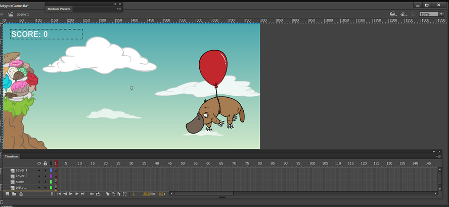

# Using the Stage and Tools panel

## Using the Stage

The Stage is the rectangular area where you place graphic content when creating
Flash Pro documents. The Stage in the authoring environment represents the
rectangular space in Flash Player or in a web browser window where your document
appears during playback. To change the view of the Stage as you work, zoom in
and out. To help you position items on the Stage, you can use the grid, guides,
and rulers.

<caption>The Timeline and Stage with content.</caption>

#### Zoom the Stage

To view the entire Stage on the screen, or to view a particular area of your
drawing at high magnification, change the magnification level. The maximum
magnification depends on the resolution of your monitor and the document size.
The minimum value for zooming out on the Stage is 8%. The maximum value for
zooming in on the Stage is 2000%.

- To zoom in on an element, select the Zoom
  tool  in the Tools panel, and click the
  element. To switch the Zoom tool between zooming in or out, use the
  Enlarge  or
  Reduce  modifiers (in the options area of the
  Tools panel when the Zoom tool is selected) or Alt‑click (Windows) or
  Option-click (Macintosh).

- To zoom in so that a specific area of your drawing fills the window, drag a
  rectangular selection on the Stage with the Zoom tool.

- To zoom in on or out of the entire Stage, select View \> Zoom In or View \>
  Zoom Out.

- To zoom in or out by a specified percentage, select View \> Magnification, and
  select a percentage from the submenu or select a percentage from the Zoom
  control at the upper-right corner of the document window.

- To scale the Stage so that it fits completely in the application window,
  select View \> Magnification \> Fit in Window.

- To show the contents of the current frame, select View \> Magnification \>
  Show All, or select Show All from the Zoom control at the upper-right side of
  the application window. If the scene is empty, the entire Stage appears.

- To show the entire Stage, select View \> Magnification \> Show Frame or select
  Show Frame from the Zoom control at the upper-right corner of the document
  window.

- To show the workspace surrounding the Stage, or to view elements in a scene
  that are partly or completely outside of the Stage area, select View \>
  Pasteboard. The pasteboard appears in light gray. For example, to have a bird
  fly into a frame, initially position the bird outside of the Stage in the
  pasteboard and animate it into the Stage area.

#### Move the view of the Stage

When the Stage is magnified, you may not be able to see all of it. To change the
view without having to change the magnification, use the Hand tool to move the
Stage.

- In the Tools panel, select the Hand tool and drag the Stage. To temporarily
  switch between another tool and the Hand tool, hold down the Spacebar and
  click the tool in the Tools panel.

## Use rulers

When rulers show, they appear along the top and left sides of the document. You
can change the unit of measure used in the rulers from the default of pixels to
another unit. When you move an element on the Stage with the rulers displayed,
lines indicating the element's dimensions appear on the rulers.

- To show or hide rulers, select View \> Rulers.

- To specify the rulers' unit of measure for a document, select Modify \>
  Document, and select a unit from the Ruler Units menu.

## Use guides

When rulers show (View \> Rulers), you can drag horizontal and vertical guides
from the rulers onto the Stage.

When you create nested timelines, draggable guides appear on the Stage only when
the Timeline in which they were created is active.

To create custom guides or irregular guides, use guide layers.

- To display or hide the drawing guides, select View \> Guides \> Show Guides.

  > **Note:** If the grid is visible and Snap to Grid is turned on when you
  > create guides, guides snap to the grid.

- To turn snapping to guides on or off, select View \> Snapping \> Snap to
  Guides.

  > **Note:** Snapping to guides takes precedence over snapping to the grid in
  > places where guides fall between grid lines.

- To move a guide, click anywhere on the ruler with the Selection tool and drag
  the guide to the desired place on the Stage.

- To remove a guide, use the Selection tool with guides unlocked to drag the
  guide to the horizontal or vertical ruler.

- To lock guides, select View \> Guides \> Lock Guides or use the Lock Guides
  option in the Edit Guides (View \> Guides \> Edit Guides) dialog box.

- To clear guides, select View \> Guides \> Clear Guides. If you are in
  document-editing mode, all guides in the document are cleared. If you are in
  symbol-editing mode, only guides used in symbols are cleared.

#### Set guide preferences

1.  Select View \> Guides \> Edit Guides and do any of the following:
    - To set Color, click the triangle in the color box and select a guide line
      color from the palette. The default guide color is green.

    - To display or hide guides, select or deselect Show Guides.

    - To turn snapping to guides on or off, select or deselect Snap To Guides.

    - Select or deselect Lock Guides.

    - To set Snap Accuracy, select an option from the pop‑up menu.

    - To remove all guides, click Clear All. Clear All removes all guides from
      the current scene.

    - To save the current settings as the default, click Save Default.

2.  Click OK.

## Use the grid

The grid appears in a document as a set of lines behind the artwork in all
scenes.

#### Display or hide the drawing grid

 Do one of the following:

- Select View \> Grid \> Show Grid.

- Press Control+'' (quote) (Windows) or Command+'' (quote) (Macintosh).

#### Turn snapping to grid lines on or off

 Select View \> Snapping \> Snap to Grid.

#### Set grid preferences

1.  Select View \> Grid \> Edit Grid and select from the options.

2.  To save the current settings as the default, click Save Default.

## About the main toolbar and edit bar

The menu bar at the top of the application window contains menus with commands
for controlling functionality.

The edit bar, at the top of the Stage, contains controls and information for
editing scenes and symbols, and for changing the magnification level of the
Stage.

## Use the Tools panel

The tools in the Tools panel let you draw, paint, select, and modify artwork, as
well as change the view of the Stage. The Tools panel is divided into four
sections:

- The tools area contains drawing, painting, and selection tools.

- The view area contains tools for zooming and panning in the application
  window.

- The colors area contains modifiers for stroke and fill colors.

- The options area contains modifiers for the currently selected tool. Modifiers
  affect the tool's painting or editing operations.

  To specify which tools to display in the authoring environment, use the
  Customize Tools Panel dialog box.

To show or hide the Tools panel, select Window \> Tools.

#### Select tools

 Do one of the following:

- Click the tool in the Tools panel. Depending on the tool you select, a set of
  modifiers might appear in the options area at the bottom of the Tools panel.

- Press the tool's keyboard shortcut. To view the keyboard shortcuts, select
  Edit \> Keyboard Shortcuts (Windows) or Flash \> Keyboard Shortcuts
  (Macintosh). On the Macintosh, you might need to move the mouse to see the new
  pointer appear.

- To select a tool located in the pop‑up menu for a visible tool such as the
  Rectangle tool, press the icon of the visible tool and select another tool
  from the pop‑up menu.

#### Customize the Tools panel

To specify which tools appear in the authoring environment, use the Customize
Tools Panel dialog box to add or remove tools from the Tools panel.

When more than one tool appears in a location, the top tool in the group (the
most recently used) appears with an arrow in the lower-right corner of its icon.
This arrow indicates that additional tools are present in a pop‑up menu. The
same keyboard shortcut functions for all tools in the pop‑up menu. When you
press and hold the mouse button on the icon, the other tools in the group appear
in a pop‑up menu.

1.  To show the Customize Tools Panel dialog box, do one of the following:
    - (Windows) Select Edit \> Customize Tools panel.

    - (Macintosh) Select Flash \> Customize Tools panel.

      The Available Tools menu indicates the tools that are currently available.
      The Current Selection menu indicates the tools currently assigned to the
      selected location in the Tools panel.

2.  To browse through the tools to specify the location to assign to another
    tool, click a tool in the image of the Tools panel or use the arrows.

3.  To add a tool to the selected location, select the tool in the Available
    Tools list and click Add. You can assign a tool to more than one location.

4.  To remove a tool from the selected location, select the tool in the Current
    Selection scroll list and click Remove.

5.  To restore the default Tools Panel layout, click Restore Default in the
    Customize Tools Panel dialog box.

6.  Click OK to apply your changes and close the Customize Tools Panel dialog
    box.

## Use context menus

Context menus contain commands relevant to the current selection. For example,
when you select a frame in the Timeline window, the context menu contains
commands for creating, deleting, and modifying frames and keyframes. Context
menus exist for many items and controls in many locations, including on the
Stage, in the Timeline, in the Library panel, and in the Actions panel.

 Right-click (Windows) or Control-click (Macintosh) an
item.

More Help topics

[Snapping art into position](../creating-and-editing-artwork/snapping-art-into-position.md)

[Symbols, instances, and library assets](../symbols-instances-and-library-assets/index.md)

[Working with scenes](../timelines-and-animation/working-with-scenes.md)

[Creating and Editing Artwork](../creating-and-editing-artwork/index.md)

[Selecting objects](../creating-and-editing-artwork/selecting-objects.md)
